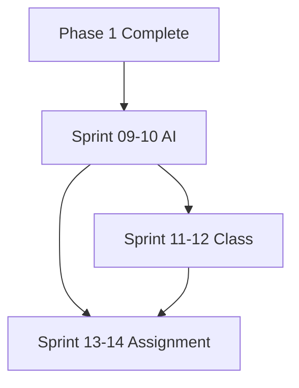

# Execution Order - Phase 2: AI Grading & Class Management

## 📋 Overview

Phase 2 bao gồm 3 sprints (6 tuần), tập trung vào AI scoring và Teacher portal.

---

## 🔄 Sprint 09-10: AI Grading Service

### Week 9: AI Service Foundation

**Day 1-2: Infrastructure Setup**
```
AI-001 → AI-002 → AI-003
```
| Order | Task ID | Name | Est. |
|-------|---------|------|------|
| 1 | AI-001 | Python FastAPI Project Setup | 4h |
| 2 | AI-002 | RabbitMQ Integration | 4h |
| 3 | AI-003 | AI Job Queue Schema | 3h |

**Day 3-4: Writing Grader**
```
BE-036 → BE-037 → BE-038
```
| Order | Task ID | Name | Est. |
|-------|---------|------|------|
| 4 | BE-036 | AI Writing Submit Endpoint | 4h |
| 5 | BE-037 | Writing Job Producer | 4h |
| 6 | AI-004 | GPT-4 Writing Scorer | 8h |

**Day 5: Integration**
| Order | Task ID | Name | Est. |
|-------|---------|------|------|
| 7 | BE-038 | Writing Result Callback | 4h |
| 8 | FE-038 | Writing AI Progress UI | 4h |

### Week 10: Speaking Grader

**Day 1-2: Audio Processing**
```
AI-005 → AI-006 → BE-039
```
| Order | Task ID | Name | Est. |
|-------|---------|------|------|
| 9 | AI-005 | Whisper STT Integration | 8h |
| 10 | AI-006 | Pronunciation Analyzer | 8h |
| 11 | BE-039 | Speaking Audio Upload | 4h |

**Day 3-4: Speaking Pipeline**
| Order | Task ID | Name | Est. |
|-------|---------|------|------|
| 12 | BE-040 | Speaking Job Producer | 4h |
| 13 | AI-007 | Speaking Scorer Pipeline | 6h |
| 14 | BE-041 | Speaking Result Callback | 4h |

**Day 5: Frontend Integration**
| Order | Task ID | Name | Est. |
|-------|---------|------|------|
| 15 | FE-039 | Speaking Record Component | 6h |
| 16 | FE-040 | Speaking AI Progress UI | 4h |
| 17 | FE-041 | AI Feedback Display | 5h |

---

## 🔄 Sprint 11-12: Class Management

### Week 11: Teacher Portal Foundation

**Day 1-2: Class Entity & APIs**
```
BE-044 → BE-045 → BE-046
```
| Order | Task ID | Name | Est. |
|-------|---------|------|------|
| 1 | BE-044 | Class Entity & Migration | 4h |
| 2 | BE-045 | Class CRUD Service | 5h |
| 3 | BE-046 | Class Students Management | 4h |

**Day 3-4: Teacher Dashboard**
| Order | Task ID | Name | Est. |
|-------|---------|------|------|
| 4 | FE-044 | Teacher Dashboard Layout | 6h |
| 5 | FE-045 | Class List Page | 5h |
| 6 | FE-046 | Create Class Modal | 4h |

**Day 5: Class Detail**
| Order | Task ID | Name | Est. |
|-------|---------|------|------|
| 7 | FE-047 | Class Detail Page | 6h |
| 8 | FE-048 | Student Management UI | 5h |

### Week 12: Materials & Analytics

**Day 1-2: Materials System**
```
BE-047 → BE-048 → FE-049
```
| Order | Task ID | Name | Est. |
|-------|---------|------|------|
| 9 | BE-047 | Materials Entity | 3h |
| 10 | BE-048 | Materials Upload Service | 5h |
| 11 | FE-049 | Materials Management UI | 5h |

**Day 3-4: Class Analytics**
| Order | Task ID | Name | Est. |
|-------|---------|------|------|
| 12 | BE-049 | Class Analytics Service | 5h |
| 13 | BE-050 | Student Progress API | 4h |
| 14 | FE-050 | Class Analytics Dashboard | 6h |

**Day 5: Polish**
| Order | Task ID | Name | Est. |
|-------|---------|------|------|
| 15 | BE-051 | Class Invitation System | 4h |
| 16 | FE-051 | Invite Students Modal | 4h |

---

## 🔄 Sprint 13-14: Assignment System

### Week 13: Assignment CRUD

**Day 1-2: Assignment Entity**
```
BE-052 → BE-053 → BE-054
```
| Order | Task ID | Name | Est. |
|-------|---------|------|------|
| 1 | BE-052 | Assignment Entity | 4h |
| 2 | BE-053 | Assignment CRUD Service | 5h |
| 3 | BE-054 | Assignment Questions Attach | 4h |

**Day 3-4: Assignment UI**
| Order | Task ID | Name | Est. |
|-------|---------|------|------|
| 4 | FE-052 | Assignment List Page | 5h |
| 5 | FE-053 | Create Assignment Modal | 6h |
| 6 | FE-054 | Question Selector UI | 5h |

**Day 5: Deadline System**
| Order | Task ID | Name | Est. |
|-------|---------|------|------|
| 7 | BE-055 | Deadline Reminder Service | 4h |
| 8 | FE-055 | Assignment Calendar View | 5h |

### Week 14: Submission & Grading

**Day 1-2: Student Submission**
```
BE-056 → BE-057 → FE-056
```
| Order | Task ID | Name | Est. |
|-------|---------|------|------|
| 9 | BE-056 | Submission Entity | 3h |
| 10 | BE-057 | Submission Service | 5h |
| 11 | FE-056 | Assignment Taking UI | 6h |

**Day 3-4: Manual Grading**
| Order | Task ID | Name | Est. |
|-------|---------|------|------|
| 12 | BE-058 | Manual Grading Service | 5h |
| 13 | FE-057 | Teacher Grading UI | 6h |
| 14 | FE-058 | Feedback Form | 4h |

**Day 5: Reports**
| Order | Task ID | Name | Est. |
|-------|---------|------|------|
| 15 | BE-059 | Assignment Report Service | 4h |
| 16 | FE-059 | Assignment Analytics | 5h |

---

## 📊 Phase 2 Summary

| Sprint | Tasks | Est. Hours |
|--------|-------|------------|
| 09-10 (AI) | 17 tasks | 70h |
| 11-12 (Class) | 16 tasks | 70h |
| 13-14 (Assignment) | 16 tasks | 70h |
| **Total** | **49 tasks** | **210h** |

---

## ⚠️ Critical Dependencies



1. **AI Service** phải hoàn thành trước khi tích hợp vào Class assignments
2. **Class Management** là prerequisite cho Assignment System
3. **Question Bank** từ Phase 1 được reuse cho Assignments
