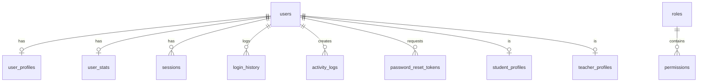
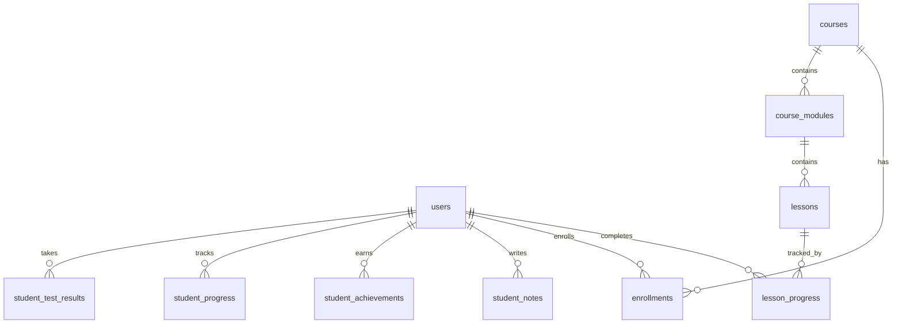
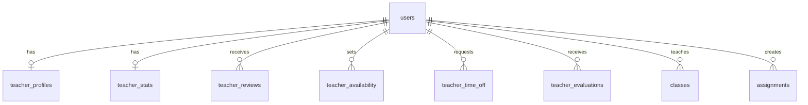
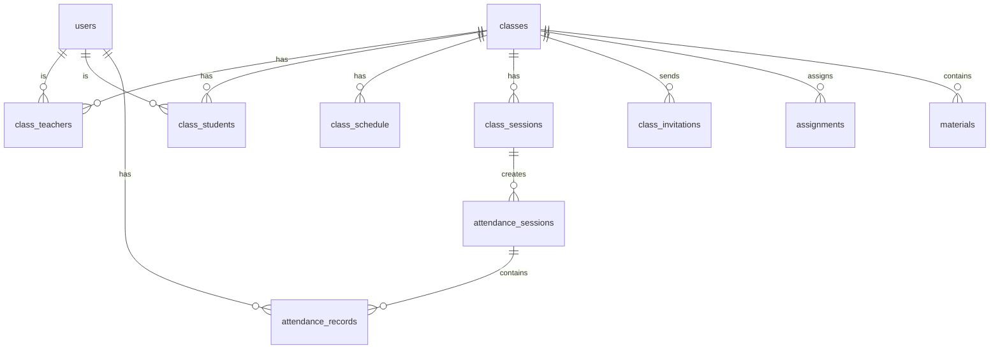
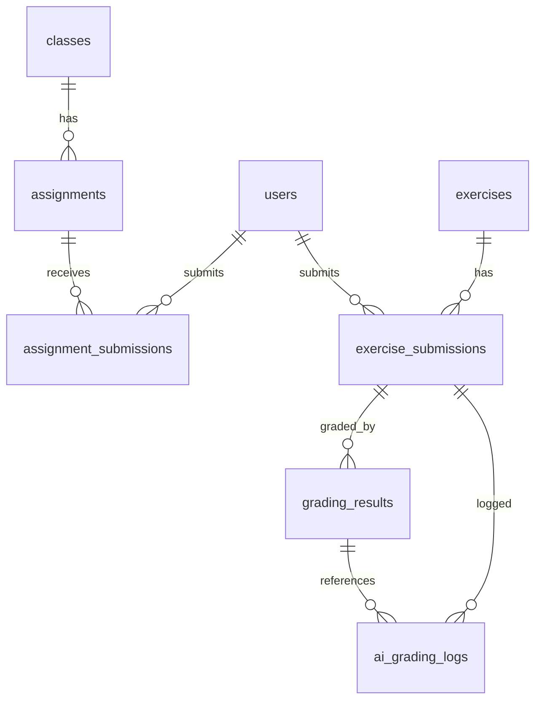
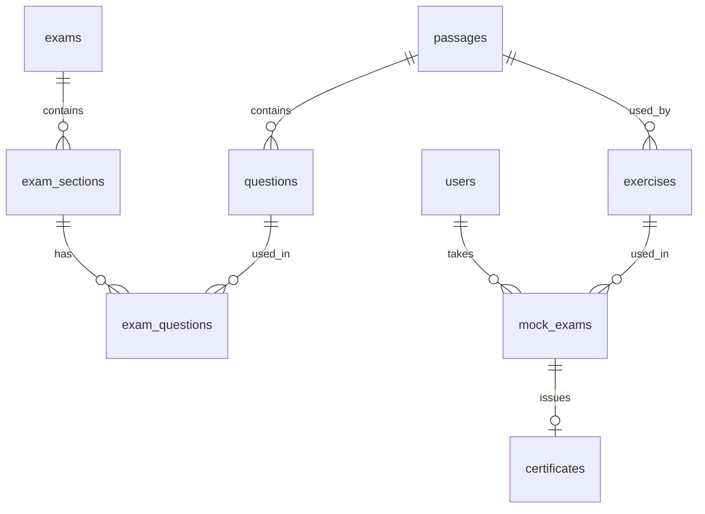
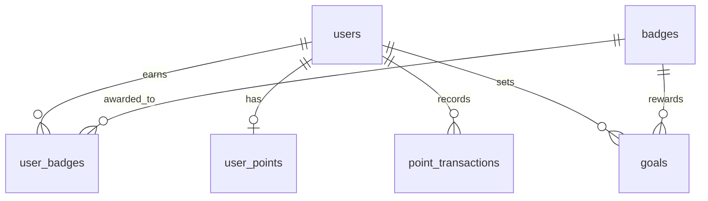
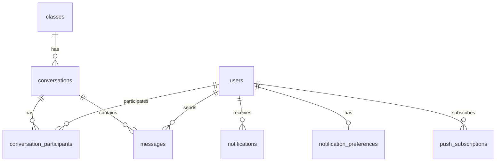

# 🗄️ Database Design - VSTEPRO Complete

> **Tài liệu thiết kế database hoàn thiện cho hệ thống luyện thi VSTEP**
> 
> File: `23-DATABASE-DESIGN_NEW.md`  
> Version: 2.0  
> Last Updated: 16/12/2024

---

## 📑 Mục lục

- [1. Tổng quan Database](#1-tổng-quan-database)
- [2. Danh sách tất cả bảng](#2-danh-sách-tất-cả-bảng)
- [3. Core Tables](#3-core-tables)
- [4. Student Tables](#4-student-tables)
- [5. Teacher Tables](#5-teacher-tables)
- [6. Class & Assignment Tables](#6-class--assignment-tables)
- [7. Content & Course Tables](#7-content--course-tables)
- [8. Exam & Question Tables](#8-exam--question-tables)
- [9. Practice & Submission Tables](#9-practice--submission-tables)
- [10. Mock Exam & Certificate Tables](#10-mock-exam--certificate-tables)
- [11. Gamification Tables](#11-gamification-tables)
- [12. Notification & Communication Tables](#12-notification--communication-tables)
- [13. Admin & System Tables](#13-admin--system-tables)
- [14. Analytics & Payment Tables](#14-analytics--payment-tables)
- [15. ERD Diagram](#15-erd-diagram)
- [16. Indexes & Optimization](#16-indexes--optimization)
- [17. DBML Schema](#17-dbml-schema)

---

## 1. Tổng quan Database

### 1.1. Thông tin chung

| Thông số | Giá trị |
|----------|---------|
| **Database Engine** | MySQL 8.0+ |
| **Character Set** | UTF-8 (utf8mb4) |
| **Collation** | utf8mb4_unicode_ci |
| **Timezone** | Asia/Ho_Chi_Minh |
| **Tổng số bảng** | 55+ tables |
| **Storage Engine** | InnoDB |

### 1.2. Technology Stack & Features

- **UUID Primary Keys**: Sử dụng UUID thay vì auto-increment cho distributed systems
- **JSON/JSONB**: Lưu trữ flexible/nested data
- **Timestamps**: Audit trail với `createdAt`, `updatedAt`, `deletedAt`
- **Indexes**: Tối ưu performance cho foreign keys và search fields
- **Foreign Keys**: Đảm bảo referential integrity
- **Triggers**: Automation cho các tác vụ phức tạp
- **Soft Delete**: Sử dụng `deletedAt` thay vì xóa thật

### 1.3. Nguyên tắc thiết kế

1. **Normalization**: Chuẩn hóa đến 3NF (Third Normal Form)
2. **UUID Primary Keys**: Scalable cho distributed systems
3. **Soft Delete**: Không xóa thật, chỉ đánh dấu `deletedAt`
4. **Timestamps**: Mọi bảng có `createdAt`, `updatedAt`
5. **JSON Fields**: Sử dụng cho flexible/dynamic data
6. **Indexes**: Index cho FK, search fields, frequently queried columns
7. **Constraints**: NOT NULL, CHECK, UNIQUE, FOREIGN KEY

### 1.4. Naming Conventions

| Loại | Convention | Ví dụ |
|------|------------|-------|
| **Tables** | snake_case | `user_profiles`, `exercise_submissions` |
| **Columns** | camelCase | `createdAt`, `fullName`, `userId` |
| **Indexes** | idx_{table}_{column} | `idx_users_email` |
| **Foreign Keys** | fk_{table}_{referenced} | `fk_submissions_users` |
| **Unique Constraints** | uq_{table}_{column} | `uq_users_email` |
| **Check Constraints** | chk_{table}_{column} | `chk_users_status` |

### 1.5. Statistics (Estimated Production)

| Metric | Value |
|--------|-------|
| **Total Tables** | 55+ tables |
| **Core Entities** | 15 tables |
| **Supporting Tables** | 40+ tables |
| **Indexes** | 120+ indexes |
| **Relationships** | 90+ foreign keys |
| **Estimated Total Rows** | 15M+ rows |

---

## 2. Danh sách tất cả bảng

### 2.1. Core Tables (Người dùng & Phân quyền) - 9 bảng

| Bảng | Mô tả | Rows (est.) |
|------|-------|-------------|
| `users` | Tất cả người dùng trong hệ thống | 15,000 |
| `user_profiles` | Thông tin chi tiết người dùng | 15,000 |
| `roles` | Vai trò (Student/Teacher/Admin/Uploader) | 4 |
| `permissions` | Quyền hạn chi tiết | 50 |
| `user_stats` | Thống kê hoạt động người dùng | 15,000 |
| `sessions` | Phiên đăng nhập active | 2,000 |
| `login_history` | Lịch sử đăng nhập | 500,000 |
| `password_reset_tokens` | Token reset mật khẩu | 100 |
| `activity_logs` | Nhật ký hoạt động | 1,000,000 |

### 2.2. Student Tables (Học viên) - 8 bảng

| Bảng | Mô tả | Rows (est.) |
|------|-------|-------------|
| `student_profiles` | Profile học viên mở rộng | 12,000 |
| `student_test_results` | Kết quả thi của học viên | 200,000 |
| `student_progress` | Tiến độ học viên theo skill | 20,000 |
| `lesson_progress` | Tiến độ từng bài học | 100,000 |
| `enrollments` | Ghi danh khóa học/lớp | 20,000 |
| `student_attendance` | Điểm danh học viên | 100,000 |
| `student_achievements` | Thành tích học viên | 50,000 |
| `student_notes` | Ghi chú của học viên | 30,000 |

### 2.3. Teacher Tables (Giáo viên) - 6 bảng

| Bảng | Mô tả | Rows (est.) |
|------|-------|-------------|
| `teacher_profiles` | Profile giáo viên | 250 |
| `teacher_stats` | Thống kê giảng dạy | 250 |
| `teacher_reviews` | Đánh giá giáo viên | 5,000 |
| `teacher_availability` | Lịch khả dụng | 1,000 |
| `teacher_time_off` | Nghỉ phép | 500 |
| `teacher_evaluations` | Đánh giá định kỳ | 1,000 |

### 2.4. Class Tables (Lớp học) - 9 bảng

| Bảng | Mô tả | Rows (est.) |
|------|-------|-------------|
| `classes` | Lớp học | 100 |
| `class_teachers` | Giáo viên phụ trách lớp | 120 |
| `class_students` | Học viên trong lớp | 3,000 |
| `class_schedule` | Lịch học | 500 |
| `class_sessions` | Các buổi học | 2,000 |
| `session_attendance` | Điểm danh từng buổi | 50,000 |
| `class_invitations` | Link mời vào lớp | 200 |
| `class_stats` | Thống kê lớp học | 100 |
| `class_announcements` | Thông báo lớp học | 1,000 |

### 2.5. Content Tables (Nội dung) - 6 bảng

| Bảng | Mô tả | Rows (est.) |
|------|-------|-------------|
| `courses` | Khóa học | 100 |
| `course_modules` | Module trong khóa học | 500 |
| `lessons` | Bài học | 2,000 |
| `materials` | Tài liệu | 5,000 |
| `material_folders` | Thư mục tài liệu | 200 |
| `content_versions` | Phiên bản nội dung | 10,000 |

### 2.6. Exam & Question Tables (Đề thi & Câu hỏi) - 6 bảng

| Bảng | Mô tả | Rows (est.) |
|------|-------|-------------|
| `questions` | Ngân hàng câu hỏi | 10,000 |
| `passages` | Đoạn văn Reading/Listening | 500 |
| `exams` | Đề thi | 300 |
| `exam_sections` | Phần của đề thi | 1,200 |
| `exam_questions` | Câu hỏi trong đề | 30,000 |
| `question_tags` | Tags cho câu hỏi | 5,000 |

### 2.7. Practice & Submission Tables - 5 bảng

| Bảng | Mô tả | Rows (est.) |
|------|-------|-------------|
| `exercises` | Ngân hàng bài tập | 5,000 |
| `exercise_submissions` | Bài làm của học viên | 100,000 |
| `grading_results` | Kết quả chấm điểm | 100,000 |
| `bookmarks` | Đánh dấu câu hỏi | 30,000 |
| `ai_grading_logs` | Log chấm AI | 10,000 |

### 2.8. Assignment Tables - 2 bảng

| Bảng | Mô tả | Rows (est.) |
|------|-------|-------------|
| `assignments` | Bài tập được giao | 500 |
| `assignment_submissions` | Bài nộp assignment | 20,000 |

### 2.9. Mock Exam & Certificate Tables - 2 bảng

| Bảng | Mô tả | Rows (est.) |
|------|-------|-------------|
| `mock_exams` | Đề thi thử | 10,000 |
| `certificates` | Chứng chỉ | 5,000 |

### 2.10. Gamification Tables - 5 bảng

| Bảng | Mô tả | Rows (est.) |
|------|-------|-------------|
| `badges` | Định nghĩa huy hiệu | 50 |
| `user_badges` | Huy hiệu của user | 50,000 |
| `goals` | Mục tiêu cá nhân | 30,000 |
| `user_points` | Điểm số gamification | 15,000 |
| `point_transactions` | Lịch sử điểm | 500,000 |

### 2.11. Notification Tables - 4 bảng

| Bảng | Mô tả | Rows (est.) |
|------|-------|-------------|
| `notifications` | Thông báo | 500,000 |
| `notification_preferences` | Tùy chọn thông báo | 15,000 |
| `notification_templates` | Mẫu thông báo | 50 |
| `push_subscriptions` | Đăng ký push notification | 5,000 |

### 2.12. Communication Tables - 3 bảng

| Bảng | Mô tả | Rows (est.) |
|------|-------|-------------|
| `conversations` | Cuộc trò chuyện | 5,000 |
| `messages` | Tin nhắn | 100,000 |
| `conversation_participants` | Thành viên cuộc trò chuyện | 10,000 |

### 2.13. Admin & System Tables - 5 bảng

| Bảng | Mô tả | Rows (est.) |
|------|-------|-------------|
| `attendance_sessions` | Buổi điểm danh | 5,000 |
| `attendance_records` | Bản ghi điểm danh | 100,000 |
| `exam_upload_submissions` | Đề thi chờ duyệt | 500 |
| `system_config` | Cấu hình hệ thống | 100 |
| `admin_logs` | Log hành động admin | 50,000 |

### 2.14. Analytics Tables - 3 bảng

| Bảng | Mô tả | Rows (est.) |
|------|-------|-------------|
| `analytics_events` | Sự kiện analytics | 5,000,000 |
| `daily_stats` | Thống kê theo ngày | 1,000 |
| `reports` | Báo cáo đã tạo | 5,000 |

### 2.15. Payment Tables (Optional) - 3 bảng

| Bảng | Mô tả | Rows (est.) |
|------|-------|-------------|
| `transactions` | Giao dịch thanh toán | 10,000 |
| `subscriptions` | Đăng ký gói | 5,000 |
| `invoices` | Hóa đơn | 10,000 |

---

**Tổng cộng: ~55 bảng**

---

## 3. Core Tables

### 3.1. users

**Mô tả**: Bảng người dùng chính - lưu thông tin xác thực và trạng thái tài khoản

```sql
CREATE TABLE users (
  id CHAR(36) PRIMARY KEY DEFAULT (UUID()),
  
  -- Authentication
  email VARCHAR(255) NOT NULL UNIQUE,
  passwordHash VARCHAR(255) NOT NULL,
  emailVerified BOOLEAN DEFAULT FALSE,
  emailVerifiedAt TIMESTAMP NULL,
  emailVerificationToken VARCHAR(255) NULL,
  
  -- Profile Basic
  fullName VARCHAR(255) NOT NULL,
  avatar VARCHAR(500) NULL,
  phone VARCHAR(20) NULL,
  dateOfBirth DATE NULL,
  gender ENUM('male', 'female', 'other') NULL,
  bio TEXT NULL,
  
  -- Role & Status
  role ENUM('student', 'teacher', 'admin', 'uploader') DEFAULT 'student',
  status ENUM('active', 'inactive', 'suspended', 'banned') DEFAULT 'active',
  
  -- Account Type & Premium
  accountType ENUM('free', 'premium', 'trial') DEFAULT 'free',
  premiumExpiresAt TIMESTAMP NULL,
  trialStartedAt TIMESTAMP NULL,
  
  -- Security
  lastLoginAt TIMESTAMP NULL,
  lastLoginIp VARCHAR(45) NULL,
  passwordChangedAt TIMESTAMP NULL,
  failedLoginAttempts INT DEFAULT 0,
  lockedUntil TIMESTAMP NULL,
  
  -- Suspension Info
  suspensionReason TEXT NULL,
  suspendedBy CHAR(36) NULL,
  suspendedAt TIMESTAMP NULL,
  
  -- Timestamps
  createdAt TIMESTAMP DEFAULT CURRENT_TIMESTAMP,
  updatedAt TIMESTAMP DEFAULT CURRENT_TIMESTAMP ON UPDATE CURRENT_TIMESTAMP,
  deletedAt TIMESTAMP NULL,
  
  -- Foreign Keys
  FOREIGN KEY (suspendedBy) REFERENCES users(id) ON DELETE SET NULL,
  
  -- Indexes
  INDEX idx_users_email (email),
  INDEX idx_users_role (role),
  INDEX idx_users_status (status),
  INDEX idx_users_accountType (accountType),
  INDEX idx_users_createdAt (createdAt DESC),
  INDEX idx_users_deletedAt (deletedAt)
);
```

---

### 3.2. user_profiles

**Mô tả**: Thông tin profile mở rộng của người dùng

```sql
CREATE TABLE user_profiles (
  id CHAR(36) PRIMARY KEY DEFAULT (UUID()),
  userId CHAR(36) NOT NULL UNIQUE,
  
  -- Location
  address TEXT NULL,
  city VARCHAR(100) NULL,
  country VARCHAR(100) DEFAULT 'Vietnam',
  
  -- Learning Info
  currentLevel ENUM('A1', 'A2', 'B1', 'B2', 'C1') NULL,
  targetLevel ENUM('A2', 'B1', 'B2', 'C1') NULL,
  targetDate DATE NULL,
  
  -- Preferences
  preferredLanguage VARCHAR(10) DEFAULT 'vi',
  timezone VARCHAR(50) DEFAULT 'Asia/Ho_Chi_Minh',
  
  -- Notification Settings
  notificationEmail BOOLEAN DEFAULT TRUE,
  notificationPush BOOLEAN DEFAULT TRUE,
  notificationSms BOOLEAN DEFAULT FALSE,
  
  -- Social Links
  facebookUrl VARCHAR(255) NULL,
  linkedinUrl VARCHAR(255) NULL,
  
  -- Student Code (for students)
  studentCode VARCHAR(20) NULL UNIQUE,
  
  -- Timestamps
  createdAt TIMESTAMP DEFAULT CURRENT_TIMESTAMP,
  updatedAt TIMESTAMP DEFAULT CURRENT_TIMESTAMP ON UPDATE CURRENT_TIMESTAMP,
  
  -- Foreign Keys
  FOREIGN KEY (userId) REFERENCES users(id) ON DELETE CASCADE,
  
  -- Indexes
  INDEX idx_user_profiles_userId (userId),
  INDEX idx_user_profiles_studentCode (studentCode),
  INDEX idx_user_profiles_currentLevel (currentLevel)
);
```

---

### 3.3. roles

**Mô tả**: Định nghĩa các vai trò trong hệ thống

```sql
CREATE TABLE roles (
  id CHAR(36) PRIMARY KEY DEFAULT (UUID()),
  name VARCHAR(50) NOT NULL UNIQUE,
  displayName VARCHAR(100) NOT NULL,
  description TEXT NULL,
  permissions JSON NULL,
  isDefault BOOLEAN DEFAULT FALSE,
  
  createdAt TIMESTAMP DEFAULT CURRENT_TIMESTAMP,
  updatedAt TIMESTAMP DEFAULT CURRENT_TIMESTAMP ON UPDATE CURRENT_TIMESTAMP,
  
  INDEX idx_roles_name (name)
);

-- Seed data
INSERT INTO roles (name, displayName, description, isDefault) VALUES
('student', 'Học viên', 'Người dùng học tập trên hệ thống', TRUE),
('teacher', 'Giáo viên', 'Giáo viên quản lý lớp học và chấm bài', FALSE),
('admin', 'Quản trị viên', 'Quản trị toàn bộ hệ thống', FALSE),
('uploader', 'Người đóng góp', 'Người đóng góp đề thi và tài liệu', FALSE);
```

---

### 3.4. permissions

**Mô tả**: Quyền hạn chi tiết trong hệ thống

```sql
CREATE TABLE permissions (
  id CHAR(36) PRIMARY KEY DEFAULT (UUID()),
  name VARCHAR(100) NOT NULL UNIQUE,
  displayName VARCHAR(100) NOT NULL,
  description TEXT NULL,
  module ENUM('practice', 'exam', 'class', 'user', 'admin', 'content', 'report') NOT NULL,
  
  createdAt TIMESTAMP DEFAULT CURRENT_TIMESTAMP,
  
  INDEX idx_permissions_name (name),
  INDEX idx_permissions_module (module)
);

-- Sample permissions
INSERT INTO permissions (name, displayName, module) VALUES
('practice.access', 'Truy cập luyện tập', 'practice'),
('practice.submit', 'Nộp bài luyện tập', 'practice'),
('exam.create', 'Tạo đề thi', 'exam'),
('exam.grade', 'Chấm bài thi', 'exam'),
('class.create', 'Tạo lớp học', 'class'),
('class.manage', 'Quản lý lớp học', 'class'),
('user.view', 'Xem thông tin user', 'user'),
('user.manage', 'Quản lý user', 'user'),
('admin.full', 'Toàn quyền admin', 'admin');
```

---

### 3.5. sessions

**Mô tả**: Quản lý phiên đăng nhập active

```sql
CREATE TABLE sessions (
  id CHAR(36) PRIMARY KEY DEFAULT (UUID()),
  userId CHAR(36) NOT NULL,
  
  -- Token
  refreshToken VARCHAR(500) NOT NULL UNIQUE,
  accessToken VARCHAR(500) NULL,
  
  -- Device Info
  deviceName VARCHAR(255) NULL,
  deviceType ENUM('desktop', 'mobile', 'tablet') NULL,
  browser VARCHAR(100) NULL,
  os VARCHAR(100) NULL,
  
  -- Location
  ipAddress VARCHAR(45) NULL,
  location VARCHAR(255) NULL,
  
  -- Status
  isActive BOOLEAN DEFAULT TRUE,
  lastActivityAt TIMESTAMP DEFAULT CURRENT_TIMESTAMP,
  
  -- Expiry
  expiresAt TIMESTAMP NOT NULL,
  
  -- Timestamps
  createdAt TIMESTAMP DEFAULT CURRENT_TIMESTAMP,
  revokedAt TIMESTAMP NULL,
  
  -- Foreign Keys
  FOREIGN KEY (userId) REFERENCES users(id) ON DELETE CASCADE,
  
  -- Indexes
  INDEX idx_sessions_userId (userId),
  INDEX idx_sessions_refreshToken (refreshToken),
  INDEX idx_sessions_isActive (isActive),
  INDEX idx_sessions_expiresAt (expiresAt)
);
```

---

### 3.6. login_history

**Mô tả**: Lịch sử đăng nhập của người dùng

```sql
CREATE TABLE login_history (
  id CHAR(36) PRIMARY KEY DEFAULT (UUID()),
  userId CHAR(36) NOT NULL,
  
  -- Login Info
  ipAddress VARCHAR(45) NULL,
  userAgent TEXT NULL,
  deviceType ENUM('desktop', 'mobile', 'tablet') NULL,
  browser VARCHAR(100) NULL,
  os VARCHAR(100) NULL,
  location VARCHAR(255) NULL,
  
  -- Status
  success BOOLEAN DEFAULT TRUE,
  failureReason VARCHAR(100) NULL,
  
  createdAt TIMESTAMP DEFAULT CURRENT_TIMESTAMP,
  
  -- Foreign Keys
  FOREIGN KEY (userId) REFERENCES users(id) ON DELETE CASCADE,
  
  -- Indexes
  INDEX idx_login_history_userId (userId),
  INDEX idx_login_history_createdAt (createdAt DESC),
  INDEX idx_login_history_success (success)
);
```

---

### 3.7. password_reset_tokens

**Mô tả**: Token reset mật khẩu

```sql
CREATE TABLE password_reset_tokens (
  id CHAR(36) PRIMARY KEY DEFAULT (UUID()),
  userId CHAR(36) NOT NULL,
  token VARCHAR(255) NOT NULL UNIQUE,
  expiresAt TIMESTAMP NOT NULL,
  usedAt TIMESTAMP NULL,
  
  createdAt TIMESTAMP DEFAULT CURRENT_TIMESTAMP,
  
  -- Foreign Keys
  FOREIGN KEY (userId) REFERENCES users(id) ON DELETE CASCADE,
  
  -- Indexes
  INDEX idx_password_reset_tokens_token (token),
  INDEX idx_password_reset_tokens_userId (userId),
  INDEX idx_password_reset_tokens_expiresAt (expiresAt)
);
```

---

### 3.8. user_stats

**Mô tả**: Thống kê hoạt động tổng hợp của người dùng

```sql
CREATE TABLE user_stats (
  id CHAR(36) PRIMARY KEY DEFAULT (UUID()),
  userId CHAR(36) NOT NULL UNIQUE,
  
  -- Practice Stats
  totalPracticeTime INT DEFAULT 0 COMMENT 'in minutes',
  totalExercisesCompleted INT DEFAULT 0,
  totalTestsTaken INT DEFAULT 0,
  
  -- Skill Scores (0-10)
  readingAvgScore DECIMAL(4,2) NULL,
  listeningAvgScore DECIMAL(4,2) NULL,
  writingAvgScore DECIMAL(4,2) NULL,
  speakingAvgScore DECIMAL(4,2) NULL,
  overallAvgScore DECIMAL(4,2) NULL,
  
  -- Streak
  currentStreak INT DEFAULT 0,
  longestStreak INT DEFAULT 0,
  lastPracticeDate DATE NULL,
  
  -- Level Progress
  currentLevel ENUM('A1', 'A2', 'B1', 'B2', 'C1') NULL,
  levelProgress DECIMAL(5,2) DEFAULT 0 COMMENT 'percentage 0-100',
  
  -- Timestamps
  createdAt TIMESTAMP DEFAULT CURRENT_TIMESTAMP,
  updatedAt TIMESTAMP DEFAULT CURRENT_TIMESTAMP ON UPDATE CURRENT_TIMESTAMP,
  
  -- Foreign Keys
  FOREIGN KEY (userId) REFERENCES users(id) ON DELETE CASCADE,
  
  -- Indexes
  INDEX idx_user_stats_userId (userId),
  INDEX idx_user_stats_currentStreak (currentStreak DESC),
  INDEX idx_user_stats_overallAvgScore (overallAvgScore DESC)
);
```

---

### 3.9. activity_logs

**Mô tả**: Nhật ký hoạt động của người dùng

```sql
CREATE TABLE activity_logs (
  id CHAR(36) PRIMARY KEY DEFAULT (UUID()),
  userId CHAR(36) NULL,
  
  -- Activity Info
  action VARCHAR(100) NOT NULL COMMENT 'login, logout, practice_start, practice_submit, etc.',
  entityType VARCHAR(50) NULL COMMENT 'exercise, exam, class, assignment, etc.',
  entityId CHAR(36) NULL,
  
  -- Details
  details JSON NULL,
  ipAddress VARCHAR(45) NULL,
  userAgent TEXT NULL,
  
  createdAt TIMESTAMP DEFAULT CURRENT_TIMESTAMP,
  
  -- Foreign Keys
  FOREIGN KEY (userId) REFERENCES users(id) ON DELETE SET NULL,
  
  -- Indexes
  INDEX idx_activity_logs_userId (userId),
  INDEX idx_activity_logs_action (action),
  INDEX idx_activity_logs_entityType (entityType),
  INDEX idx_activity_logs_createdAt (createdAt DESC)
);
```

---

## 4. Student Tables

### 4.1. student_profiles

**Mô tả**: Profile học viên mở rộng với thông tin học tập chi tiết

```sql
CREATE TABLE student_profiles (
  id CHAR(36) PRIMARY KEY DEFAULT (UUID()),
  userId CHAR(36) NOT NULL UNIQUE,
  
  -- Student Info
  studentCode VARCHAR(50) NULL UNIQUE COMMENT 'SV-2024-00123',
  enrollmentDate DATE DEFAULT (CURRENT_DATE),
  graduationDate DATE NULL,
  
  -- Learning Info
  currentLevel ENUM('A1', 'A2', 'B1', 'B2', 'C1') DEFAULT 'A2',
  targetLevel ENUM('A2', 'B1', 'B2', 'C1') DEFAULT 'B2',
  targetExamDate DATE NULL,
  
  -- Background
  education VARCHAR(200) NULL,
  major VARCHAR(100) NULL,
  occupation VARCHAR(100) NULL,
  purpose TEXT NULL COMMENT 'Mục đích học VSTEP',
  
  -- Emergency Contact
  emergencyContactName VARCHAR(100) NULL,
  emergencyContactPhone VARCHAR(20) NULL,
  
  -- Learning Preferences
  preferredLearningTime ENUM('morning', 'afternoon', 'evening', 'night') NULL,
  learningStyle ENUM('visual', 'auditory', 'reading', 'kinesthetic') NULL,
  dailyGoalMinutes INT DEFAULT 30,
  
  -- Timestamps
  createdAt TIMESTAMP DEFAULT CURRENT_TIMESTAMP,
  updatedAt TIMESTAMP DEFAULT CURRENT_TIMESTAMP ON UPDATE CURRENT_TIMESTAMP,
  
  -- Foreign Keys
  FOREIGN KEY (userId) REFERENCES users(id) ON DELETE CASCADE,
  
  -- Indexes
  INDEX idx_student_profiles_userId (userId),
  INDEX idx_student_profiles_studentCode (studentCode),
  INDEX idx_student_profiles_currentLevel (currentLevel),
  INDEX idx_student_profiles_targetLevel (targetLevel)
);
```

---

### 4.2. student_test_results

**Mô tả**: Kết quả thi của học viên (tất cả các loại bài thi)

```sql
CREATE TABLE student_test_results (
  id CHAR(36) PRIMARY KEY DEFAULT (UUID()),
  studentId CHAR(36) NOT NULL,
  
  -- Test Info
  testId CHAR(36) NULL,
  testType ENUM('reading', 'listening', 'writing', 'speaking', 'full_test') NOT NULL,
  testMode ENUM('practice', 'exam', 'mock_exam', 'assignment') NOT NULL,
  level ENUM('A2', 'B1', 'B2', 'C1') NULL,
  partNumber INT NULL COMMENT 'Part 1, 2, 3, etc. for part practice',
  
  -- Scores
  score DECIMAL(4,2) NOT NULL COMMENT '0-10 scale',
  maxScore DECIMAL(4,2) DEFAULT 10,
  percentage DECIMAL(5,2) NULL COMMENT '0-100',
  bandScore DECIMAL(3,1) NULL COMMENT 'VSTEP band score',
  
  -- Details
  totalQuestions INT NULL,
  correctAnswers INT NULL,
  
  -- Timing
  timeTaken INT NULL COMMENT 'in seconds',
  timeAllowed INT NULL COMMENT 'in seconds',
  startedAt TIMESTAMP NOT NULL,
  submittedAt TIMESTAMP NOT NULL,
  
  -- Context
  classId CHAR(36) NULL,
  assignmentId CHAR(36) NULL,
  
  -- Status
  status ENUM('completed', 'graded', 'pending_review') DEFAULT 'completed',
  gradedBy CHAR(36) NULL,
  gradedAt TIMESTAMP NULL,
  
  -- Timestamps
  createdAt TIMESTAMP DEFAULT CURRENT_TIMESTAMP,
  updatedAt TIMESTAMP DEFAULT CURRENT_TIMESTAMP ON UPDATE CURRENT_TIMESTAMP,
  
  -- Foreign Keys
  FOREIGN KEY (studentId) REFERENCES users(id) ON DELETE CASCADE,
  FOREIGN KEY (classId) REFERENCES classes(id) ON DELETE SET NULL,
  FOREIGN KEY (gradedBy) REFERENCES users(id) ON DELETE SET NULL,
  
  -- Indexes
  INDEX idx_student_test_results_studentId (studentId),
  INDEX idx_student_test_results_testType (testType),
  INDEX idx_student_test_results_level (level),
  INDEX idx_student_test_results_submittedAt (submittedAt DESC),
  INDEX idx_student_test_results_classId (classId)
);
```

---

### 4.3. student_progress

**Mô tả**: Tiến độ học viên theo từng skill

```sql
CREATE TABLE student_progress (
  id CHAR(36) PRIMARY KEY DEFAULT (UUID()),
  studentId CHAR(36) NOT NULL,
  
  -- Skill Info
  skill ENUM('reading', 'listening', 'writing', 'speaking') NOT NULL,
  level ENUM('A2', 'B1', 'B2', 'C1') NOT NULL,
  
  -- Progress
  totalExercises INT DEFAULT 0,
  completedExercises INT DEFAULT 0,
  progressPercentage DECIMAL(5,2) DEFAULT 0,
  
  -- Scores
  averageScore DECIMAL(4,2) NULL,
  highestScore DECIMAL(4,2) NULL,
  lowestScore DECIMAL(4,2) NULL,
  
  -- Time Spent
  totalTimeSpent INT DEFAULT 0 COMMENT 'in minutes',
  
  -- Last Activity
  lastPracticeAt TIMESTAMP NULL,
  
  -- Timestamps
  createdAt TIMESTAMP DEFAULT CURRENT_TIMESTAMP,
  updatedAt TIMESTAMP DEFAULT CURRENT_TIMESTAMP ON UPDATE CURRENT_TIMESTAMP,
  
  -- Foreign Keys
  FOREIGN KEY (studentId) REFERENCES users(id) ON DELETE CASCADE,
  
  -- Unique Constraint
  UNIQUE KEY uq_student_progress_skill_level (studentId, skill, level),
  
  -- Indexes
  INDEX idx_student_progress_studentId (studentId),
  INDEX idx_student_progress_skill (skill),
  INDEX idx_student_progress_level (level)
);
```

---

### 4.4. lesson_progress

**Mô tả**: Tiến độ từng bài học của học viên

```sql
CREATE TABLE lesson_progress (
  id CHAR(36) PRIMARY KEY DEFAULT (UUID()),
  studentId CHAR(36) NOT NULL,
  lessonId CHAR(36) NOT NULL,
  courseId CHAR(36) NOT NULL,
  
  -- Progress
  status ENUM('not_started', 'in_progress', 'completed') DEFAULT 'not_started',
  progressPercentage DECIMAL(5,2) DEFAULT 0,
  
  -- Tracking
  startedAt TIMESTAMP NULL,
  completedAt TIMESTAMP NULL,
  lastAccessedAt TIMESTAMP NULL,
  
  -- Time Spent
  timeSpent INT DEFAULT 0 COMMENT 'in seconds',
  
  -- Video Progress (if applicable)
  videoProgress INT DEFAULT 0 COMMENT 'in seconds',
  videoDuration INT NULL COMMENT 'in seconds',
  
  -- Quiz/Exercise Results
  quizScore DECIMAL(4,2) NULL,
  quizAttempts INT DEFAULT 0,
  
  -- Timestamps
  createdAt TIMESTAMP DEFAULT CURRENT_TIMESTAMP,
  updatedAt TIMESTAMP DEFAULT CURRENT_TIMESTAMP ON UPDATE CURRENT_TIMESTAMP,
  
  -- Foreign Keys
  FOREIGN KEY (studentId) REFERENCES users(id) ON DELETE CASCADE,
  FOREIGN KEY (lessonId) REFERENCES lessons(id) ON DELETE CASCADE,
  FOREIGN KEY (courseId) REFERENCES courses(id) ON DELETE CASCADE,
  
  -- Unique Constraint
  UNIQUE KEY uq_lesson_progress (studentId, lessonId),
  
  -- Indexes
  INDEX idx_lesson_progress_studentId (studentId),
  INDEX idx_lesson_progress_lessonId (lessonId),
  INDEX idx_lesson_progress_courseId (courseId),
  INDEX idx_lesson_progress_status (status)
);
```

---

### 4.5. enrollments

**Mô tả**: Ghi danh khóa học/lớp học của học viên

```sql
CREATE TABLE enrollments (
  id CHAR(36) PRIMARY KEY DEFAULT (UUID()),
  studentId CHAR(36) NOT NULL,
  
  -- Enrollment Target (one of these)
  courseId CHAR(36) NULL,
  classId CHAR(36) NULL,
  
  -- Enrollment Info
  enrolledAt TIMESTAMP DEFAULT CURRENT_TIMESTAMP,
  enrollmentMethod ENUM('self', 'invited', 'assigned', 'purchased') DEFAULT 'self',
  
  -- Status
  status ENUM('active', 'completed', 'dropped', 'expired') DEFAULT 'active',
  completedAt TIMESTAMP NULL,
  droppedAt TIMESTAMP NULL,
  
  -- Progress
  progressPercentage DECIMAL(5,2) DEFAULT 0,
  
  -- Certificate
  certificateId CHAR(36) NULL,
  certificateIssuedAt TIMESTAMP NULL,
  
  -- Timestamps
  createdAt TIMESTAMP DEFAULT CURRENT_TIMESTAMP,
  updatedAt TIMESTAMP DEFAULT CURRENT_TIMESTAMP ON UPDATE CURRENT_TIMESTAMP,
  
  -- Foreign Keys
  FOREIGN KEY (studentId) REFERENCES users(id) ON DELETE CASCADE,
  FOREIGN KEY (courseId) REFERENCES courses(id) ON DELETE CASCADE,
  FOREIGN KEY (classId) REFERENCES classes(id) ON DELETE CASCADE,
  
  -- Indexes
  INDEX idx_enrollments_studentId (studentId),
  INDEX idx_enrollments_courseId (courseId),
  INDEX idx_enrollments_classId (classId),
  INDEX idx_enrollments_status (status)
);
```

---

### 4.6. student_achievements

**Mô tả**: Thành tích đặc biệt của học viên

```sql
CREATE TABLE student_achievements (
  id CHAR(36) PRIMARY KEY DEFAULT (UUID()),
  studentId CHAR(36) NOT NULL,
  
  -- Achievement Info
  type ENUM('milestone', 'streak', 'score', 'completion', 'special') NOT NULL,
  title VARCHAR(255) NOT NULL,
  description TEXT NULL,
  
  -- Context
  skill ENUM('reading', 'listening', 'writing', 'speaking', 'overall') NULL,
  level ENUM('A2', 'B1', 'B2', 'C1') NULL,
  
  -- Value
  value DECIMAL(10,2) NULL COMMENT 'score, count, etc.',
  
  -- Earned
  earnedAt TIMESTAMP DEFAULT CURRENT_TIMESTAMP,
  
  -- Reference
  referenceType VARCHAR(50) NULL,
  referenceId CHAR(36) NULL,
  
  -- Timestamps
  createdAt TIMESTAMP DEFAULT CURRENT_TIMESTAMP,
  
  -- Foreign Keys
  FOREIGN KEY (studentId) REFERENCES users(id) ON DELETE CASCADE,
  
  -- Indexes
  INDEX idx_student_achievements_studentId (studentId),
  INDEX idx_student_achievements_type (type),
  INDEX idx_student_achievements_earnedAt (earnedAt DESC)
);
```

---

### 4.7. student_notes

**Mô tả**: Ghi chú cá nhân của học viên

```sql
CREATE TABLE student_notes (
  id CHAR(36) PRIMARY KEY DEFAULT (UUID()),
  studentId CHAR(36) NOT NULL,
  
  -- Note Content
  title VARCHAR(255) NULL,
  content TEXT NOT NULL,
  
  -- Context (optional)
  exerciseId CHAR(36) NULL,
  questionNumber INT NULL,
  lessonId CHAR(36) NULL,
  
  -- Tags
  tags JSON NULL,
  
  -- Flags
  isPinned BOOLEAN DEFAULT FALSE,
  isArchived BOOLEAN DEFAULT FALSE,
  
  -- Timestamps
  createdAt TIMESTAMP DEFAULT CURRENT_TIMESTAMP,
  updatedAt TIMESTAMP DEFAULT CURRENT_TIMESTAMP ON UPDATE CURRENT_TIMESTAMP,
  
  -- Foreign Keys
  FOREIGN KEY (studentId) REFERENCES users(id) ON DELETE CASCADE,
  FOREIGN KEY (exerciseId) REFERENCES exercises(id) ON DELETE SET NULL,
  FOREIGN KEY (lessonId) REFERENCES lessons(id) ON DELETE SET NULL,
  
  -- Indexes
  INDEX idx_student_notes_studentId (studentId),
  INDEX idx_student_notes_isPinned (isPinned),
  INDEX idx_student_notes_createdAt (createdAt DESC)
);
```

---

## 5. Teacher Tables

### 5.1. teacher_profiles

**Mô tả**: Profile giáo viên với thông tin chuyên môn

```sql
CREATE TABLE teacher_profiles (
  id CHAR(36) PRIMARY KEY DEFAULT (UUID()),
  userId CHAR(36) NOT NULL UNIQUE,
  
  -- Teacher Info
  teacherCode VARCHAR(50) NULL UNIQUE COMMENT 'GV-2023-00045',
  title ENUM('ThS.', 'TS.', 'PGS.', 'GS.', 'GV.') NULL,
  joinedDate DATE DEFAULT (CURRENT_DATE),
  
  -- Employment
  employmentType ENUM('full_time', 'part_time', 'contract') DEFAULT 'full_time',
  status ENUM('active', 'inactive', 'on_leave') DEFAULT 'active',
  
  -- Education & Certifications
  education JSON NULL COMMENT '[{"degree": "ThS", "major": "English", "school": "...", "year": 2020}]',
  certifications JSON NULL COMMENT '[{"name": "IELTS 8.5", "issuedBy": "...", "year": 2021}]',
  
  -- Experience
  experienceYears INT DEFAULT 0,
  specialties JSON NULL COMMENT '["reading", "writing"]',
  levelsTaught JSON NULL COMMENT '["B1", "B2", "C1"]',
  
  -- Bio
  bio TEXT NULL,
  achievements JSON NULL,
  publications JSON NULL,
  
  -- Social
  linkedinUrl VARCHAR(255) NULL,
  websiteUrl VARCHAR(255) NULL,
  
  -- Work Settings
  maxHoursPerWeek INT DEFAULT 40,
  maxClassesPerWeek INT DEFAULT 10,
  
  -- Timestamps
  createdAt TIMESTAMP DEFAULT CURRENT_TIMESTAMP,
  updatedAt TIMESTAMP DEFAULT CURRENT_TIMESTAMP ON UPDATE CURRENT_TIMESTAMP,
  
  -- Foreign Keys
  FOREIGN KEY (userId) REFERENCES users(id) ON DELETE CASCADE,
  
  -- Indexes
  INDEX idx_teacher_profiles_userId (userId),
  INDEX idx_teacher_profiles_teacherCode (teacherCode),
  INDEX idx_teacher_profiles_status (status)
);
```

---

### 5.2. teacher_stats

**Mô tả**: Thống kê giảng dạy của giáo viên

```sql
CREATE TABLE teacher_stats (
  id CHAR(36) PRIMARY KEY DEFAULT (UUID()),
  teacherId CHAR(36) NOT NULL UNIQUE,
  
  -- Class Stats
  currentClasses INT DEFAULT 0,
  totalClasses INT DEFAULT 0,
  completedClasses INT DEFAULT 0,
  
  -- Student Stats
  currentStudents INT DEFAULT 0,
  totalStudentsTaught INT DEFAULT 0,
  
  -- Content Stats
  exercisesCreated INT DEFAULT 0,
  examsCreated INT DEFAULT 0,
  materialsUploaded INT DEFAULT 0,
  
  -- Grading Stats
  totalSubmissionsGraded INT DEFAULT 0,
  avgGradingTime INT NULL COMMENT 'in minutes',
  
  -- Rating Stats
  averageRating DECIMAL(3,2) DEFAULT 0 COMMENT '0-5 scale',
  totalReviews INT DEFAULT 0,
  
  -- Performance
  studentPassRate DECIMAL(5,2) DEFAULT 0 COMMENT 'percentage',
  studentAvgImprovement DECIMAL(4,2) NULL COMMENT 'average score improvement',
  
  -- Timestamps
  createdAt TIMESTAMP DEFAULT CURRENT_TIMESTAMP,
  updatedAt TIMESTAMP DEFAULT CURRENT_TIMESTAMP ON UPDATE CURRENT_TIMESTAMP,
  
  -- Foreign Keys
  FOREIGN KEY (teacherId) REFERENCES users(id) ON DELETE CASCADE,
  
  -- Indexes
  INDEX idx_teacher_stats_teacherId (teacherId),
  INDEX idx_teacher_stats_averageRating (averageRating DESC)
);
```

---

### 5.3. teacher_reviews

**Mô tả**: Đánh giá giáo viên từ học viên

```sql
CREATE TABLE teacher_reviews (
  id CHAR(36) PRIMARY KEY DEFAULT (UUID()),
  teacherId CHAR(36) NOT NULL,
  studentId CHAR(36) NOT NULL,
  classId CHAR(36) NULL,
  
  -- Rating (1-5)
  overallRating INT NOT NULL CHECK (overallRating >= 1 AND overallRating <= 5),
  teachingQuality INT NULL CHECK (teachingQuality >= 1 AND teachingQuality <= 5),
  communication INT NULL CHECK (communication >= 1 AND communication <= 5),
  helpfulness INT NULL CHECK (helpfulness >= 1 AND helpfulness <= 5),
  
  -- Review Content
  comment TEXT NULL,
  
  -- Flags
  isAnonymous BOOLEAN DEFAULT FALSE,
  isVerified BOOLEAN DEFAULT FALSE COMMENT 'Student actually took class with teacher',
  
  -- Moderation
  status ENUM('pending', 'approved', 'rejected', 'hidden') DEFAULT 'approved',
  moderatedBy CHAR(36) NULL,
  moderatedAt TIMESTAMP NULL,
  
  -- Timestamps
  createdAt TIMESTAMP DEFAULT CURRENT_TIMESTAMP,
  updatedAt TIMESTAMP DEFAULT CURRENT_TIMESTAMP ON UPDATE CURRENT_TIMESTAMP,
  
  -- Foreign Keys
  FOREIGN KEY (teacherId) REFERENCES users(id) ON DELETE CASCADE,
  FOREIGN KEY (studentId) REFERENCES users(id) ON DELETE CASCADE,
  FOREIGN KEY (classId) REFERENCES classes(id) ON DELETE SET NULL,
  FOREIGN KEY (moderatedBy) REFERENCES users(id) ON DELETE SET NULL,
  
  -- Unique Constraint (one review per student per class)
  UNIQUE KEY uq_teacher_reviews (teacherId, studentId, classId),
  
  -- Indexes
  INDEX idx_teacher_reviews_teacherId (teacherId),
  INDEX idx_teacher_reviews_studentId (studentId),
  INDEX idx_teacher_reviews_overallRating (overallRating),
  INDEX idx_teacher_reviews_createdAt (createdAt DESC)
);
```

---

### 5.4. teacher_availability

**Mô tả**: Lịch khả dụng của giáo viên

```sql
CREATE TABLE teacher_availability (
  id CHAR(36) PRIMARY KEY DEFAULT (UUID()),
  teacherId CHAR(36) NOT NULL,
  
  -- Schedule
  dayOfWeek ENUM('monday', 'tuesday', 'wednesday', 'thursday', 'friday', 'saturday', 'sunday') NOT NULL,
  startTime TIME NOT NULL,
  endTime TIME NOT NULL,
  
  -- Recurrence
  isRecurring BOOLEAN DEFAULT TRUE,
  specificDate DATE NULL COMMENT 'For one-time availability',
  
  -- Status
  isAvailable BOOLEAN DEFAULT TRUE,
  
  -- Timestamps
  createdAt TIMESTAMP DEFAULT CURRENT_TIMESTAMP,
  updatedAt TIMESTAMP DEFAULT CURRENT_TIMESTAMP ON UPDATE CURRENT_TIMESTAMP,
  
  -- Foreign Keys
  FOREIGN KEY (teacherId) REFERENCES users(id) ON DELETE CASCADE,
  
  -- Indexes
  INDEX idx_teacher_availability_teacherId (teacherId),
  INDEX idx_teacher_availability_dayOfWeek (dayOfWeek),
  INDEX idx_teacher_availability_specificDate (specificDate)
);
```

---

### 5.5. teacher_time_off

**Mô tả**: Nghỉ phép của giáo viên

```sql
CREATE TABLE teacher_time_off (
  id CHAR(36) PRIMARY KEY DEFAULT (UUID()),
  teacherId CHAR(36) NOT NULL,
  
  -- Time Off Period
  startDate DATE NOT NULL,
  endDate DATE NOT NULL,
  
  -- Type
  type ENUM('vacation', 'sick', 'personal', 'training', 'other') NOT NULL,
  reason TEXT NULL,
  
  -- Status
  status ENUM('pending', 'approved', 'rejected', 'cancelled') DEFAULT 'pending',
  approvedBy CHAR(36) NULL,
  approvedAt TIMESTAMP NULL,
  rejectionReason TEXT NULL,
  
  -- Timestamps
  createdAt TIMESTAMP DEFAULT CURRENT_TIMESTAMP,
  updatedAt TIMESTAMP DEFAULT CURRENT_TIMESTAMP ON UPDATE CURRENT_TIMESTAMP,
  
  -- Foreign Keys
  FOREIGN KEY (teacherId) REFERENCES users(id) ON DELETE CASCADE,
  FOREIGN KEY (approvedBy) REFERENCES users(id) ON DELETE SET NULL,
  
  -- Indexes
  INDEX idx_teacher_time_off_teacherId (teacherId),
  INDEX idx_teacher_time_off_startDate (startDate),
  INDEX idx_teacher_time_off_status (status)
);
```

---

### 5.6. teacher_evaluations

**Mô tả**: Đánh giá định kỳ giáo viên bởi admin

```sql
CREATE TABLE teacher_evaluations (
  id CHAR(36) PRIMARY KEY DEFAULT (UUID()),
  teacherId CHAR(36) NOT NULL,
  evaluatorId CHAR(36) NOT NULL,
  
  -- Evaluation Period
  periodStart DATE NOT NULL,
  periodEnd DATE NOT NULL,
  
  -- Scores (1-5)
  teachingScore INT NOT NULL CHECK (teachingScore >= 1 AND teachingScore <= 5),
  contentScore INT NULL CHECK (contentScore >= 1 AND contentScore <= 5),
  attendanceScore INT NULL CHECK (attendanceScore >= 1 AND attendanceScore <= 5),
  studentFeedbackScore INT NULL CHECK (studentFeedbackScore >= 1 AND studentFeedbackScore <= 5),
  overallScore DECIMAL(3,2) NOT NULL,
  
  -- Feedback
  strengths TEXT NULL,
  areasForImprovement TEXT NULL,
  recommendations TEXT NULL,
  teacherResponse TEXT NULL,
  
  -- Goals
  goalsForNextPeriod JSON NULL,
  
  -- Status
  status ENUM('draft', 'submitted', 'acknowledged') DEFAULT 'draft',
  acknowledgedAt TIMESTAMP NULL,
  
  -- Timestamps
  createdAt TIMESTAMP DEFAULT CURRENT_TIMESTAMP,
  updatedAt TIMESTAMP DEFAULT CURRENT_TIMESTAMP ON UPDATE CURRENT_TIMESTAMP,
  
  -- Foreign Keys
  FOREIGN KEY (teacherId) REFERENCES users(id) ON DELETE CASCADE,
  FOREIGN KEY (evaluatorId) REFERENCES users(id) ON DELETE CASCADE,
  
  -- Indexes
  INDEX idx_teacher_evaluations_teacherId (teacherId),
  INDEX idx_teacher_evaluations_periodEnd (periodEnd DESC),
  INDEX idx_teacher_evaluations_overallScore (overallScore DESC)
);
```

---

## 6. Class & Assignment Tables

### 6.1. classes

**Mô tả**: Lớp học trong hệ thống

```sql
CREATE TABLE classes (
  id CHAR(36) PRIMARY KEY DEFAULT (UUID()),
  
  -- Basic Info
  code VARCHAR(50) NOT NULL UNIQUE COMMENT 'VST-B2-2024-15',
  name VARCHAR(255) NOT NULL,
  description TEXT NULL,
  thumbnail VARCHAR(500) NULL,
  
  -- Level & Skill
  level ENUM('A2', 'B1', 'B2', 'C1') NOT NULL,
  skills JSON NULL COMMENT '["reading", "listening", "writing", "speaking"]',
  
  -- Capacity
  maxStudents INT DEFAULT 30,
  minStudents INT DEFAULT 5,
  currentStudents INT DEFAULT 0,
  
  -- Schedule
  startDate DATE NOT NULL,
  endDate DATE NOT NULL,
  durationWeeks INT NULL,
  
  -- Teacher
  primaryTeacherId CHAR(36) NOT NULL,
  
  -- Join Methods
  classCode VARCHAR(10) NULL UNIQUE COMMENT 'For student join',
  isPublic BOOLEAN DEFAULT FALSE,
  requireApproval BOOLEAN DEFAULT TRUE,
  
  -- Settings
  allowStudentMaterials BOOLEAN DEFAULT FALSE,
  allowStudentDiscussion BOOLEAN DEFAULT TRUE,
  
  -- Meeting
  meetingLink VARCHAR(500) NULL,
  meetingSchedule TEXT NULL,
  
  -- Status
  status ENUM('draft', 'upcoming', 'active', 'completed', 'archived', 'cancelled') DEFAULT 'upcoming',
  
  -- Syllabus
  syllabusUrl VARCHAR(500) NULL,
  
  -- Timestamps
  createdAt TIMESTAMP DEFAULT CURRENT_TIMESTAMP,
  updatedAt TIMESTAMP DEFAULT CURRENT_TIMESTAMP ON UPDATE CURRENT_TIMESTAMP,
  archivedAt TIMESTAMP NULL,
  deletedAt TIMESTAMP NULL,
  
  -- Foreign Keys
  FOREIGN KEY (primaryTeacherId) REFERENCES users(id) ON DELETE RESTRICT,
  
  -- Indexes
  INDEX idx_classes_code (code),
  INDEX idx_classes_level (level),
  INDEX idx_classes_status (status),
  INDEX idx_classes_startDate (startDate),
  INDEX idx_classes_primaryTeacherId (primaryTeacherId),
  INDEX idx_classes_classCode (classCode)
);
```

---

### 6.2. class_teachers

**Mô tả**: Giáo viên phụ trách lớp (hỗ trợ nhiều giáo viên)

```sql
CREATE TABLE class_teachers (
  id CHAR(36) PRIMARY KEY DEFAULT (UUID()),
  classId CHAR(36) NOT NULL,
  teacherId CHAR(36) NOT NULL,
  
  -- Role
  role ENUM('primary', 'assistant', 'substitute', 'guest') DEFAULT 'assistant',
  
  -- Assignment Period
  assignedAt TIMESTAMP DEFAULT CURRENT_TIMESTAMP,
  removedAt TIMESTAMP NULL,
  
  -- Status
  isActive BOOLEAN DEFAULT TRUE,
  
  -- Timestamps
  createdAt TIMESTAMP DEFAULT CURRENT_TIMESTAMP,
  updatedAt TIMESTAMP DEFAULT CURRENT_TIMESTAMP ON UPDATE CURRENT_TIMESTAMP,
  
  -- Foreign Keys
  FOREIGN KEY (classId) REFERENCES classes(id) ON DELETE CASCADE,
  FOREIGN KEY (teacherId) REFERENCES users(id) ON DELETE CASCADE,
  
  -- Unique Constraint
  UNIQUE KEY uq_class_teachers (classId, teacherId, role),
  
  -- Indexes
  INDEX idx_class_teachers_classId (classId),
  INDEX idx_class_teachers_teacherId (teacherId),
  INDEX idx_class_teachers_isActive (isActive)
);
```

---

### 6.3. class_students

**Mô tả**: Học viên trong lớp

```sql
CREATE TABLE class_students (
  id CHAR(36) PRIMARY KEY DEFAULT (UUID()),
  classId CHAR(36) NOT NULL,
  studentId CHAR(36) NOT NULL,
  
  -- Join Info
  joinedAt TIMESTAMP DEFAULT CURRENT_TIMESTAMP,
  joinedVia ENUM('code', 'email', 'link', 'admin') DEFAULT 'code',
  invitedBy CHAR(36) NULL,
  
  -- Status
  status ENUM('pending', 'active', 'removed', 'left', 'completed') DEFAULT 'active',
  removedAt TIMESTAMP NULL,
  removedBy CHAR(36) NULL,
  removalReason TEXT NULL,
  
  -- Progress
  progressPercentage DECIMAL(5,2) DEFAULT 0,
  attendedSessions INT DEFAULT 0,
  totalSessions INT DEFAULT 0,
  attendanceRate DECIMAL(5,2) DEFAULT 0,
  
  -- Scores
  averageScore DECIMAL(4,2) NULL,
  assignmentsCompleted INT DEFAULT 0,
  totalAssignments INT DEFAULT 0,
  
  -- Timestamps
  createdAt TIMESTAMP DEFAULT CURRENT_TIMESTAMP,
  updatedAt TIMESTAMP DEFAULT CURRENT_TIMESTAMP ON UPDATE CURRENT_TIMESTAMP,
  completedAt TIMESTAMP NULL,
  
  -- Foreign Keys
  FOREIGN KEY (classId) REFERENCES classes(id) ON DELETE CASCADE,
  FOREIGN KEY (studentId) REFERENCES users(id) ON DELETE CASCADE,
  FOREIGN KEY (invitedBy) REFERENCES users(id) ON DELETE SET NULL,
  FOREIGN KEY (removedBy) REFERENCES users(id) ON DELETE SET NULL,
  
  -- Unique Constraint
  UNIQUE KEY uq_class_students (classId, studentId),
  
  -- Indexes
  INDEX idx_class_students_classId (classId),
  INDEX idx_class_students_studentId (studentId),
  INDEX idx_class_students_status (status)
);
```

---

### 6.4. class_schedule

**Mô tả**: Lịch học của lớp

```sql
CREATE TABLE class_schedule (
  id CHAR(36) PRIMARY KEY DEFAULT (UUID()),
  classId CHAR(36) NOT NULL,
  
  -- Schedule Info
  title VARCHAR(255) NULL,
  description TEXT NULL,
  
  -- Date & Time
  date DATE NOT NULL,
  startTime TIME NOT NULL,
  endTime TIME NOT NULL,
  
  -- Recurrence
  isRecurring BOOLEAN DEFAULT FALSE,
  recurrenceRule VARCHAR(255) NULL COMMENT 'RRULE format',
  
  -- Location
  location VARCHAR(255) NULL,
  roomNumber VARCHAR(50) NULL,
  
  -- Online Meeting
  zoomLink VARCHAR(500) NULL,
  meetingId VARCHAR(100) NULL,
  meetingPassword VARCHAR(100) NULL,
  
  -- Content
  topics JSON NULL,
  materials JSON NULL COMMENT 'Array of material IDs',
  
  -- Status
  status ENUM('scheduled', 'in_progress', 'completed', 'cancelled', 'rescheduled') DEFAULT 'scheduled',
  
  -- Notes
  notes TEXT NULL,
  
  -- Timestamps
  createdAt TIMESTAMP DEFAULT CURRENT_TIMESTAMP,
  updatedAt TIMESTAMP DEFAULT CURRENT_TIMESTAMP ON UPDATE CURRENT_TIMESTAMP,
  
  -- Foreign Keys
  FOREIGN KEY (classId) REFERENCES classes(id) ON DELETE CASCADE,
  
  -- Indexes
  INDEX idx_class_schedule_classId (classId),
  INDEX idx_class_schedule_date (date),
  INDEX idx_class_schedule_status (status)
);
```

---

### 6.5. class_sessions

**Mô tả**: Các buổi học thực tế

```sql
CREATE TABLE class_sessions (
  id CHAR(36) PRIMARY KEY DEFAULT (UUID()),
  classId CHAR(36) NOT NULL,
  scheduleId CHAR(36) NULL,
  
  -- Session Info
  sessionNumber INT NOT NULL,
  title VARCHAR(255) NULL,
  
  -- Date & Time
  date DATE NOT NULL,
  startTime TIME NOT NULL,
  endTime TIME NOT NULL,
  actualStartTime TIME NULL,
  actualEndTime TIME NULL,
  
  -- Teacher
  teacherId CHAR(36) NOT NULL,
  
  -- Content Covered
  topicsCovered TEXT NULL,
  notes TEXT NULL,
  
  -- Recording
  recordingUrl VARCHAR(500) NULL,
  recordingDuration INT NULL COMMENT 'in minutes',
  
  -- Status
  status ENUM('scheduled', 'in_progress', 'completed', 'cancelled', 'no_show') DEFAULT 'scheduled',
  
  -- Stats
  attendeeCount INT DEFAULT 0,
  
  -- Timestamps
  createdAt TIMESTAMP DEFAULT CURRENT_TIMESTAMP,
  updatedAt TIMESTAMP DEFAULT CURRENT_TIMESTAMP ON UPDATE CURRENT_TIMESTAMP,
  
  -- Foreign Keys
  FOREIGN KEY (classId) REFERENCES classes(id) ON DELETE CASCADE,
  FOREIGN KEY (scheduleId) REFERENCES class_schedule(id) ON DELETE SET NULL,
  FOREIGN KEY (teacherId) REFERENCES users(id) ON DELETE RESTRICT,
  
  -- Indexes
  INDEX idx_class_sessions_classId (classId),
  INDEX idx_class_sessions_date (date),
  INDEX idx_class_sessions_teacherId (teacherId),
  INDEX idx_class_sessions_status (status)
);
```

---

### 6.6. class_invitations

**Mô tả**: Lời mời vào lớp học

```sql
CREATE TABLE class_invitations (
  id CHAR(36) PRIMARY KEY DEFAULT (UUID()),
  classId CHAR(36) NOT NULL,
  
  -- Invitee
  email VARCHAR(255) NOT NULL,
  userId CHAR(36) NULL COMMENT 'If user already exists',
  
  -- Invitation
  token VARCHAR(255) NOT NULL UNIQUE,
  invitedBy CHAR(36) NOT NULL,
  message TEXT NULL,
  
  -- Status
  status ENUM('pending', 'accepted', 'declined', 'expired', 'cancelled') DEFAULT 'pending',
  
  -- Timing
  expiresAt TIMESTAMP NOT NULL,
  acceptedAt TIMESTAMP NULL,
  declinedAt TIMESTAMP NULL,
  
  -- Timestamps
  createdAt TIMESTAMP DEFAULT CURRENT_TIMESTAMP,
  
  -- Foreign Keys
  FOREIGN KEY (classId) REFERENCES classes(id) ON DELETE CASCADE,
  FOREIGN KEY (userId) REFERENCES users(id) ON DELETE SET NULL,
  FOREIGN KEY (invitedBy) REFERENCES users(id) ON DELETE CASCADE,
  
  -- Indexes
  INDEX idx_class_invitations_classId (classId),
  INDEX idx_class_invitations_email (email),
  INDEX idx_class_invitations_token (token),
  INDEX idx_class_invitations_status (status)
);
```

---

### 6.7. assignments

**Mô tả**: Bài tập được giao cho lớp

```sql
CREATE TABLE assignments (
  id CHAR(36) PRIMARY KEY DEFAULT (UUID()),
  classId CHAR(36) NOT NULL,
  teacherId CHAR(36) NOT NULL,
  
  -- Basic Info
  title VARCHAR(255) NOT NULL,
  description TEXT NULL,
  instructions TEXT NULL,
  
  -- Type
  assignmentType ENUM('homework', 'quiz', 'test', 'project', 'practice') DEFAULT 'homework',
  
  -- Exercise Link (if using existing exercise)
  exerciseId CHAR(36) NULL,
  
  -- Custom Exercise Data (if not using exerciseId)
  customContent JSON NULL,
  customAnswerKey JSON NULL,
  
  -- Skill & Level
  skill ENUM('reading', 'listening', 'writing', 'speaking', 'mixed') NULL,
  level ENUM('A2', 'B1', 'B2', 'C1') NULL,
  
  -- Settings
  dueDate TIMESTAMP NOT NULL,
  availableFrom TIMESTAMP NULL,
  maxAttempts INT DEFAULT 1,
  timeLimitMinutes INT NULL,
  
  -- Grading
  gradingMethod ENUM('auto', 'manual', 'ai', 'hybrid') DEFAULT 'auto',
  passingScore DECIMAL(5,2) NULL,
  totalPoints DECIMAL(6,2) DEFAULT 100,
  
  -- Options
  allowLateSubmission BOOLEAN DEFAULT FALSE,
  latePenaltyPercent DECIMAL(5,2) NULL,
  showAnswersAfterDue BOOLEAN DEFAULT TRUE,
  randomizeQuestions BOOLEAN DEFAULT FALSE,
  shuffleOptions BOOLEAN DEFAULT FALSE,
  
  -- Attachments
  attachments JSON NULL,
  
  -- Status
  status ENUM('draft', 'published', 'closed', 'archived') DEFAULT 'draft',
  publishedAt TIMESTAMP NULL,
  closedAt TIMESTAMP NULL,
  
  -- Stats
  submissionCount INT DEFAULT 0,
  avgScore DECIMAL(5,2) NULL,
  
  -- Timestamps
  createdAt TIMESTAMP DEFAULT CURRENT_TIMESTAMP,
  updatedAt TIMESTAMP DEFAULT CURRENT_TIMESTAMP ON UPDATE CURRENT_TIMESTAMP,
  deletedAt TIMESTAMP NULL,
  
  -- Foreign Keys
  FOREIGN KEY (classId) REFERENCES classes(id) ON DELETE CASCADE,
  FOREIGN KEY (teacherId) REFERENCES users(id) ON DELETE RESTRICT,
  FOREIGN KEY (exerciseId) REFERENCES exercises(id) ON DELETE SET NULL,
  
  -- Indexes
  INDEX idx_assignments_classId (classId),
  INDEX idx_assignments_teacherId (teacherId),
  INDEX idx_assignments_exerciseId (exerciseId),
  INDEX idx_assignments_status (status),
  INDEX idx_assignments_dueDate (dueDate)
);
```

---

### 6.8. assignment_submissions

**Mô tả**: Bài làm của học viên cho assignment

```sql
CREATE TABLE assignment_submissions (
  id CHAR(36) PRIMARY KEY DEFAULT (UUID()),
  assignmentId CHAR(36) NOT NULL,
  studentId CHAR(36) NOT NULL,
  
  -- Link to exercise submission
  exerciseSubmissionId CHAR(36) NULL,
  
  -- Submission Info
  attemptNumber INT DEFAULT 1,
  
  -- Answers (if not linked to exercise_submissions)
  answers JSON NULL,
  content JSON NULL COMMENT 'For writing/speaking',
  
  -- Timing
  startedAt TIMESTAMP NULL,
  submittedAt TIMESTAMP NULL,
  timeSpent INT NULL COMMENT 'in seconds',
  
  -- Late Submission
  isLate BOOLEAN DEFAULT FALSE,
  latePenalty DECIMAL(5,2) NULL,
  
  -- Scores
  rawScore DECIMAL(5,2) NULL,
  adjustedScore DECIMAL(5,2) NULL COMMENT 'After late penalty',
  finalScore DECIMAL(5,2) NULL,
  percentage DECIMAL(5,2) NULL,
  passed BOOLEAN NULL,
  
  -- Status
  status ENUM('not_started', 'in_progress', 'submitted', 'grading', 'graded', 'returned') DEFAULT 'not_started',
  
  -- Teacher Feedback
  teacherFeedback TEXT NULL,
  feedbackAudioUrl VARCHAR(500) NULL,
  gradedBy CHAR(36) NULL,
  gradedAt TIMESTAMP NULL,
  
  -- Auto-save
  lastSavedAt TIMESTAMP NULL,
  autoSaveData JSON NULL,
  
  -- Timestamps
  createdAt TIMESTAMP DEFAULT CURRENT_TIMESTAMP,
  updatedAt TIMESTAMP DEFAULT CURRENT_TIMESTAMP ON UPDATE CURRENT_TIMESTAMP,
  
  -- Foreign Keys
  FOREIGN KEY (assignmentId) REFERENCES assignments(id) ON DELETE CASCADE,
  FOREIGN KEY (studentId) REFERENCES users(id) ON DELETE CASCADE,
  FOREIGN KEY (exerciseSubmissionId) REFERENCES exercise_submissions(id) ON DELETE SET NULL,
  FOREIGN KEY (gradedBy) REFERENCES users(id) ON DELETE SET NULL,
  
  -- Unique Constraint
  UNIQUE KEY uq_assignment_submissions (assignmentId, studentId, attemptNumber),
  
  -- Indexes
  INDEX idx_assignment_submissions_assignmentId (assignmentId),
  INDEX idx_assignment_submissions_studentId (studentId),
  INDEX idx_assignment_submissions_status (status),
  INDEX idx_assignment_submissions_submittedAt (submittedAt DESC)
);
```

---

### 6.9. materials

**Mô tả**: Tài liệu học tập

```sql
CREATE TABLE materials (
  id CHAR(36) PRIMARY KEY DEFAULT (UUID()),
  uploadedBy CHAR(36) NOT NULL,
  
  -- Context
  classId CHAR(36) NULL,
  folderId CHAR(36) NULL,
  
  -- File Info
  title VARCHAR(255) NOT NULL,
  description TEXT NULL,
  fileUrl VARCHAR(500) NOT NULL,
  fileName VARCHAR(255) NOT NULL,
  fileType ENUM('pdf', 'docx', 'doc', 'pptx', 'ppt', 'xlsx', 'xls', 'image', 'video', 'audio', 'other') NOT NULL,
  fileSize BIGINT NOT NULL COMMENT 'in bytes',
  mimeType VARCHAR(100) NULL,
  
  -- Classification
  category ENUM('vocabulary', 'grammar', 'practice', 'reference', 'template', 'other') NULL,
  tags JSON NULL,
  
  -- Skill & Level
  skill ENUM('reading', 'listening', 'writing', 'speaking', 'general') NULL,
  level ENUM('A2', 'B1', 'B2', 'C1', 'all') NULL,
  
  -- Visibility
  isPublic BOOLEAN DEFAULT FALSE,
  allowDownload BOOLEAN DEFAULT TRUE,
  
  -- Stats
  downloadCount INT DEFAULT 0,
  viewCount INT DEFAULT 0,
  
  -- Timestamps
  createdAt TIMESTAMP DEFAULT CURRENT_TIMESTAMP,
  updatedAt TIMESTAMP DEFAULT CURRENT_TIMESTAMP ON UPDATE CURRENT_TIMESTAMP,
  deletedAt TIMESTAMP NULL,
  
  -- Foreign Keys
  FOREIGN KEY (uploadedBy) REFERENCES users(id) ON DELETE CASCADE,
  FOREIGN KEY (classId) REFERENCES classes(id) ON DELETE SET NULL,
  FOREIGN KEY (folderId) REFERENCES material_folders(id) ON DELETE SET NULL,
  
  -- Indexes
  INDEX idx_materials_uploadedBy (uploadedBy),
  INDEX idx_materials_classId (classId),
  INDEX idx_materials_folderId (folderId),
  INDEX idx_materials_isPublic (isPublic),
  INDEX idx_materials_category (category)
);
```

---

## 7. Content & Course Tables

### 7.1. courses

**Mô tả**: Khóa học tự học trên hệ thống

```sql
CREATE TABLE courses (
  id CHAR(36) PRIMARY KEY DEFAULT (UUID()),
  
  -- Basic Info
  title VARCHAR(255) NOT NULL,
  slug VARCHAR(255) NULL UNIQUE,
  description TEXT NULL,
  shortDescription VARCHAR(500) NULL,
  thumbnail VARCHAR(500) NULL,
  previewVideo VARCHAR(500) NULL,
  
  -- Level & Skill
  level ENUM('A2', 'B1', 'B2', 'C1') NOT NULL,
  skills JSON NULL COMMENT '["reading", "listening"]',
  
  -- Structure
  totalModules INT DEFAULT 0,
  totalLessons INT DEFAULT 0,
  totalDuration INT DEFAULT 0 COMMENT 'in minutes',
  
  -- Creator
  createdBy CHAR(36) NOT NULL,
  
  -- Pricing
  isFree BOOLEAN DEFAULT TRUE,
  price DECIMAL(10,2) DEFAULT 0,
  salePrice DECIMAL(10,2) NULL,
  
  -- Status
  status ENUM('draft', 'review', 'published', 'archived') DEFAULT 'draft',
  publishedAt TIMESTAMP NULL,
  
  -- Stats
  enrolledCount INT DEFAULT 0,
  completedCount INT DEFAULT 0,
  averageRating DECIMAL(3,2) DEFAULT 0,
  totalReviews INT DEFAULT 0,
  
  -- SEO
  metaTitle VARCHAR(255) NULL,
  metaDescription TEXT NULL,
  
  -- Timestamps
  createdAt TIMESTAMP DEFAULT CURRENT_TIMESTAMP,
  updatedAt TIMESTAMP DEFAULT CURRENT_TIMESTAMP ON UPDATE CURRENT_TIMESTAMP,
  deletedAt TIMESTAMP NULL,
  
  -- Foreign Keys
  FOREIGN KEY (createdBy) REFERENCES users(id) ON DELETE RESTRICT,
  
  -- Indexes
  INDEX idx_courses_slug (slug),
  INDEX idx_courses_level (level),
  INDEX idx_courses_status (status),
  INDEX idx_courses_createdBy (createdBy),
  INDEX idx_courses_isFree (isFree),
  INDEX idx_courses_averageRating (averageRating DESC)
);
```

---

### 7.2. course_modules

**Mô tả**: Module trong khóa học

```sql
CREATE TABLE course_modules (
  id CHAR(36) PRIMARY KEY DEFAULT (UUID()),
  courseId CHAR(36) NOT NULL,
  
  -- Basic Info
  title VARCHAR(255) NOT NULL,
  description TEXT NULL,
  
  -- Order
  orderNumber INT NOT NULL,
  
  -- Structure
  totalLessons INT DEFAULT 0,
  duration INT DEFAULT 0 COMMENT 'in minutes',
  
  -- Unlock Logic
  isLocked BOOLEAN DEFAULT FALSE,
  unlockAfterModuleId CHAR(36) NULL,
  unlockAfterDays INT NULL COMMENT 'Days after enrollment',
  
  -- Status
  status ENUM('draft', 'published') DEFAULT 'published',
  
  -- Timestamps
  createdAt TIMESTAMP DEFAULT CURRENT_TIMESTAMP,
  updatedAt TIMESTAMP DEFAULT CURRENT_TIMESTAMP ON UPDATE CURRENT_TIMESTAMP,
  
  -- Foreign Keys
  FOREIGN KEY (courseId) REFERENCES courses(id) ON DELETE CASCADE,
  FOREIGN KEY (unlockAfterModuleId) REFERENCES course_modules(id) ON DELETE SET NULL,
  
  -- Unique Constraint
  UNIQUE KEY uq_course_modules_order (courseId, orderNumber),
  
  -- Indexes
  INDEX idx_course_modules_courseId (courseId),
  INDEX idx_course_modules_orderNumber (orderNumber)
);
```

---

### 7.3. lessons

**Mô tả**: Bài học trong module

```sql
CREATE TABLE lessons (
  id CHAR(36) PRIMARY KEY DEFAULT (UUID()),
  moduleId CHAR(36) NOT NULL,
  courseId CHAR(36) NOT NULL,
  
  -- Basic Info
  title VARCHAR(255) NOT NULL,
  description TEXT NULL,
  
  -- Order
  orderNumber INT NOT NULL,
  
  -- Content Type
  contentType ENUM('video', 'text', 'quiz', 'exercise', 'mixed') NOT NULL,
  
  -- Video Content
  videoUrl VARCHAR(500) NULL,
  videoDuration INT NULL COMMENT 'in seconds',
  videoThumbnail VARCHAR(500) NULL,
  
  -- Text Content
  textContent LONGTEXT NULL,
  
  -- Quiz/Exercise
  questions JSON NULL,
  exerciseId CHAR(36) NULL,
  
  -- Attachments
  attachments JSON NULL,
  
  -- Settings
  isPreview BOOLEAN DEFAULT FALSE COMMENT 'Can be viewed without enrollment',
  isRequired BOOLEAN DEFAULT TRUE,
  estimatedTime INT NULL COMMENT 'in minutes',
  
  -- Status
  status ENUM('draft', 'published') DEFAULT 'published',
  
  -- Timestamps
  createdAt TIMESTAMP DEFAULT CURRENT_TIMESTAMP,
  updatedAt TIMESTAMP DEFAULT CURRENT_TIMESTAMP ON UPDATE CURRENT_TIMESTAMP,
  
  -- Foreign Keys
  FOREIGN KEY (moduleId) REFERENCES course_modules(id) ON DELETE CASCADE,
  FOREIGN KEY (courseId) REFERENCES courses(id) ON DELETE CASCADE,
  FOREIGN KEY (exerciseId) REFERENCES exercises(id) ON DELETE SET NULL,
  
  -- Unique Constraint
  UNIQUE KEY uq_lessons_order (moduleId, orderNumber),
  
  -- Indexes
  INDEX idx_lessons_moduleId (moduleId),
  INDEX idx_lessons_courseId (courseId),
  INDEX idx_lessons_contentType (contentType),
  INDEX idx_lessons_isPreview (isPreview)
);
```

---

### 7.4. material_folders

**Mô tả**: Thư mục tổ chức tài liệu

```sql
CREATE TABLE material_folders (
  id CHAR(36) PRIMARY KEY DEFAULT (UUID()),
  
  -- Folder Info
  name VARCHAR(255) NOT NULL,
  description TEXT NULL,
  
  -- Hierarchy
  parentId CHAR(36) NULL,
  path VARCHAR(1000) NULL COMMENT 'Full path like /root/parent/current',
  level INT DEFAULT 0,
  
  -- Context
  classId CHAR(36) NULL,
  ownerId CHAR(36) NOT NULL,
  
  -- Visibility
  isPublic BOOLEAN DEFAULT FALSE,
  
  -- Timestamps
  createdAt TIMESTAMP DEFAULT CURRENT_TIMESTAMP,
  updatedAt TIMESTAMP DEFAULT CURRENT_TIMESTAMP ON UPDATE CURRENT_TIMESTAMP,
  
  -- Foreign Keys
  FOREIGN KEY (parentId) REFERENCES material_folders(id) ON DELETE CASCADE,
  FOREIGN KEY (classId) REFERENCES classes(id) ON DELETE CASCADE,
  FOREIGN KEY (ownerId) REFERENCES users(id) ON DELETE CASCADE,
  
  -- Indexes
  INDEX idx_material_folders_parentId (parentId),
  INDEX idx_material_folders_classId (classId),
  INDEX idx_material_folders_ownerId (ownerId)
);
```

---

### 7.5. content_versions

**Mô tả**: Phiên bản nội dung (cho audit trail)

```sql
CREATE TABLE content_versions (
  id CHAR(36) PRIMARY KEY DEFAULT (UUID()),
  
  -- Content Reference
  contentType ENUM('lesson', 'exercise', 'question', 'course') NOT NULL,
  contentId CHAR(36) NOT NULL,
  
  -- Version Info
  versionNumber INT NOT NULL,
  
  -- Content Snapshot
  content JSON NOT NULL,
  
  -- Change Info
  changeType ENUM('create', 'update', 'restore') NOT NULL,
  changeDescription TEXT NULL,
  changedBy CHAR(36) NOT NULL,
  
  -- Timestamps
  createdAt TIMESTAMP DEFAULT CURRENT_TIMESTAMP,
  
  -- Foreign Keys
  FOREIGN KEY (changedBy) REFERENCES users(id) ON DELETE CASCADE,
  
  -- Indexes
  INDEX idx_content_versions_contentType (contentType),
  INDEX idx_content_versions_contentId (contentId),
  INDEX idx_content_versions_versionNumber (versionNumber DESC),
  INDEX idx_content_versions_createdAt (createdAt DESC)
);
```

---

## 8. Exam & Question Tables

### 8.1. questions

**Mô tả**: Ngân hàng câu hỏi

```sql
CREATE TABLE questions (
  id CHAR(36) PRIMARY KEY DEFAULT (UUID()),
  
  -- Basic Info
  skill ENUM('reading', 'listening', 'writing', 'speaking') NOT NULL,
  level ENUM('A2', 'B1', 'B2', 'C1') NOT NULL,
  
  -- Question Type
  questionType ENUM(
    'multiple_choice',
    'true_false_not_given',
    'matching',
    'fill_blank',
    'short_answer',
    'essay',
    'speaking_task'
  ) NOT NULL,
  
  -- Part Info
  partNumber INT NULL COMMENT 'Part 1, 2, 3, etc.',
  
  -- Question Content
  questionText TEXT NULL,
  questionHtml TEXT NULL,
  questionAudioUrl VARCHAR(500) NULL,
  questionImageUrl VARCHAR(500) NULL,
  
  -- Passage Reference (for Reading/Listening)
  passageId CHAR(36) NULL,
  
  -- Options (for multiple choice, matching)
  options JSON NULL COMMENT '[{"label": "A", "text": "...", "isCorrect": true}]',
  
  -- Answer
  correctAnswer TEXT NULL COMMENT 'For single answer',
  correctAnswers JSON NULL COMMENT 'For multiple answers',
  acceptableAnswers JSON NULL COMMENT 'Alternative correct answers',
  
  -- Scoring
  points DECIMAL(4,1) DEFAULT 1,
  partialCredit BOOLEAN DEFAULT FALSE,
  
  -- Difficulty & Stats
  difficulty ENUM('easy', 'medium', 'hard') DEFAULT 'medium',
  timesUsed INT DEFAULT 0,
  correctRate DECIMAL(5,2) NULL COMMENT 'Percentage of correct answers',
  
  -- Explanation
  explanation TEXT NULL,
  explanationAudioUrl VARCHAR(500) NULL,
  
  -- Tags
  tags JSON NULL,
  
  -- Source
  source VARCHAR(255) NULL,
  createdBy CHAR(36) NOT NULL,
  
  -- Status
  status ENUM('draft', 'review', 'active', 'archived') DEFAULT 'active',
  
  -- Timestamps
  createdAt TIMESTAMP DEFAULT CURRENT_TIMESTAMP,
  updatedAt TIMESTAMP DEFAULT CURRENT_TIMESTAMP ON UPDATE CURRENT_TIMESTAMP,
  deletedAt TIMESTAMP NULL,
  
  -- Foreign Keys
  FOREIGN KEY (passageId) REFERENCES passages(id) ON DELETE SET NULL,
  FOREIGN KEY (createdBy) REFERENCES users(id) ON DELETE RESTRICT,
  
  -- Indexes
  INDEX idx_questions_skill (skill),
  INDEX idx_questions_level (level),
  INDEX idx_questions_questionType (questionType),
  INDEX idx_questions_partNumber (partNumber),
  INDEX idx_questions_difficulty (difficulty),
  INDEX idx_questions_status (status),
  INDEX idx_questions_createdBy (createdBy),
  INDEX idx_questions_passageId (passageId)
);
```

---

### 8.2. passages

**Mô tả**: Đoạn văn cho Reading/Listening

```sql
CREATE TABLE passages (
  id CHAR(36) PRIMARY KEY DEFAULT (UUID()),
  
  -- Basic Info
  title VARCHAR(255) NOT NULL,
  skill ENUM('reading', 'listening') NOT NULL,
  level ENUM('A2', 'B1', 'B2', 'C1') NOT NULL,
  partNumber INT NULL,
  
  -- Content
  content TEXT NULL COMMENT 'For reading passages',
  contentHtml TEXT NULL,
  audioUrl VARCHAR(500) NULL COMMENT 'For listening passages',
  audioDuration INT NULL COMMENT 'in seconds',
  audioTranscript TEXT NULL,
  
  -- Images
  imageUrl VARCHAR(500) NULL,
  images JSON NULL COMMENT 'Array of image URLs',
  
  -- Metadata
  wordCount INT NULL,
  topic VARCHAR(100) NULL,
  source VARCHAR(255) NULL,
  
  -- Stats
  questionCount INT DEFAULT 0,
  
  -- Creator
  createdBy CHAR(36) NOT NULL,
  
  -- Status
  status ENUM('draft', 'active', 'archived') DEFAULT 'active',
  
  -- Timestamps
  createdAt TIMESTAMP DEFAULT CURRENT_TIMESTAMP,
  updatedAt TIMESTAMP DEFAULT CURRENT_TIMESTAMP ON UPDATE CURRENT_TIMESTAMP,
  deletedAt TIMESTAMP NULL,
  
  -- Foreign Keys
  FOREIGN KEY (createdBy) REFERENCES users(id) ON DELETE RESTRICT,
  
  -- Indexes
  INDEX idx_passages_skill (skill),
  INDEX idx_passages_level (level),
  INDEX idx_passages_partNumber (partNumber),
  INDEX idx_passages_status (status),
  INDEX idx_passages_topic (topic)
);
```

---

### 8.3. exams

**Mô tả**: Đề thi

```sql
CREATE TABLE exams (
  id CHAR(36) PRIMARY KEY DEFAULT (UUID()),
  
  -- Basic Info
  title VARCHAR(255) NOT NULL,
  code VARCHAR(50) NULL UNIQUE,
  description TEXT NULL,
  instructions TEXT NULL,
  
  -- Type
  examType ENUM('practice', 'mock_exam', 'official', 'placement') DEFAULT 'practice',
  
  -- Level & Skills
  level ENUM('A2', 'B1', 'B2', 'C1') NOT NULL,
  skills JSON NOT NULL COMMENT '["reading", "listening", "writing", "speaking"]',
  
  -- Structure
  totalSections INT DEFAULT 0,
  totalQuestions INT DEFAULT 0,
  totalPoints DECIMAL(6,1) DEFAULT 0,
  
  -- Timing
  totalDuration INT NULL COMMENT 'in minutes',
  
  -- Scoring
  passingScore DECIMAL(6,1) NULL,
  passingPercentage DECIMAL(5,2) NULL,
  
  -- Settings
  shuffleQuestions BOOLEAN DEFAULT FALSE,
  shuffleOptions BOOLEAN DEFAULT FALSE,
  showResults BOOLEAN DEFAULT TRUE,
  showAnswers BOOLEAN DEFAULT TRUE,
  allowReview BOOLEAN DEFAULT TRUE,
  
  -- Access
  isPublic BOOLEAN DEFAULT TRUE,
  requiresEnrollment BOOLEAN DEFAULT FALSE,
  
  -- Creator
  createdBy CHAR(36) NOT NULL,
  
  -- Status
  status ENUM('draft', 'review', 'published', 'archived') DEFAULT 'draft',
  publishedAt TIMESTAMP NULL,
  
  -- Stats
  attemptCount INT DEFAULT 0,
  avgScore DECIMAL(5,2) NULL,
  passRate DECIMAL(5,2) NULL,
  
  -- Timestamps
  createdAt TIMESTAMP DEFAULT CURRENT_TIMESTAMP,
  updatedAt TIMESTAMP DEFAULT CURRENT_TIMESTAMP ON UPDATE CURRENT_TIMESTAMP,
  deletedAt TIMESTAMP NULL,
  
  -- Foreign Keys
  FOREIGN KEY (createdBy) REFERENCES users(id) ON DELETE RESTRICT,
  
  -- Indexes
  INDEX idx_exams_code (code),
  INDEX idx_exams_examType (examType),
  INDEX idx_exams_level (level),
  INDEX idx_exams_status (status),
  INDEX idx_exams_isPublic (isPublic),
  INDEX idx_exams_createdBy (createdBy)
);
```

---

### 8.4. exam_sections

**Mô tả**: Phần của đề thi (Reading, Listening, etc.)

```sql
CREATE TABLE exam_sections (
  id CHAR(36) PRIMARY KEY DEFAULT (UUID()),
  examId CHAR(36) NOT NULL,
  
  -- Section Info
  title VARCHAR(255) NOT NULL,
  description TEXT NULL,
  instructions TEXT NULL,
  
  -- Skill & Part
  skill ENUM('reading', 'listening', 'writing', 'speaking') NOT NULL,
  partNumber INT NULL,
  
  -- Order
  orderNumber INT NOT NULL,
  
  -- Structure
  questionCount INT DEFAULT 0,
  totalPoints DECIMAL(6,1) DEFAULT 0,
  
  -- Timing
  duration INT NULL COMMENT 'in minutes',
  
  -- Passage (if applicable)
  passageId CHAR(36) NULL,
  
  -- Timestamps
  createdAt TIMESTAMP DEFAULT CURRENT_TIMESTAMP,
  updatedAt TIMESTAMP DEFAULT CURRENT_TIMESTAMP ON UPDATE CURRENT_TIMESTAMP,
  
  -- Foreign Keys
  FOREIGN KEY (examId) REFERENCES exams(id) ON DELETE CASCADE,
  FOREIGN KEY (passageId) REFERENCES passages(id) ON DELETE SET NULL,
  
  -- Unique Constraint
  UNIQUE KEY uq_exam_sections_order (examId, orderNumber),
  
  -- Indexes
  INDEX idx_exam_sections_examId (examId),
  INDEX idx_exam_sections_skill (skill),
  INDEX idx_exam_sections_orderNumber (orderNumber)
);
```

---

### 8.5. exam_questions

**Mô tả**: Câu hỏi trong đề thi (junction table)

```sql
CREATE TABLE exam_questions (
  id CHAR(36) PRIMARY KEY DEFAULT (UUID()),
  examId CHAR(36) NOT NULL,
  sectionId CHAR(36) NOT NULL,
  questionId CHAR(36) NOT NULL,
  
  -- Order
  orderNumber INT NOT NULL,
  
  -- Override Points (if different from question default)
  points DECIMAL(4,1) NULL,
  
  -- Timestamps
  createdAt TIMESTAMP DEFAULT CURRENT_TIMESTAMP,
  
  -- Foreign Keys
  FOREIGN KEY (examId) REFERENCES exams(id) ON DELETE CASCADE,
  FOREIGN KEY (sectionId) REFERENCES exam_sections(id) ON DELETE CASCADE,
  FOREIGN KEY (questionId) REFERENCES questions(id) ON DELETE CASCADE,
  
  -- Unique Constraint
  UNIQUE KEY uq_exam_questions (sectionId, questionId),
  UNIQUE KEY uq_exam_questions_order (sectionId, orderNumber),
  
  -- Indexes
  INDEX idx_exam_questions_examId (examId),
  INDEX idx_exam_questions_sectionId (sectionId),
  INDEX idx_exam_questions_questionId (questionId)
);
```

---

### 8.6. question_tags

**Mô tả**: Tags cho câu hỏi

```sql
CREATE TABLE question_tags (
  id CHAR(36) PRIMARY KEY DEFAULT (UUID()),
  
  -- Tag Info
  name VARCHAR(100) NOT NULL UNIQUE,
  displayName VARCHAR(100) NOT NULL,
  description TEXT NULL,
  
  -- Category
  category ENUM('topic', 'grammar', 'vocabulary', 'skill', 'difficulty', 'custom') DEFAULT 'custom',
  
  -- Stats
  questionCount INT DEFAULT 0,
  
  -- Timestamps
  createdAt TIMESTAMP DEFAULT CURRENT_TIMESTAMP,
  
  -- Indexes
  INDEX idx_question_tags_name (name),
  INDEX idx_question_tags_category (category)
);
```

---

## 9. Practice & Submission Tables

### 9.1. exercises

**Mô tả**: Ngân hàng bài tập (practice mode)

```sql
CREATE TABLE exercises (
  id CHAR(36) PRIMARY KEY DEFAULT (UUID()),
  
  -- Basic Info
  title VARCHAR(255) NOT NULL,
  description TEXT NULL,
  instructions TEXT NULL,
  
  -- Classification
  skill ENUM('reading', 'listening', 'writing', 'speaking') NOT NULL,
  level ENUM('A2', 'B1', 'B2', 'C1') NOT NULL,
  
  -- Type
  type ENUM('part_practice', 'full_test', 'mini_test', 'custom') NOT NULL,
  partNumber INT NULL COMMENT 'Part 1, 2, 3, etc.',
  
  -- Content
  content JSON NOT NULL COMMENT 'Exercise content (questions, passages, etc.)',
  answerKey JSON NOT NULL COMMENT 'Correct answers',
  
  -- Passage (if applicable)
  passageId CHAR(36) NULL,
  
  -- Metadata
  durationMinutes INT NULL,
  questionCount INT DEFAULT 0,
  totalPoints DECIMAL(6,1) DEFAULT 0,
  
  -- Difficulty
  difficulty ENUM('easy', 'medium', 'hard') DEFAULT 'medium',
  
  -- Tags
  tags JSON NULL,
  
  -- Visibility
  isPublic BOOLEAN DEFAULT TRUE,
  isFeatured BOOLEAN DEFAULT FALSE,
  isPremium BOOLEAN DEFAULT FALSE,
  
  -- Stats
  attemptCount INT DEFAULT 0,
  avgScore DECIMAL(5,2) NULL,
  avgTimeSpent INT NULL COMMENT 'in seconds',
  
  -- Upload Info
  uploadedBy CHAR(36) NULL,
  approvedBy CHAR(36) NULL,
  approvedAt TIMESTAMP NULL,
  
  -- Source
  source VARCHAR(255) NULL,
  year INT NULL,
  
  -- Status
  status ENUM('draft', 'review', 'published', 'archived') DEFAULT 'published',
  
  -- Timestamps
  createdAt TIMESTAMP DEFAULT CURRENT_TIMESTAMP,
  updatedAt TIMESTAMP DEFAULT CURRENT_TIMESTAMP ON UPDATE CURRENT_TIMESTAMP,
  deletedAt TIMESTAMP NULL,
  
  -- Foreign Keys
  FOREIGN KEY (passageId) REFERENCES passages(id) ON DELETE SET NULL,
  FOREIGN KEY (uploadedBy) REFERENCES users(id) ON DELETE SET NULL,
  FOREIGN KEY (approvedBy) REFERENCES users(id) ON DELETE SET NULL,
  
  -- Indexes
  INDEX idx_exercises_skill (skill),
  INDEX idx_exercises_level (level),
  INDEX idx_exercises_type (type),
  INDEX idx_exercises_partNumber (partNumber),
  INDEX idx_exercises_difficulty (difficulty),
  INDEX idx_exercises_isPublic (isPublic),
  INDEX idx_exercises_isFeatured (isFeatured),
  INDEX idx_exercises_status (status),
  INDEX idx_exercises_skill_level (skill, level),
  INDEX idx_exercises_uploadedBy (uploadedBy)
);
```

---

### 9.2. exercise_submissions

**Mô tả**: Bài làm của học viên

```sql
CREATE TABLE exercise_submissions (
  id CHAR(36) PRIMARY KEY DEFAULT (UUID()),
  userId CHAR(36) NOT NULL,
  exerciseId CHAR(36) NOT NULL,
  
  -- Submission
  answers JSON NOT NULL COMMENT 'User answers',
  content JSON NULL COMMENT 'For writing/speaking submissions',
  
  -- Media (for speaking)
  audioUrl VARCHAR(500) NULL,
  audioDuration INT NULL COMMENT 'in seconds',
  
  -- Timing
  startedAt TIMESTAMP NOT NULL,
  submittedAt TIMESTAMP NULL,
  timeSpent INT NULL COMMENT 'in seconds',
  
  -- Status
  status ENUM('in_progress', 'submitted', 'grading', 'graded', 'error') DEFAULT 'in_progress',
  
  -- Scores
  rawScore DECIMAL(5,2) NULL,
  percentageScore DECIMAL(5,2) NULL,
  
  -- Grading Info
  autoGraded BOOLEAN DEFAULT FALSE,
  gradingResultId CHAR(36) NULL,
  
  -- Auto-save
  lastSavedAt TIMESTAMP DEFAULT CURRENT_TIMESTAMP,
  autoSaveData JSON NULL,
  
  -- Context (optional)
  classId CHAR(36) NULL,
  assignmentId CHAR(36) NULL,
  
  -- Timestamps
  createdAt TIMESTAMP DEFAULT CURRENT_TIMESTAMP,
  updatedAt TIMESTAMP DEFAULT CURRENT_TIMESTAMP ON UPDATE CURRENT_TIMESTAMP,
  
  -- Foreign Keys
  FOREIGN KEY (userId) REFERENCES users(id) ON DELETE CASCADE,
  FOREIGN KEY (exerciseId) REFERENCES exercises(id) ON DELETE CASCADE,
  FOREIGN KEY (classId) REFERENCES classes(id) ON DELETE SET NULL,
  FOREIGN KEY (assignmentId) REFERENCES assignments(id) ON DELETE SET NULL,
  
  -- Indexes
  INDEX idx_exercise_submissions_userId (userId),
  INDEX idx_exercise_submissions_exerciseId (exerciseId),
  INDEX idx_exercise_submissions_status (status),
  INDEX idx_exercise_submissions_submittedAt (submittedAt DESC),
  INDEX idx_exercise_submissions_user_exercise (userId, exerciseId)
);
```

---

### 9.3. grading_results

**Mô tả**: Kết quả chấm điểm chi tiết

```sql
CREATE TABLE grading_results (
  id CHAR(36) PRIMARY KEY DEFAULT (UUID()),
  submissionId CHAR(36) NOT NULL,
  
  -- Grading Type
  gradingType ENUM('auto', 'ai', 'manual', 'hybrid') NOT NULL,
  gradedBy VARCHAR(100) NULL COMMENT 'system, openai-gpt4, user_id, etc.',
  
  -- Overall Score
  overallScore DECIMAL(5,2) NOT NULL,
  maxScore DECIMAL(5,2) DEFAULT 10,
  percentageScore DECIMAL(5,2) NULL,
  
  -- Criteria Scores (for Writing/Speaking)
  criteriaScores JSON NULL COMMENT '{
    "taskAchievement": 7.5,
    "coherenceCohesion": 7.0,
    "lexicalResource": 7.5,
    "grammaticalRange": 7.0
  }',
  
  -- Question-by-Question Results (for Reading/Listening)
  gradingDetails JSON NULL COMMENT '[{
    "questionNumber": 1,
    "userAnswer": "A",
    "correctAnswer": "B",
    "isCorrect": false,
    "points": 0
  }]',
  
  -- Feedback
  feedback JSON NULL COMMENT '{
    "strengths": [...],
    "weaknesses": [...],
    "suggestions": [...]
  }',
  detailedFeedback JSON NULL COMMENT 'Per criterion feedback',
  
  -- AI-specific Fields
  aiModel VARCHAR(50) NULL,
  aiTokensUsed INT NULL,
  aiCost DECIMAL(10, 6) NULL,
  aiPrompt TEXT NULL,
  aiResponse TEXT NULL,
  
  -- Timing
  gradedAt TIMESTAMP DEFAULT CURRENT_TIMESTAMP,
  gradingDuration INT NULL COMMENT 'in seconds',
  
  -- Status
  status ENUM('pending', 'processing', 'completed', 'failed', 'review') DEFAULT 'completed',
  errorMessage TEXT NULL,
  
  -- Timestamps
  createdAt TIMESTAMP DEFAULT CURRENT_TIMESTAMP,
  updatedAt TIMESTAMP DEFAULT CURRENT_TIMESTAMP ON UPDATE CURRENT_TIMESTAMP,
  
  -- Foreign Keys
  FOREIGN KEY (submissionId) REFERENCES exercise_submissions(id) ON DELETE CASCADE,
  
  -- Indexes
  INDEX idx_grading_results_submissionId (submissionId),
  INDEX idx_grading_results_gradingType (gradingType),
  INDEX idx_grading_results_status (status),
  INDEX idx_grading_results_gradedAt (gradedAt DESC)
);
```

---

### 9.4. bookmarks

**Mô tả**: Đánh dấu câu hỏi để ôn tập

```sql
CREATE TABLE bookmarks (
  id CHAR(36) PRIMARY KEY DEFAULT (UUID()),
  userId CHAR(36) NOT NULL,
  
  -- Bookmark Target
  exerciseId CHAR(36) NOT NULL,
  questionNumber INT NOT NULL,
  
  -- Context
  skill ENUM('reading', 'listening', 'writing', 'speaking') NULL,
  level ENUM('A2', 'B1', 'B2', 'C1') NULL,
  
  -- Note
  note TEXT NULL,
  
  -- Tags
  tags JSON NULL,
  
  -- Timestamps
  createdAt TIMESTAMP DEFAULT CURRENT_TIMESTAMP,
  updatedAt TIMESTAMP DEFAULT CURRENT_TIMESTAMP ON UPDATE CURRENT_TIMESTAMP,
  
  -- Foreign Keys
  FOREIGN KEY (userId) REFERENCES users(id) ON DELETE CASCADE,
  FOREIGN KEY (exerciseId) REFERENCES exercises(id) ON DELETE CASCADE,
  
  -- Unique Constraint
  UNIQUE KEY uq_bookmarks (userId, exerciseId, questionNumber),
  
  -- Indexes
  INDEX idx_bookmarks_userId (userId),
  INDEX idx_bookmarks_exerciseId (exerciseId),
  INDEX idx_bookmarks_skill (skill)
);
```

---

### 9.5. ai_grading_logs

**Mô tả**: Log chi tiết quá trình chấm AI

```sql
CREATE TABLE ai_grading_logs (
  id CHAR(36) PRIMARY KEY DEFAULT (UUID()),
  submissionId CHAR(36) NOT NULL,
  gradingResultId CHAR(36) NULL,
  
  -- AI Info
  aiProvider ENUM('openai', 'anthropic', 'google', 'custom') NOT NULL,
  aiModel VARCHAR(50) NOT NULL,
  
  -- Request
  requestPayload JSON NOT NULL,
  requestTokens INT NULL,
  
  -- Response
  responsePayload JSON NULL,
  responseTokens INT NULL,
  
  -- Cost
  totalTokens INT NULL,
  estimatedCost DECIMAL(10, 6) NULL,
  
  -- Timing
  requestedAt TIMESTAMP DEFAULT CURRENT_TIMESTAMP,
  respondedAt TIMESTAMP NULL,
  latencyMs INT NULL,
  
  -- Status
  status ENUM('pending', 'processing', 'success', 'failed', 'timeout', 'rate_limited') DEFAULT 'pending',
  errorCode VARCHAR(50) NULL,
  errorMessage TEXT NULL,
  
  -- Retry Info
  retryCount INT DEFAULT 0,
  parentLogId CHAR(36) NULL COMMENT 'Original log if this is a retry',
  
  -- Timestamps
  createdAt TIMESTAMP DEFAULT CURRENT_TIMESTAMP,
  
  -- Foreign Keys
  FOREIGN KEY (submissionId) REFERENCES exercise_submissions(id) ON DELETE CASCADE,
  FOREIGN KEY (gradingResultId) REFERENCES grading_results(id) ON DELETE SET NULL,
  FOREIGN KEY (parentLogId) REFERENCES ai_grading_logs(id) ON DELETE SET NULL,
  
  -- Indexes
  INDEX idx_ai_grading_logs_submissionId (submissionId),
  INDEX idx_ai_grading_logs_status (status),
  INDEX idx_ai_grading_logs_aiProvider (aiProvider),
  INDEX idx_ai_grading_logs_requestedAt (requestedAt DESC)
);
```

---

## 10. Mock Exam & Certificate Tables

### 10.1. mock_exams

**Mô tả**: Đề thi thử đầy đủ 4 kỹ năng

```sql
CREATE TABLE mock_exams (
  id CHAR(36) PRIMARY KEY DEFAULT (UUID()),
  userId CHAR(36) NOT NULL,
  
  -- Exam Reference
  examId CHAR(36) NULL COMMENT 'If using predefined exam',
  
  -- Exercise References (individual skills)
  readingExerciseId CHAR(36) NULL,
  listeningExerciseId CHAR(36) NULL,
  writingExerciseId CHAR(36) NULL,
  speakingExerciseId CHAR(36) NULL,
  
  -- Submission References
  readingSubmissionId CHAR(36) NULL,
  listeningSubmissionId CHAR(36) NULL,
  writingSubmissionId CHAR(36) NULL,
  speakingSubmissionId CHAR(36) NULL,
  
  -- Level
  level ENUM('A2', 'B1', 'B2', 'C1') NOT NULL,
  
  -- Timing
  startedAt TIMESTAMP NOT NULL,
  completedAt TIMESTAMP NULL,
  totalTimeSeconds INT NULL COMMENT 'Total time spent',
  maxTimeSeconds INT DEFAULT 10320 COMMENT '172 minutes = 10320 seconds',
  
  -- Current Progress
  currentSection ENUM('reading', 'listening', 'writing', 'speaking') NULL,
  sectionStartedAt TIMESTAMP NULL,
  
  -- Individual Scores (0-10)
  readingScore DECIMAL(4,2) NULL,
  listeningScore DECIMAL(4,2) NULL,
  writingScore DECIMAL(4,2) NULL,
  speakingScore DECIMAL(4,2) NULL,
  
  -- Overall Scores
  overallScore DECIMAL(4,2) NULL,
  bandScore DECIMAL(3,1) NULL COMMENT 'VSTEP band (3.0-10.0)',
  
  -- Status
  status ENUM('in_progress', 'paused', 'completed', 'abandoned', 'expired') DEFAULT 'in_progress',
  
  -- Certificate
  certificateId CHAR(36) NULL,
  certificateEligible BOOLEAN DEFAULT FALSE,
  
  -- Context
  classId CHAR(36) NULL,
  assignmentId CHAR(36) NULL,
  
  -- Timestamps
  createdAt TIMESTAMP DEFAULT CURRENT_TIMESTAMP,
  updatedAt TIMESTAMP DEFAULT CURRENT_TIMESTAMP ON UPDATE CURRENT_TIMESTAMP,
  
  -- Foreign Keys
  FOREIGN KEY (userId) REFERENCES users(id) ON DELETE CASCADE,
  FOREIGN KEY (examId) REFERENCES exams(id) ON DELETE SET NULL,
  FOREIGN KEY (readingExerciseId) REFERENCES exercises(id) ON DELETE SET NULL,
  FOREIGN KEY (listeningExerciseId) REFERENCES exercises(id) ON DELETE SET NULL,
  FOREIGN KEY (writingExerciseId) REFERENCES exercises(id) ON DELETE SET NULL,
  FOREIGN KEY (speakingExerciseId) REFERENCES exercises(id) ON DELETE SET NULL,
  FOREIGN KEY (classId) REFERENCES classes(id) ON DELETE SET NULL,
  FOREIGN KEY (assignmentId) REFERENCES assignments(id) ON DELETE SET NULL,
  
  -- Indexes
  INDEX idx_mock_exams_userId (userId),
  INDEX idx_mock_exams_level (level),
  INDEX idx_mock_exams_status (status),
  INDEX idx_mock_exams_startedAt (startedAt DESC),
  INDEX idx_mock_exams_completedAt (completedAt DESC),
  INDEX idx_mock_exams_overallScore (overallScore DESC)
);
```

---

### 10.2. certificates

**Mô tả**: Chứng chỉ hoàn thành mock exam

```sql
CREATE TABLE certificates (
  id CHAR(36) PRIMARY KEY DEFAULT (UUID()),
  userId CHAR(36) NOT NULL,
  mockExamId CHAR(36) NOT NULL,
  
  -- Certificate Info
  certificateNumber VARCHAR(50) NOT NULL UNIQUE COMMENT 'VST-2024-00001',
  verificationCode VARCHAR(20) NOT NULL UNIQUE COMMENT 'For public verification',
  
  -- Scores
  overallScore DECIMAL(4,2) NOT NULL,
  bandScore DECIMAL(3,1) NOT NULL,
  skillScores JSON NOT NULL COMMENT '{
    "reading": 7.5,
    "listening": 7.0,
    "writing": 7.5,
    "speaking": 7.0
  }',
  
  -- Level Achieved
  levelAchieved ENUM('A2', 'B1', 'B2', 'C1') NOT NULL,
  
  -- Dates
  issuedAt TIMESTAMP DEFAULT CURRENT_TIMESTAMP,
  expiresAt TIMESTAMP NULL COMMENT 'NULL = never expires',
  
  -- Certificate File
  certificateUrl VARCHAR(500) NULL,
  certificatePdfUrl VARCHAR(500) NULL,
  
  -- Verification
  isVerified BOOLEAN DEFAULT TRUE,
  verifiedBy CHAR(36) NULL,
  verifiedAt TIMESTAMP NULL,
  
  -- Revocation
  isRevoked BOOLEAN DEFAULT FALSE,
  revokedAt TIMESTAMP NULL,
  revokedBy CHAR(36) NULL,
  revokedReason TEXT NULL,
  
  -- Stats
  viewCount INT DEFAULT 0,
  downloadCount INT DEFAULT 0,
  shareCount INT DEFAULT 0,
  
  -- Timestamps
  createdAt TIMESTAMP DEFAULT CURRENT_TIMESTAMP,
  updatedAt TIMESTAMP DEFAULT CURRENT_TIMESTAMP ON UPDATE CURRENT_TIMESTAMP,
  
  -- Foreign Keys
  FOREIGN KEY (userId) REFERENCES users(id) ON DELETE CASCADE,
  FOREIGN KEY (mockExamId) REFERENCES mock_exams(id) ON DELETE CASCADE,
  FOREIGN KEY (verifiedBy) REFERENCES users(id) ON DELETE SET NULL,
  FOREIGN KEY (revokedBy) REFERENCES users(id) ON DELETE SET NULL,
  
  -- Indexes
  INDEX idx_certificates_userId (userId),
  INDEX idx_certificates_mockExamId (mockExamId),
  INDEX idx_certificates_certificateNumber (certificateNumber),
  INDEX idx_certificates_verificationCode (verificationCode),
  INDEX idx_certificates_levelAchieved (levelAchieved),
  INDEX idx_certificates_issuedAt (issuedAt DESC)
);
```

---

## 11. Gamification Tables

### 11.1. badges

**Mô tả**: Định nghĩa huy hiệu trong hệ thống

```sql
CREATE TABLE badges (
  id CHAR(36) PRIMARY KEY DEFAULT (UUID()),
  
  -- Basic Info
  name VARCHAR(100) NOT NULL UNIQUE,
  displayName VARCHAR(100) NOT NULL,
  description TEXT NULL,
  
  -- Visual
  icon VARCHAR(255) NULL,
  imageUrl VARCHAR(500) NULL,
  color VARCHAR(20) NULL,
  
  -- Category
  category ENUM('practice', 'skill', 'streak', 'time', 'achievement', 'social', 'special') NOT NULL,
  
  -- Criteria
  criteria JSON NOT NULL COMMENT '{
    "type": "exercise_count",
    "skill": "reading",
    "target": 100,
    "condition": "gte"
  }',
  
  -- Rarity & Value
  rarity ENUM('common', 'uncommon', 'rare', 'epic', 'legendary') DEFAULT 'common',
  points INT DEFAULT 10,
  xpReward INT DEFAULT 0,
  
  -- Display Order
  displayOrder INT DEFAULT 0,
  
  -- Status
  isActive BOOLEAN DEFAULT TRUE,
  isHidden BOOLEAN DEFAULT FALSE COMMENT 'Hidden until unlocked',
  
  -- Timestamps
  createdAt TIMESTAMP DEFAULT CURRENT_TIMESTAMP,
  updatedAt TIMESTAMP DEFAULT CURRENT_TIMESTAMP ON UPDATE CURRENT_TIMESTAMP,
  
  -- Indexes
  INDEX idx_badges_category (category),
  INDEX idx_badges_rarity (rarity),
  INDEX idx_badges_isActive (isActive),
  INDEX idx_badges_displayOrder (displayOrder)
);

-- Sample badges
INSERT INTO badges (name, displayName, category, criteria, rarity, points) VALUES
('first_practice', 'Bước đầu tiên', 'practice', '{"type": "exercise_count", "target": 1}', 'common', 10),
('reading_master', 'Bậc thầy Reading', 'skill', '{"type": "skill_score", "skill": "reading", "target": 8.5}', 'epic', 100),
('streak_7', 'Kiên trì 7 ngày', 'streak', '{"type": "streak", "target": 7}', 'uncommon', 30),
('streak_30', 'Chiến binh 30 ngày', 'streak', '{"type": "streak", "target": 30}', 'rare', 100);
```

---

### 11.2. user_badges

**Mô tả**: Huy hiệu đã mở khóa của user

```sql
CREATE TABLE user_badges (
  id CHAR(36) PRIMARY KEY DEFAULT (UUID()),
  userId CHAR(36) NOT NULL,
  badgeId CHAR(36) NOT NULL,
  
  -- Unlock Info
  unlockedAt TIMESTAMP DEFAULT CURRENT_TIMESTAMP,
  
  -- Progress (for progressive badges)
  progress JSON NULL COMMENT '{
    "current": 75,
    "target": 100,
    "percentage": 75
  }',
  
  -- Display
  isDisplayed BOOLEAN DEFAULT TRUE COMMENT 'Show on profile',
  displayOrder INT NULL,
  
  -- Notification
  notified BOOLEAN DEFAULT FALSE,
  notifiedAt TIMESTAMP NULL,
  
  -- Timestamps
  createdAt TIMESTAMP DEFAULT CURRENT_TIMESTAMP,
  
  -- Foreign Keys
  FOREIGN KEY (userId) REFERENCES users(id) ON DELETE CASCADE,
  FOREIGN KEY (badgeId) REFERENCES badges(id) ON DELETE CASCADE,
  
  -- Unique Constraint
  UNIQUE KEY uq_user_badges (userId, badgeId),
  
  -- Indexes
  INDEX idx_user_badges_userId (userId),
  INDEX idx_user_badges_badgeId (badgeId),
  INDEX idx_user_badges_unlockedAt (unlockedAt DESC)
);
```

---

### 11.3. goals

**Mô tả**: Mục tiêu cá nhân của user

```sql
CREATE TABLE goals (
  id CHAR(36) PRIMARY KEY DEFAULT (UUID()),
  userId CHAR(36) NOT NULL,
  
  -- Goal Info
  title VARCHAR(255) NOT NULL,
  description TEXT NULL,
  
  -- Type & Target
  type ENUM('exercise_count', 'practice_time', 'avg_score', 'streak', 'mock_exam', 'level_up', 'custom') NOT NULL,
  targetValue DECIMAL(10,2) NOT NULL,
  currentValue DECIMAL(10,2) DEFAULT 0,
  
  -- Skill (optional)
  skill ENUM('reading', 'listening', 'writing', 'speaking', 'overall') NULL,
  level ENUM('A2', 'B1', 'B2', 'C1') NULL,
  
  -- Period
  startDate TIMESTAMP DEFAULT CURRENT_TIMESTAMP,
  endDate TIMESTAMP NOT NULL,
  
  -- Reminder
  reminderEnabled BOOLEAN DEFAULT TRUE,
  reminderTime TIME NULL,
  
  -- Status
  status ENUM('active', 'completed', 'failed', 'abandoned', 'paused') DEFAULT 'active',
  completedAt TIMESTAMP NULL,
  
  -- Reward
  xpReward INT DEFAULT 0,
  badgeId CHAR(36) NULL COMMENT 'Badge awarded on completion',
  
  -- Timestamps
  createdAt TIMESTAMP DEFAULT CURRENT_TIMESTAMP,
  updatedAt TIMESTAMP DEFAULT CURRENT_TIMESTAMP ON UPDATE CURRENT_TIMESTAMP,
  
  -- Foreign Keys
  FOREIGN KEY (userId) REFERENCES users(id) ON DELETE CASCADE,
  FOREIGN KEY (badgeId) REFERENCES badges(id) ON DELETE SET NULL,
  
  -- Indexes
  INDEX idx_goals_userId (userId),
  INDEX idx_goals_type (type),
  INDEX idx_goals_status (status),
  INDEX idx_goals_endDate (endDate)
);
```

---

### 11.4. user_points

**Mô tả**: Điểm số gamification của user

```sql
CREATE TABLE user_points (
  id CHAR(36) PRIMARY KEY DEFAULT (UUID()),
  userId CHAR(36) NOT NULL UNIQUE,
  
  -- Points
  totalPoints INT DEFAULT 0 COMMENT 'Current spendable points',
  lifetimePoints INT DEFAULT 0 COMMENT 'All-time earned points',
  
  -- XP & Level
  currentXp INT DEFAULT 0,
  totalXp INT DEFAULT 0,
  level INT DEFAULT 1,
  levelProgress DECIMAL(5,2) DEFAULT 0 COMMENT 'Progress to next level %',
  
  -- Multiplier
  currentMultiplier DECIMAL(3,2) DEFAULT 1.00,
  multiplierExpiresAt TIMESTAMP NULL,
  
  -- Rank
  currentRank INT NULL,
  highestRank INT NULL,
  
  -- Timestamps
  createdAt TIMESTAMP DEFAULT CURRENT_TIMESTAMP,
  updatedAt TIMESTAMP DEFAULT CURRENT_TIMESTAMP ON UPDATE CURRENT_TIMESTAMP,
  
  -- Foreign Keys
  FOREIGN KEY (userId) REFERENCES users(id) ON DELETE CASCADE,
  
  -- Indexes
  INDEX idx_user_points_userId (userId),
  INDEX idx_user_points_totalPoints (totalPoints DESC),
  INDEX idx_user_points_totalXp (totalXp DESC),
  INDEX idx_user_points_level (level DESC)
);
```

---

### 11.5. point_transactions

**Mô tả**: Lịch sử giao dịch điểm

```sql
CREATE TABLE point_transactions (
  id CHAR(36) PRIMARY KEY DEFAULT (UUID()),
  userId CHAR(36) NOT NULL,
  
  -- Transaction Info
  type ENUM('earn', 'spend', 'bonus', 'penalty', 'expire', 'transfer') NOT NULL,
  amount INT NOT NULL COMMENT 'Positive for earn, negative for spend',
  
  -- Balance
  balanceBefore INT NOT NULL,
  balanceAfter INT NOT NULL,
  
  -- Source
  source VARCHAR(100) NOT NULL COMMENT 'exercise_complete, badge_unlock, streak_bonus, etc.',
  description TEXT NULL,
  
  -- Reference
  referenceType VARCHAR(50) NULL COMMENT 'exercise, badge, goal, etc.',
  referenceId CHAR(36) NULL,
  
  -- Multiplier Applied
  multiplierApplied DECIMAL(3,2) DEFAULT 1.00,
  baseAmount INT NULL COMMENT 'Amount before multiplier',
  
  -- Timestamps
  createdAt TIMESTAMP DEFAULT CURRENT_TIMESTAMP,
  
  -- Foreign Keys
  FOREIGN KEY (userId) REFERENCES users(id) ON DELETE CASCADE,
  
  -- Indexes
  INDEX idx_point_transactions_userId (userId),
  INDEX idx_point_transactions_type (type),
  INDEX idx_point_transactions_source (source),
  INDEX idx_point_transactions_createdAt (createdAt DESC)
);
```

---

## 12. Notification & Communication Tables

### 12.1. notifications

**Mô tả**: Thông báo cho người dùng

```sql
CREATE TABLE notifications (
  id CHAR(36) PRIMARY KEY DEFAULT (UUID()),
  userId CHAR(36) NOT NULL,
  
  -- Notification Type
  type VARCHAR(50) NOT NULL COMMENT 'assignment_due, grade_received, badge_unlocked, etc.',
  category ENUM('system', 'class', 'assignment', 'grade', 'achievement', 'reminder', 'social', 'marketing') NOT NULL,
  
  -- Content
  title VARCHAR(255) NOT NULL,
  message TEXT NOT NULL,
  icon VARCHAR(50) NULL,
  imageUrl VARCHAR(500) NULL,
  
  -- Action
  actionUrl VARCHAR(500) NULL,
  actionType VARCHAR(50) NULL COMMENT 'navigate, open_modal, external_link',
  actionData JSON NULL,
  
  -- Related Entity
  relatedEntityType VARCHAR(50) NULL,
  relatedEntityId CHAR(36) NULL,
  
  -- Status
  isRead BOOLEAN DEFAULT FALSE,
  readAt TIMESTAMP NULL,
  isDeleted BOOLEAN DEFAULT FALSE,
  deletedAt TIMESTAMP NULL,
  
  -- Delivery
  sentInApp BOOLEAN DEFAULT TRUE,
  sentEmail BOOLEAN DEFAULT FALSE,
  emailSentAt TIMESTAMP NULL,
  sentPush BOOLEAN DEFAULT FALSE,
  pushSentAt TIMESTAMP NULL,
  
  -- Priority
  priority ENUM('low', 'normal', 'high', 'urgent') DEFAULT 'normal',
  
  -- Expiry
  expiresAt TIMESTAMP NULL,
  
  -- Timestamps
  createdAt TIMESTAMP DEFAULT CURRENT_TIMESTAMP,
  
  -- Foreign Keys
  FOREIGN KEY (userId) REFERENCES users(id) ON DELETE CASCADE,
  
  -- Indexes
  INDEX idx_notifications_userId (userId),
  INDEX idx_notifications_type (type),
  INDEX idx_notifications_category (category),
  INDEX idx_notifications_isRead (isRead),
  INDEX idx_notifications_createdAt (createdAt DESC),
  INDEX idx_notifications_user_unread (userId, isRead)
);
```

---

### 12.2. notification_preferences

**Mô tả**: Tùy chọn thông báo của user

```sql
CREATE TABLE notification_preferences (
  id CHAR(36) PRIMARY KEY DEFAULT (UUID()),
  userId CHAR(36) NOT NULL UNIQUE,
  
  -- Global Settings
  emailEnabled BOOLEAN DEFAULT TRUE,
  pushEnabled BOOLEAN DEFAULT TRUE,
  smsEnabled BOOLEAN DEFAULT FALSE,
  
  -- Quiet Hours
  quietHoursEnabled BOOLEAN DEFAULT FALSE,
  quietHoursStart TIME NULL,
  quietHoursEnd TIME NULL,
  
  -- Category Preferences (JSON for flexibility)
  categoryPreferences JSON NULL COMMENT '{
    "system": {"email": true, "push": true},
    "class": {"email": true, "push": true},
    "assignment": {"email": true, "push": true},
    "grade": {"email": true, "push": true},
    "achievement": {"email": false, "push": true},
    "reminder": {"email": false, "push": true},
    "marketing": {"email": false, "push": false}
  }',
  
  -- Frequency
  digestFrequency ENUM('realtime', 'daily', 'weekly', 'never') DEFAULT 'realtime',
  digestTime TIME NULL COMMENT 'For daily/weekly digest',
  digestDay ENUM('monday', 'tuesday', 'wednesday', 'thursday', 'friday', 'saturday', 'sunday') NULL,
  
  -- Timestamps
  createdAt TIMESTAMP DEFAULT CURRENT_TIMESTAMP,
  updatedAt TIMESTAMP DEFAULT CURRENT_TIMESTAMP ON UPDATE CURRENT_TIMESTAMP,
  
  -- Foreign Keys
  FOREIGN KEY (userId) REFERENCES users(id) ON DELETE CASCADE,
  
  -- Indexes
  INDEX idx_notification_preferences_userId (userId)
);
```

---

### 12.3. notification_templates

**Mô tả**: Mẫu thông báo

```sql
CREATE TABLE notification_templates (
  id CHAR(36) PRIMARY KEY DEFAULT (UUID()),
  
  -- Template Info
  name VARCHAR(100) NOT NULL UNIQUE,
  type VARCHAR(50) NOT NULL,
  category ENUM('system', 'class', 'assignment', 'grade', 'achievement', 'reminder', 'social', 'marketing') NOT NULL,
  
  -- Content Templates
  titleTemplate VARCHAR(255) NOT NULL COMMENT 'Supports {{variable}} placeholders',
  messageTemplate TEXT NOT NULL,
  
  -- Email Template (optional)
  emailSubjectTemplate VARCHAR(255) NULL,
  emailBodyTemplate TEXT NULL,
  emailHtmlTemplate TEXT NULL,
  
  -- Push Template (optional)
  pushTitleTemplate VARCHAR(100) NULL,
  pushBodyTemplate VARCHAR(255) NULL,
  
  -- Settings
  defaultPriority ENUM('low', 'normal', 'high', 'urgent') DEFAULT 'normal',
  isActive BOOLEAN DEFAULT TRUE,
  
  -- Timestamps
  createdAt TIMESTAMP DEFAULT CURRENT_TIMESTAMP,
  updatedAt TIMESTAMP DEFAULT CURRENT_TIMESTAMP ON UPDATE CURRENT_TIMESTAMP,
  
  -- Indexes
  INDEX idx_notification_templates_name (name),
  INDEX idx_notification_templates_type (type),
  INDEX idx_notification_templates_isActive (isActive)
);
```

---

### 12.4. push_subscriptions

**Mô tả**: Đăng ký push notification

```sql
CREATE TABLE push_subscriptions (
  id CHAR(36) PRIMARY KEY DEFAULT (UUID()),
  userId CHAR(36) NOT NULL,
  
  -- Subscription Data
  endpoint VARCHAR(500) NOT NULL,
  p256dhKey VARCHAR(255) NULL,
  authKey VARCHAR(255) NULL,
  
  -- Device Info
  deviceType ENUM('web', 'android', 'ios') NOT NULL,
  deviceName VARCHAR(255) NULL,
  browser VARCHAR(100) NULL,
  
  -- Status
  isActive BOOLEAN DEFAULT TRUE,
  
  -- Stats
  successCount INT DEFAULT 0,
  failureCount INT DEFAULT 0,
  lastSuccessAt TIMESTAMP NULL,
  lastFailureAt TIMESTAMP NULL,
  lastFailureReason TEXT NULL,
  
  -- Timestamps
  createdAt TIMESTAMP DEFAULT CURRENT_TIMESTAMP,
  updatedAt TIMESTAMP DEFAULT CURRENT_TIMESTAMP ON UPDATE CURRENT_TIMESTAMP,
  
  -- Foreign Keys
  FOREIGN KEY (userId) REFERENCES users(id) ON DELETE CASCADE,
  
  -- Unique Constraint
  UNIQUE KEY uq_push_subscriptions (userId, endpoint),
  
  -- Indexes
  INDEX idx_push_subscriptions_userId (userId),
  INDEX idx_push_subscriptions_isActive (isActive)
);
```

---

### 12.5. conversations

**Mô tả**: Cuộc trò chuyện

```sql
CREATE TABLE conversations (
  id CHAR(36) PRIMARY KEY DEFAULT (UUID()),
  
  -- Conversation Type
  type ENUM('direct', 'group', 'class', 'support') NOT NULL,
  
  -- Title (for group/class)
  title VARCHAR(255) NULL,
  
  -- Context
  classId CHAR(36) NULL,
  
  -- Creator
  createdBy CHAR(36) NULL,
  
  -- Settings
  isArchived BOOLEAN DEFAULT FALSE,
  isMuted BOOLEAN DEFAULT FALSE,
  
  -- Last Activity
  lastMessageAt TIMESTAMP NULL,
  lastMessagePreview VARCHAR(255) NULL,
  
  -- Timestamps
  createdAt TIMESTAMP DEFAULT CURRENT_TIMESTAMP,
  updatedAt TIMESTAMP DEFAULT CURRENT_TIMESTAMP ON UPDATE CURRENT_TIMESTAMP,
  
  -- Foreign Keys
  FOREIGN KEY (classId) REFERENCES classes(id) ON DELETE SET NULL,
  FOREIGN KEY (createdBy) REFERENCES users(id) ON DELETE SET NULL,
  
  -- Indexes
  INDEX idx_conversations_type (type),
  INDEX idx_conversations_classId (classId),
  INDEX idx_conversations_lastMessageAt (lastMessageAt DESC)
);
```

---

### 12.6. conversation_participants

**Mô tả**: Thành viên cuộc trò chuyện

```sql
CREATE TABLE conversation_participants (
  id CHAR(36) PRIMARY KEY DEFAULT (UUID()),
  conversationId CHAR(36) NOT NULL,
  userId CHAR(36) NOT NULL,
  
  -- Role
  role ENUM('admin', 'member') DEFAULT 'member',
  
  -- Status
  joinedAt TIMESTAMP DEFAULT CURRENT_TIMESTAMP,
  leftAt TIMESTAMP NULL,
  isActive BOOLEAN DEFAULT TRUE,
  
  -- Read Status
  lastReadAt TIMESTAMP NULL,
  unreadCount INT DEFAULT 0,
  
  -- Settings
  isMuted BOOLEAN DEFAULT FALSE,
  mutedUntil TIMESTAMP NULL,
  
  -- Timestamps
  createdAt TIMESTAMP DEFAULT CURRENT_TIMESTAMP,
  updatedAt TIMESTAMP DEFAULT CURRENT_TIMESTAMP ON UPDATE CURRENT_TIMESTAMP,
  
  -- Foreign Keys
  FOREIGN KEY (conversationId) REFERENCES conversations(id) ON DELETE CASCADE,
  FOREIGN KEY (userId) REFERENCES users(id) ON DELETE CASCADE,
  
  -- Unique Constraint
  UNIQUE KEY uq_conversation_participants (conversationId, userId),
  
  -- Indexes
  INDEX idx_conversation_participants_conversationId (conversationId),
  INDEX idx_conversation_participants_userId (userId),
  INDEX idx_conversation_participants_isActive (isActive)
);
```

---

### 12.7. messages

**Mô tả**: Tin nhắn trong cuộc trò chuyện

```sql
CREATE TABLE messages (
  id CHAR(36) PRIMARY KEY DEFAULT (UUID()),
  conversationId CHAR(36) NOT NULL,
  senderId CHAR(36) NULL,
  
  -- Message Type
  type ENUM('text', 'image', 'file', 'audio', 'system', 'notification') DEFAULT 'text',
  
  -- Content
  content TEXT NOT NULL,
  
  -- Media (for image/file/audio)
  mediaUrl VARCHAR(500) NULL,
  mediaType VARCHAR(100) NULL,
  mediaSize BIGINT NULL,
  mediaDuration INT NULL COMMENT 'For audio, in seconds',
  
  -- Metadata
  metadata JSON NULL,
  
  -- Reply
  replyToId CHAR(36) NULL,
  
  -- Edit
  isEdited BOOLEAN DEFAULT FALSE,
  editedAt TIMESTAMP NULL,
  originalContent TEXT NULL,
  
  -- Delete
  isDeleted BOOLEAN DEFAULT FALSE,
  deletedAt TIMESTAMP NULL,
  deletedBy CHAR(36) NULL,
  
  -- Timestamps
  createdAt TIMESTAMP DEFAULT CURRENT_TIMESTAMP,
  updatedAt TIMESTAMP DEFAULT CURRENT_TIMESTAMP ON UPDATE CURRENT_TIMESTAMP,
  
  -- Foreign Keys
  FOREIGN KEY (conversationId) REFERENCES conversations(id) ON DELETE CASCADE,
  FOREIGN KEY (senderId) REFERENCES users(id) ON DELETE SET NULL,
  FOREIGN KEY (replyToId) REFERENCES messages(id) ON DELETE SET NULL,
  FOREIGN KEY (deletedBy) REFERENCES users(id) ON DELETE SET NULL,
  
  -- Indexes
  INDEX idx_messages_conversationId (conversationId),
  INDEX idx_messages_senderId (senderId),
  INDEX idx_messages_createdAt (createdAt DESC),
  INDEX idx_messages_conversation_created (conversationId, createdAt DESC)
);
```

---

## 13. Admin & System Tables

### 13.1. attendance_sessions

**Mô tả**: Buổi điểm danh của lớp

```sql
CREATE TABLE attendance_sessions (
  id CHAR(36) PRIMARY KEY DEFAULT (UUID()),
  classId CHAR(36) NOT NULL,
  classSessionId CHAR(36) NULL,
  
  -- Session Info
  sessionDate DATE NOT NULL,
  sessionTime TIME NULL,
  sessionNumber INT NULL,
  
  -- Status
  status ENUM('open', 'closed', 'cancelled') DEFAULT 'open',
  
  -- Notes
  notes TEXT NULL,
  
  -- Marker
  markedBy CHAR(36) NOT NULL,
  markedAt TIMESTAMP DEFAULT CURRENT_TIMESTAMP,
  closedAt TIMESTAMP NULL,
  
  -- Stats
  presentCount INT DEFAULT 0,
  lateCount INT DEFAULT 0,
  absentCount INT DEFAULT 0,
  totalStudents INT DEFAULT 0,
  
  -- Timestamps
  createdAt TIMESTAMP DEFAULT CURRENT_TIMESTAMP,
  updatedAt TIMESTAMP DEFAULT CURRENT_TIMESTAMP ON UPDATE CURRENT_TIMESTAMP,
  
  -- Foreign Keys
  FOREIGN KEY (classId) REFERENCES classes(id) ON DELETE CASCADE,
  FOREIGN KEY (classSessionId) REFERENCES class_sessions(id) ON DELETE SET NULL,
  FOREIGN KEY (markedBy) REFERENCES users(id) ON DELETE RESTRICT,
  
  -- Unique Constraint
  UNIQUE KEY uq_attendance_sessions (classId, sessionDate),
  
  -- Indexes
  INDEX idx_attendance_sessions_classId (classId),
  INDEX idx_attendance_sessions_sessionDate (sessionDate DESC),
  INDEX idx_attendance_sessions_status (status)
);
```

---

### 13.2. attendance_records

**Mô tả**: Bản ghi điểm danh từng học viên

```sql
CREATE TABLE attendance_records (
  id CHAR(36) PRIMARY KEY DEFAULT (UUID()),
  sessionId CHAR(36) NOT NULL,
  studentId CHAR(36) NOT NULL,
  
  -- Status
  status ENUM('present', 'late', 'absent', 'excused') NOT NULL,
  
  -- Timing
  checkInTime TIMESTAMP NULL,
  checkOutTime TIMESTAMP NULL,
  
  -- Notes
  note TEXT NULL,
  excuseReason TEXT NULL,
  
  -- Marker
  markedBy CHAR(36) NOT NULL,
  markedAt TIMESTAMP DEFAULT CURRENT_TIMESTAMP,
  
  -- Update
  updatedBy CHAR(36) NULL,
  
  -- Timestamps
  createdAt TIMESTAMP DEFAULT CURRENT_TIMESTAMP,
  updatedAt TIMESTAMP DEFAULT CURRENT_TIMESTAMP ON UPDATE CURRENT_TIMESTAMP,
  
  -- Foreign Keys
  FOREIGN KEY (sessionId) REFERENCES attendance_sessions(id) ON DELETE CASCADE,
  FOREIGN KEY (studentId) REFERENCES users(id) ON DELETE CASCADE,
  FOREIGN KEY (markedBy) REFERENCES users(id) ON DELETE RESTRICT,
  FOREIGN KEY (updatedBy) REFERENCES users(id) ON DELETE SET NULL,
  
  -- Unique Constraint
  UNIQUE KEY uq_attendance_records (sessionId, studentId),
  
  -- Indexes
  INDEX idx_attendance_records_sessionId (sessionId),
  INDEX idx_attendance_records_studentId (studentId),
  INDEX idx_attendance_records_status (status)
);
```

---

### 13.3. exam_upload_submissions

**Mô tả**: Đề thi do người dùng upload chờ duyệt

```sql
CREATE TABLE exam_upload_submissions (
  id CHAR(36) PRIMARY KEY DEFAULT (UUID()),
  uploaderId CHAR(36) NOT NULL,
  
  -- Exam Info
  title VARCHAR(255) NOT NULL,
  skill ENUM('reading', 'listening', 'writing', 'speaking') NOT NULL,
  level ENUM('A2', 'B1', 'B2', 'C1') NOT NULL,
  partNumber INT NULL,
  
  -- Files
  contentFileUrl VARCHAR(500) NULL,
  answerKeyFileUrl VARCHAR(500) NULL,
  audioFileUrl VARCHAR(500) NULL,
  
  -- Content (parsed)
  parsedContent JSON NULL,
  parsedAnswerKey JSON NULL,
  
  -- Uploader Notes
  uploaderNotes TEXT NULL,
  source VARCHAR(255) NULL,
  year INT NULL,
  
  -- Status
  status ENUM('draft', 'submitted', 'under_review', 'needs_revision', 'approved', 'rejected', 'published') DEFAULT 'draft',
  
  -- Review
  reviewedBy CHAR(36) NULL,
  reviewedAt TIMESTAMP NULL,
  reviewerNotes TEXT NULL,
  rejectionReason TEXT NULL,
  revisionRequests JSON NULL,
  
  -- Published Exercise
  exerciseId CHAR(36) NULL,
  
  -- Timestamps
  submittedAt TIMESTAMP NULL,
  approvedAt TIMESTAMP NULL,
  publishedAt TIMESTAMP NULL,
  createdAt TIMESTAMP DEFAULT CURRENT_TIMESTAMP,
  updatedAt TIMESTAMP DEFAULT CURRENT_TIMESTAMP ON UPDATE CURRENT_TIMESTAMP,
  
  -- Foreign Keys
  FOREIGN KEY (uploaderId) REFERENCES users(id) ON DELETE CASCADE,
  FOREIGN KEY (reviewedBy) REFERENCES users(id) ON DELETE SET NULL,
  FOREIGN KEY (exerciseId) REFERENCES exercises(id) ON DELETE SET NULL,
  
  -- Indexes
  INDEX idx_exam_upload_submissions_uploaderId (uploaderId),
  INDEX idx_exam_upload_submissions_status (status),
  INDEX idx_exam_upload_submissions_skill (skill),
  INDEX idx_exam_upload_submissions_level (level),
  INDEX idx_exam_upload_submissions_reviewedBy (reviewedBy)
);
```

---

### 13.4. system_config

**Mô tả**: Cấu hình hệ thống

```sql
CREATE TABLE system_config (
  `key` VARCHAR(100) PRIMARY KEY,
  
  -- Value
  value JSON NOT NULL,
  valueType ENUM('string', 'number', 'boolean', 'json', 'array') NOT NULL DEFAULT 'string',
  
  -- Metadata
  description TEXT NULL,
  category VARCHAR(50) NULL COMMENT 'general, ai, email, payment, etc.',
  
  -- Validation
  validationRules JSON NULL,
  
  -- Access
  isPublic BOOLEAN DEFAULT FALSE COMMENT 'Accessible without auth',
  isEditable BOOLEAN DEFAULT TRUE,
  
  -- Update Info
  updatedBy CHAR(36) NULL,
  
  -- Timestamps
  createdAt TIMESTAMP DEFAULT CURRENT_TIMESTAMP,
  updatedAt TIMESTAMP DEFAULT CURRENT_TIMESTAMP ON UPDATE CURRENT_TIMESTAMP,
  
  -- Foreign Keys
  FOREIGN KEY (updatedBy) REFERENCES users(id) ON DELETE SET NULL,
  
  -- Indexes
  INDEX idx_system_config_category (category),
  INDEX idx_system_config_isPublic (isPublic)
);

-- Sample configs
INSERT INTO system_config (`key`, value, valueType, category, description) VALUES
('site_name', '"VSTEPRO"', 'string', 'general', 'Tên website'),
('max_file_size', '10485760', 'number', 'general', 'Kích thước file tối đa (bytes)'),
('ai_grading_enabled', 'true', 'boolean', 'ai', 'Bật/tắt chấm điểm AI'),
('ai_model', '"gpt-4"', 'string', 'ai', 'Model AI sử dụng'),
('free_mock_exams_per_day', '2', 'number', 'limits', 'Số lượt thi thử miễn phí/ngày');
```

---

### 13.5. admin_logs

**Mô tả**: Log hành động của admin

```sql
CREATE TABLE admin_logs (
  id CHAR(36) PRIMARY KEY DEFAULT (UUID()),
  adminId CHAR(36) NOT NULL,
  
  -- Action Info
  action VARCHAR(100) NOT NULL COMMENT 'user_suspend, content_approve, config_update, etc.',
  actionCategory ENUM('user', 'content', 'class', 'system', 'payment', 'report') NOT NULL,
  
  -- Target
  targetType VARCHAR(50) NULL COMMENT 'user, exercise, class, etc.',
  targetId CHAR(36) NULL,
  targetUserId CHAR(36) NULL,
  
  -- Details
  details JSON NULL COMMENT 'Before/after values, parameters, etc.',
  reason TEXT NULL,
  
  -- Request Info
  ipAddress VARCHAR(45) NULL,
  userAgent TEXT NULL,
  
  -- Status
  status ENUM('success', 'failed', 'pending') DEFAULT 'success',
  errorMessage TEXT NULL,
  
  -- Timestamps
  createdAt TIMESTAMP DEFAULT CURRENT_TIMESTAMP,
  
  -- Foreign Keys
  FOREIGN KEY (adminId) REFERENCES users(id) ON DELETE CASCADE,
  FOREIGN KEY (targetUserId) REFERENCES users(id) ON DELETE SET NULL,
  
  -- Indexes
  INDEX idx_admin_logs_adminId (adminId),
  INDEX idx_admin_logs_action (action),
  INDEX idx_admin_logs_actionCategory (actionCategory),
  INDEX idx_admin_logs_targetUserId (targetUserId),
  INDEX idx_admin_logs_createdAt (createdAt DESC)
);
```

---

## 14. Analytics & Payment Tables

### 14.1. analytics_events

**Mô tả**: Sự kiện analytics cho tracking

```sql
CREATE TABLE analytics_events (
  id CHAR(36) PRIMARY KEY DEFAULT (UUID()),
  
  -- User (optional for anonymous events)
  userId CHAR(36) NULL,
  sessionId VARCHAR(100) NULL,
  
  -- Event Info
  eventName VARCHAR(100) NOT NULL COMMENT 'page_view, exercise_start, button_click, etc.',
  eventCategory ENUM('navigation', 'engagement', 'conversion', 'error', 'performance', 'custom') NOT NULL,
  
  -- Context
  pagePath VARCHAR(500) NULL,
  pageTitle VARCHAR(255) NULL,
  referrer VARCHAR(500) NULL,
  
  -- Properties
  properties JSON NULL COMMENT 'Event-specific data',
  
  -- Device Info
  deviceType ENUM('desktop', 'mobile', 'tablet') NULL,
  browser VARCHAR(100) NULL,
  os VARCHAR(100) NULL,
  screenResolution VARCHAR(20) NULL,
  
  -- Location
  ipAddress VARCHAR(45) NULL,
  country VARCHAR(100) NULL,
  city VARCHAR(100) NULL,
  
  -- UTM Parameters
  utmSource VARCHAR(100) NULL,
  utmMedium VARCHAR(100) NULL,
  utmCampaign VARCHAR(100) NULL,
  
  -- Timing
  eventTimestamp TIMESTAMP DEFAULT CURRENT_TIMESTAMP,
  
  -- Timestamps
  createdAt TIMESTAMP DEFAULT CURRENT_TIMESTAMP,
  
  -- Foreign Keys
  FOREIGN KEY (userId) REFERENCES users(id) ON DELETE SET NULL,
  
  -- Indexes
  INDEX idx_analytics_events_userId (userId),
  INDEX idx_analytics_events_eventName (eventName),
  INDEX idx_analytics_events_eventCategory (eventCategory),
  INDEX idx_analytics_events_eventTimestamp (eventTimestamp DESC),
  INDEX idx_analytics_events_pagePath (pagePath(100))
) ENGINE=InnoDB
PARTITION BY RANGE (UNIX_TIMESTAMP(createdAt)) (
  PARTITION p_2024_01 VALUES LESS THAN (UNIX_TIMESTAMP('2024-02-01')),
  PARTITION p_2024_02 VALUES LESS THAN (UNIX_TIMESTAMP('2024-03-01')),
  PARTITION p_2024_03 VALUES LESS THAN (UNIX_TIMESTAMP('2024-04-01')),
  PARTITION p_future VALUES LESS THAN MAXVALUE
);
```

---

### 14.2. daily_stats

**Mô tả**: Thống kê theo ngày (aggregated)

```sql
CREATE TABLE daily_stats (
  id CHAR(36) PRIMARY KEY DEFAULT (UUID()),
  
  -- Date
  date DATE NOT NULL UNIQUE,
  
  -- User Stats
  totalUsers INT DEFAULT 0,
  newUsers INT DEFAULT 0,
  activeUsers INT DEFAULT 0,
  returningUsers INT DEFAULT 0,
  
  -- Practice Stats
  totalExercisesCompleted INT DEFAULT 0,
  totalPracticeMinutes INT DEFAULT 0,
  avgPracticeMinutes DECIMAL(6,2) DEFAULT 0,
  
  -- Mock Exam Stats
  totalMockExams INT DEFAULT 0,
  completedMockExams INT DEFAULT 0,
  avgMockExamScore DECIMAL(4,2) NULL,
  
  -- Scores by Skill
  avgReadingScore DECIMAL(4,2) NULL,
  avgListeningScore DECIMAL(4,2) NULL,
  avgWritingScore DECIMAL(4,2) NULL,
  avgSpeakingScore DECIMAL(4,2) NULL,
  
  -- AI Stats
  totalAiGradings INT DEFAULT 0,
  avgAiGradingTime DECIMAL(6,2) NULL COMMENT 'in seconds',
  aiGradingCost DECIMAL(10,4) NULL,
  
  -- Revenue (optional)
  totalRevenue DECIMAL(12,2) DEFAULT 0,
  totalTransactions INT DEFAULT 0,
  
  -- Timestamps
  createdAt TIMESTAMP DEFAULT CURRENT_TIMESTAMP,
  updatedAt TIMESTAMP DEFAULT CURRENT_TIMESTAMP ON UPDATE CURRENT_TIMESTAMP,
  
  -- Indexes
  INDEX idx_daily_stats_date (date DESC)
);
```

---

### 14.3. reports

**Mô tả**: Báo cáo đã tạo

```sql
CREATE TABLE reports (
  id CHAR(36) PRIMARY KEY DEFAULT (UUID()),
  
  -- Report Info
  name VARCHAR(255) NOT NULL,
  description TEXT NULL,
  type ENUM('user', 'class', 'exercise', 'revenue', 'performance', 'custom') NOT NULL,
  
  -- Parameters
  parameters JSON NULL COMMENT 'Filter parameters used',
  
  -- Period
  periodStart DATE NULL,
  periodEnd DATE NULL,
  
  -- Result
  resultData JSON NULL,
  resultFileUrl VARCHAR(500) NULL,
  resultFormat ENUM('json', 'csv', 'xlsx', 'pdf') DEFAULT 'json',
  
  -- Status
  status ENUM('pending', 'processing', 'completed', 'failed') DEFAULT 'pending',
  errorMessage TEXT NULL,
  
  -- Generator
  generatedBy CHAR(36) NOT NULL,
  processingStartedAt TIMESTAMP NULL,
  completedAt TIMESTAMP NULL,
  
  -- Schedule (for recurring reports)
  isScheduled BOOLEAN DEFAULT FALSE,
  scheduleFrequency ENUM('daily', 'weekly', 'monthly') NULL,
  nextRunAt TIMESTAMP NULL,
  
  -- Timestamps
  createdAt TIMESTAMP DEFAULT CURRENT_TIMESTAMP,
  updatedAt TIMESTAMP DEFAULT CURRENT_TIMESTAMP ON UPDATE CURRENT_TIMESTAMP,
  
  -- Foreign Keys
  FOREIGN KEY (generatedBy) REFERENCES users(id) ON DELETE CASCADE,
  
  -- Indexes
  INDEX idx_reports_type (type),
  INDEX idx_reports_status (status),
  INDEX idx_reports_generatedBy (generatedBy),
  INDEX idx_reports_createdAt (createdAt DESC)
);
```

---

### 14.4. transactions

**Mô tả**: Giao dịch thanh toán

```sql
CREATE TABLE transactions (
  id CHAR(36) PRIMARY KEY DEFAULT (UUID()),
  userId CHAR(36) NOT NULL,
  
  -- Transaction Info
  transactionCode VARCHAR(50) NOT NULL UNIQUE,
  type ENUM('payment', 'refund', 'credit', 'debit') NOT NULL,
  
  -- Amount
  amount DECIMAL(12,2) NOT NULL,
  currency VARCHAR(3) DEFAULT 'VND',
  
  -- Payment Method
  paymentMethod ENUM('vnpay', 'momo', 'zalopay', 'bank_transfer', 'credit_card', 'wallet', 'free') NOT NULL,
  paymentProvider VARCHAR(50) NULL,
  
  -- Provider Response
  providerTransactionId VARCHAR(100) NULL,
  providerResponse JSON NULL,
  
  -- Product
  productType ENUM('subscription', 'course', 'mock_exam', 'class', 'credit_pack') NOT NULL,
  productId CHAR(36) NULL,
  productName VARCHAR(255) NULL,
  
  -- Discount
  discountCode VARCHAR(50) NULL,
  discountAmount DECIMAL(12,2) DEFAULT 0,
  
  -- Status
  status ENUM('pending', 'processing', 'completed', 'failed', 'cancelled', 'refunded') DEFAULT 'pending',
  failureReason TEXT NULL,
  
  -- Timestamps
  paidAt TIMESTAMP NULL,
  refundedAt TIMESTAMP NULL,
  createdAt TIMESTAMP DEFAULT CURRENT_TIMESTAMP,
  updatedAt TIMESTAMP DEFAULT CURRENT_TIMESTAMP ON UPDATE CURRENT_TIMESTAMP,
  
  -- Foreign Keys
  FOREIGN KEY (userId) REFERENCES users(id) ON DELETE CASCADE,
  
  -- Indexes
  INDEX idx_transactions_userId (userId),
  INDEX idx_transactions_transactionCode (transactionCode),
  INDEX idx_transactions_status (status),
  INDEX idx_transactions_paymentMethod (paymentMethod),
  INDEX idx_transactions_productType (productType),
  INDEX idx_transactions_createdAt (createdAt DESC)
);
```

---

### 14.5. subscriptions

**Mô tả**: Đăng ký gói Premium

```sql
CREATE TABLE subscriptions (
  id CHAR(36) PRIMARY KEY DEFAULT (UUID()),
  userId CHAR(36) NOT NULL,
  
  -- Plan Info
  planId VARCHAR(50) NOT NULL,
  planName VARCHAR(100) NOT NULL,
  planType ENUM('free', 'basic', 'premium', 'vip', 'enterprise') NOT NULL,
  
  -- Billing
  billingCycle ENUM('monthly', 'quarterly', 'yearly', 'lifetime') NOT NULL,
  price DECIMAL(12,2) NOT NULL,
  currency VARCHAR(3) DEFAULT 'VND',
  
  -- Period
  startDate DATE NOT NULL,
  endDate DATE NULL,
  trialEndDate DATE NULL,
  
  -- Status
  status ENUM('trial', 'active', 'past_due', 'cancelled', 'expired', 'paused') DEFAULT 'active',
  
  -- Renewal
  autoRenew BOOLEAN DEFAULT TRUE,
  nextBillingDate DATE NULL,
  
  -- Cancellation
  cancelledAt TIMESTAMP NULL,
  cancelReason TEXT NULL,
  cancelledBy CHAR(36) NULL,
  
  -- Payment
  paymentMethodId CHAR(36) NULL,
  lastPaymentDate DATE NULL,
  lastPaymentAmount DECIMAL(12,2) NULL,
  
  -- Timestamps
  createdAt TIMESTAMP DEFAULT CURRENT_TIMESTAMP,
  updatedAt TIMESTAMP DEFAULT CURRENT_TIMESTAMP ON UPDATE CURRENT_TIMESTAMP,
  
  -- Foreign Keys
  FOREIGN KEY (userId) REFERENCES users(id) ON DELETE CASCADE,
  FOREIGN KEY (cancelledBy) REFERENCES users(id) ON DELETE SET NULL,
  
  -- Indexes
  INDEX idx_subscriptions_userId (userId),
  INDEX idx_subscriptions_planType (planType),
  INDEX idx_subscriptions_status (status),
  INDEX idx_subscriptions_endDate (endDate),
  INDEX idx_subscriptions_nextBillingDate (nextBillingDate)
);
```

---

### 14.6. invoices

**Mô tả**: Hóa đơn

```sql
CREATE TABLE invoices (
  id CHAR(36) PRIMARY KEY DEFAULT (UUID()),
  userId CHAR(36) NOT NULL,
  transactionId CHAR(36) NULL,
  subscriptionId CHAR(36) NULL,
  
  -- Invoice Info
  invoiceNumber VARCHAR(50) NOT NULL UNIQUE,
  
  -- Billing Info
  billingName VARCHAR(255) NOT NULL,
  billingEmail VARCHAR(255) NOT NULL,
  billingAddress TEXT NULL,
  billingPhone VARCHAR(20) NULL,
  taxId VARCHAR(50) NULL,
  
  -- Items
  items JSON NOT NULL COMMENT '[{"name": "...", "quantity": 1, "unitPrice": 100000, "total": 100000}]',
  
  -- Amounts
  subtotal DECIMAL(12,2) NOT NULL,
  discountAmount DECIMAL(12,2) DEFAULT 0,
  taxAmount DECIMAL(12,2) DEFAULT 0,
  totalAmount DECIMAL(12,2) NOT NULL,
  currency VARCHAR(3) DEFAULT 'VND',
  
  -- Status
  status ENUM('draft', 'sent', 'paid', 'overdue', 'cancelled', 'refunded') DEFAULT 'draft',
  
  -- Dates
  issueDate DATE NOT NULL,
  dueDate DATE NULL,
  paidDate DATE NULL,
  
  -- PDF
  pdfUrl VARCHAR(500) NULL,
  
  -- Notes
  notes TEXT NULL,
  
  -- Timestamps
  createdAt TIMESTAMP DEFAULT CURRENT_TIMESTAMP,
  updatedAt TIMESTAMP DEFAULT CURRENT_TIMESTAMP ON UPDATE CURRENT_TIMESTAMP,
  
  -- Foreign Keys
  FOREIGN KEY (userId) REFERENCES users(id) ON DELETE CASCADE,
  FOREIGN KEY (transactionId) REFERENCES transactions(id) ON DELETE SET NULL,
  FOREIGN KEY (subscriptionId) REFERENCES subscriptions(id) ON DELETE SET NULL,
  
  -- Indexes
  INDEX idx_invoices_userId (userId),
  INDEX idx_invoices_invoiceNumber (invoiceNumber),
  INDEX idx_invoices_status (status),
  INDEX idx_invoices_issueDate (issueDate DESC)
);
```

---

## 15. ERD Diagram

### 15.1. Core Relationships



### 15.2. Student Relationships



### 15.3. Teacher Relationships



### 15.4. Class Relationships



### 15.5. Assignment & Submission Relationships



### 15.6. Exam & Question Relationships



### 15.7. Gamification Relationships



### 15.8. Communication Relationships



### 15.9. Full ERD Overview

```mermaid
erDiagram
    %% Core
    users ||--o| user_profiles : has
    users ||--o| user_stats : has
    users ||--o| student_profiles : is
    users ||--o| teacher_profiles : is
    
    %% Classes
    users ||--o{ classes : teaches
    classes ||--o{ class_students : has
    users ||--o{ class_students : is
    classes ||--o{ assignments : has
    assignments ||--o{ assignment_submissions : has
    users ||--o{ assignment_submissions : submits
    
    %% Exercises
    users ||--o{ exercises : creates
    exercises ||--o{ exercise_submissions : has
    users ||--o{ exercise_submissions : submits
    exercise_submissions ||--o{ grading_results : has
    
    %% Exams
    exams ||--o{ exam_sections : has
    exam_sections ||--o{ exam_questions : has
    questions ||--o{ exam_questions : in
    
    %% Mock Exams
    users ||--o{ mock_exams : takes
    mock_exams ||--o| certificates : issues
    
    %% Courses
    courses ||--o{ course_modules : has
    course_modules ||--o{ lessons : has
    users ||--o{ enrollments : has
    courses ||--o{ enrollments : has
    
    %% Gamification
    users ||--o{ user_badges : has
    badges ||--o{ user_badges : to
    users ||--o| user_points : has
    users ||--o{ goals : has
    
    %% Communication
    users ||--o{ notifications : receives
    users ||--o{ messages : sends
    conversations ||--o{ messages : has
    
    %% Payment
    users ||--o{ transactions : makes
    users ||--o{ subscriptions : has
    users ||--o{ invoices : receives
```

---

## 16. Indexes & Optimization

### 16.1. Nguyên tắc đánh Index

| Nguyên tắc | Mô tả |
|------------|-------|
| **Query-Driven** | Đánh index theo các query thường xuyên được thực thi |
| **Cardinality First** | Ưu tiên cột có độ phân biệt cao (unique values) |
| **Composite Ordering** | Thứ tự cột trong composite index quan trọng - equality trước, range sau |
| **Covering Index** | Bao gồm các cột cần SELECT để tránh table lookup |
| **Write vs Read** | Cân nhắc trade-off giữa write performance và read performance |

### 16.2. Critical Single-Column Indexes

```sql
-- Users & Authentication (High-priority)
CREATE INDEX idx_users_email ON users(email);
CREATE INDEX idx_users_status ON users(status);
CREATE INDEX idx_sessions_token ON sessions(token);
CREATE INDEX idx_sessions_expiresAt ON sessions(expiresAt);

-- Classes & Teaching
CREATE INDEX idx_classes_teacherId ON classes(teacherId);
CREATE INDEX idx_classes_status ON classes(status);
CREATE INDEX idx_class_students_userId ON class_students(userId);
CREATE INDEX idx_class_students_classId ON class_students(classId);

-- Exercises & Questions
CREATE INDEX idx_exercises_skill ON exercises(skill);
CREATE INDEX idx_exercises_level ON exercises(level);
CREATE INDEX idx_questions_type ON questions(type);
CREATE INDEX idx_questions_skill ON questions(skill);

-- Submissions & Grading
CREATE INDEX idx_exercise_submissions_userId ON exercise_submissions(userId);
CREATE INDEX idx_exercise_submissions_status ON exercise_submissions(status);
CREATE INDEX idx_grading_results_submissionId ON grading_results(submissionId);

-- Notifications
CREATE INDEX idx_notifications_userId ON notifications(userId);
CREATE INDEX idx_notifications_isRead ON notifications(isRead);
```

### 16.3. Composite Indexes (Multi-Column)

```sql
-- User-related composite indexes
CREATE INDEX idx_users_status_createdAt ON users(status, createdAt);
CREATE INDEX idx_users_email_status ON users(email, status);
CREATE INDEX idx_login_history_user_time ON login_history(userId, loginAt DESC);

-- Class composite indexes
CREATE INDEX idx_class_students_class_status ON class_students(classId, status);
CREATE INDEX idx_class_students_user_joined ON class_students(userId, joinedAt);
CREATE INDEX idx_class_schedule_class_day ON class_schedule(classId, dayOfWeek);
CREATE INDEX idx_class_sessions_class_date ON class_sessions(classId, sessionDate);

-- Attendance composite indexes
CREATE INDEX idx_attendance_records_session_student 
  ON attendance_records(attendanceSessionId, studentId);
CREATE INDEX idx_attendance_records_student_status 
  ON attendance_records(studentId, status);

-- Exercise composite indexes
CREATE INDEX idx_exercises_skill_level ON exercises(skill, level);
CREATE INDEX idx_exercises_type_status ON exercises(type, status);
CREATE INDEX idx_exercise_submissions_user_exercise 
  ON exercise_submissions(userId, exerciseId);
CREATE INDEX idx_exercise_submissions_status_created 
  ON exercise_submissions(status, createdAt DESC);

-- Exam composite indexes
CREATE INDEX idx_exam_questions_section_order 
  ON exam_questions(sectionId, orderInSection);
CREATE INDEX idx_mock_exams_user_completed 
  ON mock_exams(userId, completedAt DESC);

-- Notification composite indexes
CREATE INDEX idx_notifications_user_read ON notifications(userId, isRead);
CREATE INDEX idx_notifications_user_created 
  ON notifications(userId, createdAt DESC);

-- Analytics composite indexes
CREATE INDEX idx_analytics_user_type_created 
  ON analytics_events(userId, eventType, createdAt);
CREATE INDEX idx_daily_stats_user_date 
  ON daily_stats(userId, date DESC);
```

### 16.4. Covering Indexes

```sql
-- Covering index for user listing
CREATE INDEX idx_users_covering 
  ON users(status, createdAt, id, email, firstName, lastName);

-- Covering index for class listing
CREATE INDEX idx_classes_covering 
  ON classes(status, startDate, id, name, teacherId);

-- Covering index for exercise listing
CREATE INDEX idx_exercises_covering 
  ON exercises(skill, level, status, id, title, type);

-- Covering index for notification badge count
CREATE INDEX idx_notifications_unread_count 
  ON notifications(userId, isRead) 
  WHERE isRead = false;
```

### 16.5. Full-Text Search Indexes

```sql
-- Full-text search on questions
CREATE FULLTEXT INDEX idx_questions_fulltext 
  ON questions(content, explanation);

-- Full-text search on exercises
CREATE FULLTEXT INDEX idx_exercises_fulltext 
  ON exercises(title, description, instructions);

-- Full-text search on lessons
CREATE FULLTEXT INDEX idx_lessons_fulltext 
  ON lessons(title, content);

-- Full-text search on materials
CREATE FULLTEXT INDEX idx_materials_fulltext 
  ON materials(title, description);
```

### 16.6. Query Optimization Tips

| Scenario | Recommendation |
|----------|----------------|
| **Pagination** | Sử dụng cursor-based pagination (WHERE id > last_id) thay vì OFFSET |
| **Count queries** | Cache count riêng hoặc dùng approximate count |
| **JOIN operations** | Đảm bảo có index trên cả 2 cột join |
| **ORDER BY** | Index cột ORDER BY, đặc biệt với LIMIT |
| **WHERE IN** | Limit số phần tử trong IN clause (< 1000) |
| **Date ranges** | Partition bảng lớn theo date (logs, analytics) |

### 16.7. Partitioning Strategy

```sql
-- Partition analytics_events by month
ALTER TABLE analytics_events
PARTITION BY RANGE (YEAR(createdAt) * 100 + MONTH(createdAt)) (
  PARTITION p202401 VALUES LESS THAN (202402),
  PARTITION p202402 VALUES LESS THAN (202403),
  PARTITION p202403 VALUES LESS THAN (202404),
  -- ... more partitions
  PARTITION pFuture VALUES LESS THAN MAXVALUE
);

-- Partition login_history by month
ALTER TABLE login_history
PARTITION BY RANGE (YEAR(loginAt) * 100 + MONTH(loginAt)) (
  PARTITION p202401 VALUES LESS THAN (202402),
  PARTITION p202402 VALUES LESS THAN (202403),
  -- ... more partitions
  PARTITION pFuture VALUES LESS THAN MAXVALUE
);

-- Partition notifications by month
ALTER TABLE notifications
PARTITION BY RANGE (YEAR(createdAt) * 100 + MONTH(createdAt)) (
  PARTITION p202401 VALUES LESS THAN (202402),
  PARTITION p202402 VALUES LESS THAN (202403),
  -- ... more partitions
  PARTITION pFuture VALUES LESS THAN MAXVALUE
);
```

### 16.8. Index Maintenance

```sql
-- Analyze table statistics
ANALYZE TABLE users, classes, exercises, exercise_submissions;

-- Optimize tables (rebuild indexes, reclaim space)
OPTIMIZE TABLE users, notifications, analytics_events;

-- Check index usage (MySQL 8.0+)
SELECT 
  table_name,
  index_name,
  rows_selected,
  rows_inserted,
  rows_updated,
  rows_deleted
FROM sys.schema_index_statistics
WHERE table_schema = 'vstep'
ORDER BY rows_selected DESC;

-- Find unused indexes
SELECT 
  t.TABLE_NAME,
  i.INDEX_NAME,
  i.CARDINALITY
FROM information_schema.TABLES t
JOIN information_schema.STATISTICS i 
  ON t.TABLE_NAME = i.TABLE_NAME
WHERE t.TABLE_SCHEMA = 'vstep'
  AND i.SEQ_IN_INDEX = 1
  AND i.CARDINALITY < 100
ORDER BY i.CARDINALITY;
```

---

## 17. DBML Schema

### 17.1. Core Tables

```dbml
// Core User Tables
Table users {
  id varchar(36) [pk]
  email varchar(255) [unique, not null]
  password varchar(255)
  firstName varchar(100)
  lastName varchar(100)
  role enum('admin', 'teacher', 'student') [default: 'student']
  avatar varchar(255)
  status enum('active', 'inactive', 'pending', 'suspended') [default: 'pending']
  emailVerifiedAt datetime
  createdAt datetime [default: `now()`]
  updatedAt datetime
  deletedAt datetime
}

Table user_profiles {
  id varchar(36) [pk]
  userId varchar(36) [ref: - users.id]
  phone varchar(20)
  dateOfBirth date
  gender enum('male', 'female', 'other')
  address text
  city varchar(100)
  country varchar(100)
  bio text
  timezone varchar(50) [default: 'Asia/Ho_Chi_Minh']
  language varchar(10) [default: 'vi']
  preferences json
}

Table user_stats {
  id varchar(36) [pk]
  userId varchar(36) [ref: - users.id]
  totalStudyTime int [default: 0]
  totalExercises int [default: 0]
  totalMockExams int [default: 0]
  averageScore decimal(5,2)
  currentStreak int [default: 0]
  longestStreak int [default: 0]
  lastActiveAt datetime
  updatedAt datetime
}

Table roles {
  id varchar(36) [pk]
  name varchar(100) [unique, not null]
  description text
  isActive boolean [default: true]
}

Table permissions {
  id varchar(36) [pk]
  roleId varchar(36) [ref: > roles.id]
  resource varchar(100)
  action varchar(50)
  conditions json
}

Table sessions {
  id varchar(36) [pk]
  userId varchar(36) [ref: > users.id]
  token varchar(500) [not null]
  refreshToken varchar(500)
  deviceInfo json
  ipAddress varchar(45)
  userAgent text
  expiresAt datetime [not null]
  createdAt datetime [default: `now()`]
}
```

### 17.2. Student Tables

```dbml
Table student_profiles {
  id varchar(36) [pk]
  userId varchar(36) [ref: - users.id]
  currentLevel enum('A1', 'A2', 'B1', 'B2', 'C1', 'C2')
  targetLevel enum('A2', 'B1', 'B2', 'C1', 'C2')
  targetDate date
  learningGoals json
  preferredSchedule json
  createdAt datetime [default: `now()`]
}

Table student_progress {
  id varchar(36) [pk]
  studentId varchar(36) [ref: > users.id]
  skill enum('listening', 'reading', 'writing', 'speaking')
  currentScore decimal(5,2)
  totalExercises int [default: 0]
  correctAnswers int [default: 0]
  averageTime int
  lastPracticeAt datetime
  updatedAt datetime
}

Table student_achievements {
  id varchar(36) [pk]
  studentId varchar(36) [ref: > users.id]
  type varchar(50)
  title varchar(200)
  description text
  metadata json
  earnedAt datetime [default: `now()`]
}
```

### 17.3. Teacher Tables

```dbml
Table teacher_profiles {
  id varchar(36) [pk]
  userId varchar(36) [ref: - users.id]
  title varchar(100)
  specializations json
  qualifications json
  experience int
  bio text
  hourlyRate decimal(10,2)
  isAvailable boolean [default: true]
  rating decimal(3,2)
  totalReviews int [default: 0]
}

Table teacher_stats {
  id varchar(36) [pk]
  teacherId varchar(36) [ref: - users.id]
  totalStudents int [default: 0]
  totalClasses int [default: 0]
  totalHours int [default: 0]
  averageRating decimal(3,2)
  completionRate decimal(5,2)
  updatedAt datetime
}

Table teacher_availability {
  id varchar(36) [pk]
  teacherId varchar(36) [ref: > users.id]
  dayOfWeek int
  startTime time
  endTime time
  isRecurring boolean [default: true]
}

Table teacher_reviews {
  id varchar(36) [pk]
  teacherId varchar(36) [ref: > users.id]
  studentId varchar(36) [ref: > users.id]
  classId varchar(36)
  rating int
  comment text
  isPublic boolean [default: true]
  createdAt datetime [default: `now()`]
}
```

### 17.4. Class Tables

```dbml
Table classes {
  id varchar(36) [pk]
  name varchar(200) [not null]
  description text
  teacherId varchar(36) [ref: > users.id]
  level enum('A1', 'A2', 'B1', 'B2', 'C1', 'C2')
  type enum('group', 'private', 'self-paced')
  status enum('draft', 'active', 'completed', 'cancelled') [default: 'draft']
  maxStudents int
  startDate date
  endDate date
  coverImage varchar(255)
  settings json
  createdAt datetime [default: `now()`]
  updatedAt datetime
}

Table class_students {
  id varchar(36) [pk]
  classId varchar(36) [ref: > classes.id]
  userId varchar(36) [ref: > users.id]
  status enum('active', 'completed', 'dropped', 'pending') [default: 'pending']
  joinedAt datetime [default: `now()`]
  completedAt datetime
  progress decimal(5,2) [default: 0]
  
  indexes {
    (classId, userId) [unique]
  }
}

Table class_sessions {
  id varchar(36) [pk]
  classId varchar(36) [ref: > classes.id]
  title varchar(200)
  description text
  sessionDate date [not null]
  startTime time
  endTime time
  type enum('online', 'offline')
  meetingUrl varchar(500)
  status enum('scheduled', 'in_progress', 'completed', 'cancelled')
}

Table attendance_records {
  id varchar(36) [pk]
  attendanceSessionId varchar(36)
  studentId varchar(36) [ref: > users.id]
  status enum('present', 'absent', 'late', 'excused')
  checkInTime datetime
  checkOutTime datetime
  note text
}
```

### 17.5. Assignment & Material Tables

```dbml
Table assignments {
  id varchar(36) [pk]
  classId varchar(36) [ref: > classes.id]
  createdBy varchar(36) [ref: > users.id]
  title varchar(200) [not null]
  description text
  instructions text
  exerciseIds json
  dueDate datetime
  status enum('draft', 'published', 'closed') [default: 'draft']
  settings json
  createdAt datetime [default: `now()`]
}

Table assignment_submissions {
  id varchar(36) [pk]
  assignmentId varchar(36) [ref: > assignments.id]
  studentId varchar(36) [ref: > users.id]
  content text
  attachments json
  status enum('draft', 'submitted', 'graded', 'returned')
  submittedAt datetime
  score decimal(5,2)
  feedback text
  gradedBy varchar(36)
  gradedAt datetime
}

Table materials {
  id varchar(36) [pk]
  classId varchar(36) [ref: > classes.id]
  uploadedBy varchar(36) [ref: > users.id]
  title varchar(200) [not null]
  description text
  type enum('document', 'video', 'audio', 'link', 'other')
  fileUrl varchar(500)
  fileSize int
  mimeType varchar(100)
  isPublic boolean [default: false]
  createdAt datetime [default: `now()`]
}
```

### 17.6. Exercise & Question Tables

```dbml
Table exercises {
  id varchar(36) [pk]
  title varchar(200) [not null]
  description text
  instructions text
  skill enum('listening', 'reading', 'writing', 'speaking') [not null]
  type varchar(50) [not null]
  level enum('A1', 'A2', 'B1', 'B2', 'C1', 'C2') [not null]
  passageId varchar(36)
  mediaUrl varchar(500)
  mediaDuration int
  timeLimit int
  totalQuestions int [default: 0]
  totalPoints decimal(5,2) [default: 0]
  status enum('draft', 'published', 'archived') [default: 'draft']
  createdBy varchar(36) [ref: > users.id]
  createdAt datetime [default: `now()`]
}

Table passages {
  id varchar(36) [pk]
  title varchar(200)
  content text [not null]
  type enum('article', 'dialog', 'audio_transcript', 'email', 'letter')
  skill enum('listening', 'reading')
  level enum('A1', 'A2', 'B1', 'B2', 'C1', 'C2')
  wordCount int
  audioUrl varchar(500)
  createdBy varchar(36)
  createdAt datetime [default: `now()`]
}

Table questions {
  id varchar(36) [pk]
  exerciseId varchar(36) [ref: > exercises.id]
  passageId varchar(36) [ref: > passages.id]
  type enum('multiple_choice', 'true_false', 'fill_blank', 'matching', 'short_answer', 'essay')
  content text [not null]
  options json
  correctAnswer json
  explanation text
  points decimal(5,2) [default: 1]
  orderIndex int [default: 0]
  metadata json
}

Table question_groups {
  id varchar(36) [pk]
  exerciseId varchar(36) [ref: > exercises.id]
  title varchar(200)
  instructions text
  orderIndex int [default: 0]
}
```

### 17.7. Submission & Grading Tables

```dbml
Table exercise_submissions {
  id varchar(36) [pk]
  exerciseId varchar(36) [ref: > exercises.id]
  userId varchar(36) [ref: > users.id]
  answers json [not null]
  audioUrls json
  startedAt datetime [not null]
  submittedAt datetime
  timeSpent int
  status enum('in_progress', 'submitted', 'graded', 'reviewed')
  autoSaveVersion int [default: 0]
  createdAt datetime [default: `now()`]
}

Table grading_results {
  id varchar(36) [pk]
  submissionId varchar(36) [ref: - exercise_submissions.id]
  totalScore decimal(5,2)
  maxScore decimal(5,2)
  percentage decimal(5,2)
  correctCount int
  incorrectCount int
  skippedCount int
  detailScores json
  aiScores json
  feedback text
  gradedBy varchar(36)
  gradedAt datetime
  createdAt datetime [default: `now()`]
}

Table ai_grading_logs {
  id varchar(36) [pk]
  submissionId varchar(36) [ref: > exercise_submissions.id]
  gradingResultId varchar(36) [ref: > grading_results.id]
  modelName varchar(100)
  modelVersion varchar(50)
  inputData json
  outputData json
  processingTime int
  status enum('pending', 'processing', 'completed', 'failed')
  errorMessage text
  createdAt datetime [default: `now()`]
}
```

### 17.8. Mock Exam & Certificate Tables

```dbml
Table mock_exams {
  id varchar(36) [pk]
  userId varchar(36) [ref: > users.id]
  exerciseId varchar(36) [ref: > exercises.id]
  level enum('A2', 'B1', 'B2', 'C1') [not null]
  status enum('in_progress', 'completed', 'abandoned')
  startedAt datetime [not null]
  completedAt datetime
  totalTime int
  scores json
  overallScore decimal(5,2)
  overallBand varchar(10)
  feedback json
}

Table certificates {
  id varchar(36) [pk]
  mockExamId varchar(36) [ref: - mock_exams.id]
  userId varchar(36) [ref: > users.id]
  certificateNumber varchar(50) [unique]
  level varchar(10)
  overallScore decimal(5,2)
  skillScores json
  issuedAt datetime [default: `now()`]
  expiresAt datetime
  pdfUrl varchar(500)
  verificationCode varchar(100) [unique]
}
```

### 17.9. Gamification Tables

```dbml
Table badges {
  id varchar(36) [pk]
  name varchar(100) [not null]
  description text
  icon varchar(255)
  category enum('achievement', 'streak', 'skill', 'social', 'special')
  criteria json [not null]
  pointsReward int [default: 0]
  rarity enum('common', 'uncommon', 'rare', 'epic', 'legendary')
  isActive boolean [default: true]
}

Table user_badges {
  id varchar(36) [pk]
  userId varchar(36) [ref: > users.id]
  badgeId varchar(36) [ref: > badges.id]
  earnedAt datetime [default: `now()`]
  metadata json
  
  indexes {
    (userId, badgeId) [unique]
  }
}

Table user_points {
  id varchar(36) [pk]
  userId varchar(36) [ref: - users.id]
  totalPoints int [default: 0]
  currentLevel int [default: 1]
  levelProgress decimal(5,2) [default: 0]
  weeklyPoints int [default: 0]
  monthlyPoints int [default: 0]
  updatedAt datetime
}

Table goals {
  id varchar(36) [pk]
  userId varchar(36) [ref: > users.id]
  title varchar(200) [not null]
  type enum('daily', 'weekly', 'monthly', 'custom')
  targetType enum('exercises', 'time', 'score', 'streak')
  targetValue int [not null]
  currentValue int [default: 0]
  startDate date [not null]
  endDate date
  status enum('active', 'completed', 'failed', 'cancelled')
  badgeRewardId varchar(36) [ref: > badges.id]
}
```

### 17.10. Notification & Communication Tables

```dbml
Table notifications {
  id varchar(36) [pk]
  userId varchar(36) [ref: > users.id]
  type varchar(50) [not null]
  title varchar(200) [not null]
  message text
  data json
  isRead boolean [default: false]
  readAt datetime
  actionUrl varchar(500)
  createdAt datetime [default: `now()`]
}

Table conversations {
  id varchar(36) [pk]
  type enum('direct', 'group', 'class')
  classId varchar(36) [ref: > classes.id]
  title varchar(200)
  createdBy varchar(36) [ref: > users.id]
  lastMessageAt datetime
  createdAt datetime [default: `now()`]
}

Table messages {
  id varchar(36) [pk]
  conversationId varchar(36) [ref: > conversations.id]
  senderId varchar(36) [ref: > users.id]
  content text [not null]
  type enum('text', 'image', 'file', 'audio', 'system')
  attachments json
  isEdited boolean [default: false]
  createdAt datetime [default: `now()`]
  deletedAt datetime
}
```

### 17.11. Analytics & Payment Tables

```dbml
Table analytics_events {
  id varchar(36) [pk]
  userId varchar(36) [ref: > users.id]
  eventType varchar(100) [not null]
  eventData json
  sessionId varchar(100)
  deviceInfo json
  ipAddress varchar(45)
  createdAt datetime [default: `now()`]
}

Table transactions {
  id varchar(36) [pk]
  userId varchar(36) [ref: > users.id]
  type enum('subscription', 'one_time', 'refund')
  amount decimal(10,2) [not null]
  currency varchar(3) [default: 'VND']
  status enum('pending', 'completed', 'failed', 'refunded')
  paymentMethod varchar(50)
  paymentGateway varchar(50)
  gatewayTransactionId varchar(200)
  metadata json
  createdAt datetime [default: `now()`]
}

Table subscriptions {
  id varchar(36) [pk]
  userId varchar(36) [ref: > users.id]
  planId varchar(36)
  status enum('active', 'cancelled', 'expired', 'paused')
  currentPeriodStart datetime
  currentPeriodEnd datetime
  cancelledAt datetime
  autoRenew boolean [default: true]
  createdAt datetime [default: `now()`]
}
```

---

## 18. Tổng kết

### 18.1. Thống kê tổng quan

| Danh mục | Số bảng |
|----------|---------|
| Core Tables | 6 |
| Student Tables | 8 |
| Teacher Tables | 6 |
| Class & Assignment | 9 |
| Content & Course | 5 |
| Exam & Question | 8 |
| Practice & Submission | 5 |
| Mock Exam & Certificate | 3 |
| Gamification | 6 |
| Notification & Communication | 7 |
| Admin & System | 5 |
| Analytics & Payment | 6 |
| **Tổng cộng** | **~74 bảng** |

### 18.2. Best Practices đã áp dụng

✅ **Primary Key**: UUID cho tất cả bảng  
✅ **Soft Delete**: `deletedAt` thay vì xóa cứng  
✅ **Audit Trail**: `createdAt`, `updatedAt` cho mọi bảng  
✅ **JSON Columns**: Linh hoạt cho metadata, settings, preferences  
✅ **Enums**: Giới hạn giá trị hợp lệ cho status, type  
✅ **Foreign Keys**: Đảm bảo referential integrity  
✅ **Indexes**: Single, composite, covering, full-text  
✅ **Partitioning**: Cho bảng lớn (analytics, logs)  
✅ **Normalization**: 3NF cho core data, denormalize cho read-heavy

### 18.3. Lưu ý khi triển khai

1. **Migrations**: Sử dụng TypeORM migrations, không sửa trực tiếp schema production
2. **Seeding**: Chuẩn bị seed data cho roles, permissions, badges
3. **Backup**: Backup daily, retention 30 ngày
4. **Monitoring**: Theo dõi slow queries, index usage
5. **Scaling**: Read replicas cho read-heavy workloads

---

**Document Version**: 1.0  
**Last Updated**: 2025  
**Authors**: VSTEP Development Team

