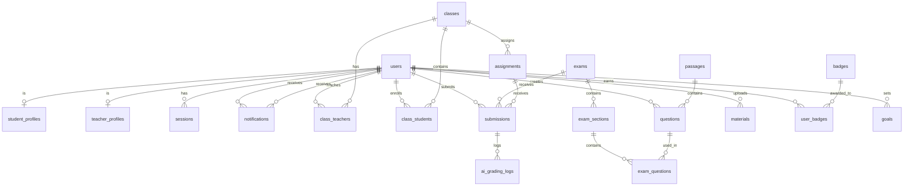

# 🗄️ Database Design - VSTEPRO

**Version**: 2.0.0  
**Last Updated**: December 21, 2024  
**Database**: PostgreSQL 14+ via Supabase

---

## 📋 Table of Contents

1. [Overview](#overview)
2. [Database Principles](#database-principles)
3. [Schema Summary](#schema-summary)
4. [Core Entities](#core-entities)
5. [Entity Relationship Diagram](#entity-relationship-diagram)
6. [Table Details](#table-details)
7. [Indexes & Constraints](#indexes--constraints)
8. [Data Types & Conventions](#data-types--conventions)
9. [Migration Strategy](#migration-strategy)
10. [Sample Data](#sample-data)
11. [Performance Considerations](#performance-considerations)

---

## 📊 Overview

### Database Information

```yaml
Engine: PostgreSQL 14+
Provider: Supabase
Character Set: UTF-8
Collation: vi_VN.UTF-8
Timezone: Asia/Ho_Chi_Minh
ORM: Prisma
Total Tables: 45+
Estimated Production Size: 10M+ rows
```

### Design Goals

✅ **Scalability**: Support 100,000+ users  
✅ **Performance**: Sub-100ms query times  
✅ **Flexibility**: JSONB for dynamic data  
✅ **Integrity**: Strong constraints & validations  
✅ **Auditability**: Track all changes  
✅ **Multi-tenancy**: Support multiple organizations (future)

---

## 🎯 Database Principles

### 1. Normalization

**Target**: Third Normal Form (3NF)

```sql
-- ✅ GOOD: Normalized
CREATE TABLE users (id UUID, name VARCHAR);
CREATE TABLE user_profiles (id UUID, user_id UUID, bio TEXT);

-- ❌ BAD: Denormalized
CREATE TABLE users (id UUID, name VARCHAR, bio TEXT, address TEXT, ...);
```

**Exceptions**: Denormalize for performance on read-heavy tables

### 2. UUID Primary Keys

**Why UUIDs over auto-increment?**
- ✅ Distributed system friendly
- ✅ No collision across databases
- ✅ Security (harder to enumerate)
- ✅ Merge databases easily

```sql
-- Standard primary key
id UUID PRIMARY KEY DEFAULT gen_random_uuid()
```

### 3. Soft Deletes

**Preserve data instead of hard delete:**

```sql
-- Add to all tables
deleted_at TIMESTAMP NULL

-- "Delete" query
UPDATE users SET deleted_at = NOW() WHERE id = ?

-- Active users only
SELECT * FROM users WHERE deleted_at IS NULL
```

### 4. Timestamps

**All tables must have:**

```sql
created_at TIMESTAMP NOT NULL DEFAULT NOW()
updated_at TIMESTAMP NOT NULL DEFAULT NOW()
```

**Auto-update trigger:**

```sql
CREATE TRIGGER update_timestamp
  BEFORE UPDATE ON table_name
  FOR EACH ROW EXECUTE FUNCTION update_updated_at_column();
```

### 5. JSONB for Flexibility

**Use JSONB for:**
- Dynamic attributes
- Configuration
- Metadata
- Arrays of objects

```sql
-- ✅ GOOD: Use JSONB for dynamic data
settings JSONB DEFAULT '{}'::jsonb

-- Example data
{
  "notifications": {
    "email": true,
    "push": false
  },
  "theme": "dark"
}
```

### 6. Enum-like Constraints

**Use CHECK constraints instead of ENUM type:**

```sql
-- ✅ GOOD: Easy to modify
role VARCHAR(20) NOT NULL CHECK (role IN ('student', 'teacher', 'admin', 'uploader'))

-- ❌ BAD: ENUM requires ALTER TYPE
role user_role_enum NOT NULL
```

---

## 📑 Schema Summary

### Tables by Category

| Category | Tables | Description |
|----------|--------|-------------|
| **Core** | 8 | Users, Auth, Sessions |
| **Student** | 6 | Student profiles, progress, results |
| **Teacher** | 5 | Teacher profiles, stats, reviews |
| **Class** | 8 | Classes, schedules, attendance |
| **Content** | 6 | Courses, modules, lessons, materials |
| **Exam** | 10 | Questions, exams, assignments, submissions |
| **Notification** | 4 | Notifications, preferences, templates |
| **Analytics** | 3 | Events, stats, reports |
| **Gamification** | 4 | Badges, goals, achievements |
| **Payment** | 3 | Transactions, subscriptions, invoices |
| **Total** | **57** | - |

### Storage Estimates

```yaml
Phase 1 (MVP - 1,000 users):
  Total Records: ~100,000
  Database Size: ~500 MB
  Backups: Daily

Phase 2 (Growth - 10,000 users):
  Total Records: ~1,000,000
  Database Size: ~5 GB
  Backups: Every 6 hours

Phase 3 (Scale - 100,000 users):
  Total Records: ~10,000,000
  Database Size: ~50 GB
  Backups: Every hour + Point-in-time recovery
```

---

## 🔑 Core Entities

### 1. Users (Người dùng)

**Primary table for all users in the system.**

```sql
CREATE TABLE users (
  id UUID PRIMARY KEY DEFAULT gen_random_uuid(),
  
  -- Basic Info
  email VARCHAR(255) NOT NULL UNIQUE,
  password VARCHAR(255) NOT NULL, -- bcrypt hashed
  full_name VARCHAR(100) NOT NULL,
  avatar VARCHAR(500),
  
  -- Role & Status
  role VARCHAR(20) NOT NULL DEFAULT 'student' 
    CHECK (role IN ('student', 'teacher', 'admin', 'uploader')),
  status VARCHAR(20) NOT NULL DEFAULT 'active'
    CHECK (status IN ('active', 'inactive', 'suspended', 'deleted')),
  
  -- Verification
  email_verified BOOLEAN DEFAULT FALSE,
  email_verified_at TIMESTAMP,
  
  -- Session Tracking
  last_login_at TIMESTAMP,
  last_login_ip INET,
  login_count INTEGER DEFAULT 0,
  
  -- Subscription
  subscription_tier VARCHAR(20) DEFAULT 'free'
    CHECK (subscription_tier IN ('free', 'premium', 'enterprise')),
  subscription_expires_at TIMESTAMP,
  
  -- Quota (Free Plan)
  daily_ai_writing_quota INTEGER DEFAULT 3,
  daily_ai_speaking_quota INTEGER DEFAULT 3,
  monthly_mock_tests_quota INTEGER DEFAULT 3,
  quota_reset_at TIMESTAMP DEFAULT CURRENT_DATE,
  
  -- Audit
  created_at TIMESTAMP NOT NULL DEFAULT NOW(),
  updated_at TIMESTAMP NOT NULL DEFAULT NOW(),
  deleted_at TIMESTAMP
);

-- Indexes
CREATE INDEX idx_users_email ON users(email);
CREATE INDEX idx_users_role ON users(role);
CREATE INDEX idx_users_status ON users(status);
CREATE INDEX idx_users_subscription ON users(subscription_tier);
CREATE INDEX idx_users_active ON users(created_at) WHERE deleted_at IS NULL;
```

**Business Rules:**
- Email must be unique (case-insensitive)
- Password must be hashed with bcrypt (min cost 10)
- Free users get daily quota reset at midnight
- Premium users have unlimited quota
- Suspended users cannot login
- Soft delete preserves historical data

---

### 2. Student Profiles

**Extended profile for students.**

```sql
CREATE TABLE student_profiles (
  id UUID PRIMARY KEY DEFAULT gen_random_uuid(),
  user_id UUID NOT NULL UNIQUE REFERENCES users(id) ON DELETE CASCADE,
  
  -- Student Info
  student_code VARCHAR(50) UNIQUE, -- SV-2024-00123
  enrollment_date DATE NOT NULL DEFAULT CURRENT_DATE,
  
  -- Learning Status
  current_level VARCHAR(5) DEFAULT 'A2'
    CHECK (current_level IN ('A2', 'B1', 'B2', 'C1')),
  target_level VARCHAR(5) DEFAULT 'B2'
    CHECK (target_level IN ('A2', 'B1', 'B2', 'C1')),
  target_date DATE,
  
  -- Personal Details
  date_of_birth DATE,
  gender VARCHAR(10) CHECK (gender IN ('male', 'female', 'other')),
  phone VARCHAR(20),
  address TEXT,
  city VARCHAR(100),
  
  -- Education & Purpose
  education VARCHAR(200),
  major VARCHAR(100),
  occupation VARCHAR(100),
  purpose TEXT, -- Why learning VSTEP?
  
  -- Preferences
  preferred_learning_time VARCHAR(50), -- morning, afternoon, evening
  learning_style VARCHAR(50), -- visual, auditory, kinesthetic
  
  -- Emergency Contact
  emergency_contact_name VARCHAR(100),
  emergency_contact_phone VARCHAR(20),
  
  -- Audit
  created_at TIMESTAMP NOT NULL DEFAULT NOW(),
  updated_at TIMESTAMP NOT NULL DEFAULT NOW()
);

-- Indexes
CREATE INDEX idx_student_profiles_user ON student_profiles(user_id);
CREATE INDEX idx_student_profiles_level ON student_profiles(current_level);
CREATE UNIQUE INDEX idx_student_code ON student_profiles(student_code) 
  WHERE student_code IS NOT NULL;
```

**Auto-generated student_code:**

```sql
-- Trigger to generate student code
CREATE OR REPLACE FUNCTION generate_student_code()
RETURNS TRIGGER AS $$
BEGIN
  IF NEW.student_code IS NULL THEN
    NEW.student_code := 'SV-' || 
                        TO_CHAR(NEW.created_at, 'YYYY') || '-' ||
                        LPAD(nextval('student_code_seq')::TEXT, 5, '0');
  END IF;
  RETURN NEW;
END;
$$ LANGUAGE plpgsql;

CREATE TRIGGER set_student_code
  BEFORE INSERT ON student_profiles
  FOR EACH ROW EXECUTE FUNCTION generate_student_code();
```

---

### 3. Teacher Profiles

**Extended profile for teachers.**

```sql
CREATE TABLE teacher_profiles (
  id UUID PRIMARY KEY DEFAULT gen_random_uuid(),
  user_id UUID NOT NULL UNIQUE REFERENCES users(id) ON DELETE CASCADE,
  
  -- Teacher Info
  teacher_code VARCHAR(50) UNIQUE, -- GV-2023-00045
  title VARCHAR(20), -- TS., ThS., GV.
  joined_date DATE NOT NULL DEFAULT CURRENT_DATE,
  
  -- Employment
  employment_type VARCHAR(20) NOT NULL DEFAULT 'full_time'
    CHECK (employment_type IN ('full_time', 'part_time', 'contract')),
  status VARCHAR(20) DEFAULT 'active'
    CHECK (status IN ('active', 'inactive', 'on_leave')),
  
  -- Qualifications
  education JSONB, -- [{"degree": "PhD", "major": "TESOL", "year": 2015}]
  certifications JSONB, -- [{"name": "IELTS", "score": 8.5}]
  experience_years INTEGER DEFAULT 0,
  
  -- Specialties
  specialties JSONB, -- ["writing", "speaking"]
  levels_taught JSONB, -- ["B1", "B2", "C1"]
  
  -- Professional Info
  bio TEXT,
  achievements JSONB,
  publications JSONB,
  linkedin_url VARCHAR(255),
  website_url VARCHAR(255),
  
  -- Capacity
  max_hours_per_week INTEGER DEFAULT 40,
  max_classes INTEGER DEFAULT 5,
  max_students_per_class INTEGER DEFAULT 30,
  
  -- Audit
  created_at TIMESTAMP NOT NULL DEFAULT NOW(),
  updated_at TIMESTAMP NOT NULL DEFAULT NOW()
);

-- Indexes
CREATE INDEX idx_teacher_profiles_user ON teacher_profiles(user_id);
CREATE INDEX idx_teacher_status ON teacher_profiles(status);
CREATE INDEX idx_teacher_specialties ON teacher_profiles USING GIN (specialties);
```

---

### 4. Classes

**Class/Course instances.**

```sql
CREATE TABLE classes (
  id UUID PRIMARY KEY DEFAULT gen_random_uuid(),
  
  -- Basic Info
  code VARCHAR(50) NOT NULL UNIQUE, -- VST-B2-2024-15
  name VARCHAR(200) NOT NULL,
  description TEXT,
  
  -- Classification
  level VARCHAR(5) NOT NULL CHECK (level IN ('A2', 'B1', 'B2', 'C1')),
  class_type VARCHAR(20) DEFAULT 'regular'
    CHECK (class_type IN ('regular', 'intensive', 'online', 'hybrid')),
  
  -- Capacity
  max_students INTEGER NOT NULL DEFAULT 30,
  min_students INTEGER DEFAULT 5,
  enrolled_count INTEGER DEFAULT 0,
  
  -- Schedule
  start_date DATE NOT NULL,
  end_date DATE NOT NULL,
  duration_weeks INTEGER,
  total_sessions INTEGER DEFAULT 0,
  
  -- Status
  status VARCHAR(20) NOT NULL DEFAULT 'upcoming'
    CHECK (status IN ('upcoming', 'active', 'completed', 'cancelled', 'archived')),
  
  -- Settings
  is_public BOOLEAN DEFAULT TRUE,
  require_approval BOOLEAN DEFAULT FALSE,
  allow_self_enroll BOOLEAN DEFAULT TRUE,
  
  -- Media
  thumbnail VARCHAR(500),
  syllabus_url VARCHAR(500),
  
  -- Pricing (optional)
  price DECIMAL(10,2) DEFAULT 0,
  currency VARCHAR(3) DEFAULT 'VND',
  
  -- Audit
  created_by UUID REFERENCES users(id) ON DELETE SET NULL,
  created_at TIMESTAMP NOT NULL DEFAULT NOW(),
  updated_at TIMESTAMP NOT NULL DEFAULT NOW(),
  archived_at TIMESTAMP,
  
  -- Constraints
  CHECK (end_date > start_date),
  CHECK (enrolled_count <= max_students)
);

-- Indexes
CREATE INDEX idx_classes_code ON classes(code);
CREATE INDEX idx_classes_level ON classes(level);
CREATE INDEX idx_classes_status ON classes(status);
CREATE INDEX idx_classes_dates ON classes(start_date, end_date);
CREATE INDEX idx_classes_active ON classes(status) WHERE status = 'active';
```

---

### 5. Exercises & Questions

**Question bank for all skills.**

```sql
CREATE TABLE questions (
  id UUID PRIMARY KEY DEFAULT gen_random_uuid(),
  
  -- Classification
  skill VARCHAR(20) NOT NULL 
    CHECK (skill IN ('reading', 'listening', 'writing', 'speaking')),
  level VARCHAR(5) NOT NULL CHECK (level IN ('A2', 'B1', 'B2', 'C1')),
  question_type VARCHAR(50) NOT NULL,
  
  -- Content (skill-dependent)
  question_text TEXT,
  passage_id UUID REFERENCES passages(id) ON DELETE SET NULL,
  audio_url VARCHAR(500),
  image_url VARCHAR(500),
  
  -- Options (for multiple choice, matching, etc.)
  options JSONB, -- [{"id": "A", "text": "Option A"}, ...]
  
  -- Answers
  correct_answer TEXT, -- Single answer (e.g., "A")
  correct_answers JSONB, -- Multiple answers (e.g., ["A", "C"])
  answer_explanation TEXT,
  
  -- Scoring
  points DECIMAL(4,1) DEFAULT 1.0,
  difficulty VARCHAR(20) DEFAULT 'medium'
    CHECK (difficulty IN ('easy', 'medium', 'hard')),
  
  -- Metadata
  tags JSONB, -- ["grammar", "present-perfect"]
  order_number INTEGER,
  time_limit INTEGER, -- seconds (for speaking/writing)
  word_limit INTEGER, -- for writing
  
  -- Usage Stats
  times_used INTEGER DEFAULT 0,
  average_score DECIMAL(5,2),
  
  -- Status
  status VARCHAR(20) DEFAULT 'draft'
    CHECK (status IN ('draft', 'review', 'active', 'archived')),
  
  -- Audit
  created_by UUID NOT NULL REFERENCES users(id) ON DELETE CASCADE,
  reviewed_by UUID REFERENCES users(id) ON DELETE SET NULL,
  created_at TIMESTAMP NOT NULL DEFAULT NOW(),
  updated_at TIMESTAMP NOT NULL DEFAULT NOW()
);

-- Indexes
CREATE INDEX idx_questions_skill ON questions(skill);
CREATE INDEX idx_questions_level ON questions(level);
CREATE INDEX idx_questions_type ON questions(question_type);
CREATE INDEX idx_questions_status ON questions(status);
CREATE INDEX idx_questions_tags ON questions USING GIN (tags);
```

**Question Types by Skill:**

```typescript
const QUESTION_TYPES = {
  reading: [
    'multiple_choice',      // Chọn 1 đáp án
    'true_false_ng',        // True/False/Not Given
    'matching_headings',    // Nối heading với đoạn
    'matching_information', // Nối thông tin
    'sentence_completion',  // Hoàn thành câu
    'summary_completion',   // Hoàn thành tóm tắt
  ],
  listening: [
    'multiple_choice',
    'matching',
    'form_completion',
    'note_completion',
    'table_completion',
  ],
  writing: [
    'task1_graph',          // Mô tả biểu đồ
    'task1_process',        // Mô tả quy trình
    'task2_essay',          // Bài luận
  ],
  speaking: [
    'part1_interview',      // Phỏng vấn cá nhân
    'part2_long_turn',      // Nói dài về topic
    'part3_discussion',     // Thảo luận
  ],
} as const;
```

---

### 6. Passages (Reading/Listening)

**Text passages for Reading and Listening.**

```sql
CREATE TABLE passages (
  id UUID PRIMARY KEY DEFAULT gen_random_uuid(),
  
  -- Classification
  skill VARCHAR(20) NOT NULL CHECK (skill IN ('reading', 'listening')),
  level VARCHAR(5) NOT NULL CHECK (level IN ('A2', 'B1', 'B2', 'C1')),
  
  -- Content
  title VARCHAR(200),
  content TEXT NOT NULL,
  audio_url VARCHAR(500), -- for listening
  audio_duration INTEGER, -- seconds
  
  -- Metadata
  topic VARCHAR(100),
  word_count INTEGER,
  reading_time INTEGER, -- estimated seconds
  difficulty VARCHAR(20) DEFAULT 'medium',
  
  -- Source
  source VARCHAR(200),
  source_url VARCHAR(500),
  
  -- Status
  status VARCHAR(20) DEFAULT 'active',
  
  -- Audit
  created_by UUID NOT NULL REFERENCES users(id),
  created_at TIMESTAMP NOT NULL DEFAULT NOW(),
  updated_at TIMESTAMP NOT NULL DEFAULT NOW()
);

-- Indexes
CREATE INDEX idx_passages_skill ON passages(skill);
CREATE INDEX idx_passages_level ON passages(level);
CREATE INDEX idx_passages_status ON passages(status);
```

---

### 7. Exams

**Full test papers.**

```sql
CREATE TABLE exams (
  id UUID PRIMARY KEY DEFAULT gen_random_uuid(),
  
  -- Basic Info
  title VARCHAR(200) NOT NULL,
  code VARCHAR(50) UNIQUE, -- VSTEP-2024-001
  description TEXT,
  
  -- Type & Level
  exam_type VARCHAR(20) NOT NULL DEFAULT 'practice'
    CHECK (exam_type IN ('practice', 'mock_test', 'full_test', 'assignment')),
  level VARCHAR(5) NOT NULL CHECK (level IN ('A2', 'B1', 'B2', 'C1')),
  
  -- Structure
  skills JSONB NOT NULL, -- ["reading", "listening", "writing", "speaking"]
  total_questions INTEGER DEFAULT 0,
  total_points DECIMAL(6,1) DEFAULT 0,
  
  -- Sections (calculated from exam_sections)
  reading_questions INTEGER DEFAULT 0,
  listening_questions INTEGER DEFAULT 0,
  writing_tasks INTEGER DEFAULT 0,
  speaking_parts INTEGER DEFAULT 0,
  
  -- Timing
  total_duration INTEGER, -- minutes
  reading_duration INTEGER,
  listening_duration INTEGER,
  writing_duration INTEGER,
  speaking_duration INTEGER,
  
  -- Scoring
  passing_score DECIMAL(6,1),
  score_to_level JSONB, -- {"0-1": "A2", "1-2": "B1", ...}
  
  -- Settings
  allow_review BOOLEAN DEFAULT TRUE,
  shuffle_questions BOOLEAN DEFAULT FALSE,
  show_answers BOOLEAN DEFAULT TRUE,
  
  -- Status
  status VARCHAR(20) DEFAULT 'draft'
    CHECK (status IN ('draft', 'review', 'published', 'archived')),
  
  -- Audit
  created_by UUID NOT NULL REFERENCES users(id),
  reviewed_by UUID REFERENCES users(id),
  published_at TIMESTAMP,
  created_at TIMESTAMP NOT NULL DEFAULT NOW(),
  updated_at TIMESTAMP NOT NULL DEFAULT NOW()
);

-- Indexes
CREATE INDEX idx_exams_code ON exams(code);
CREATE INDEX idx_exams_type ON exams(exam_type);
CREATE INDEX idx_exams_level ON exams(level);
CREATE INDEX idx_exams_status ON exams(status);
```

---

### 8. Exam Sections

**Parts/Sections of an exam.**

```sql
CREATE TABLE exam_sections (
  id UUID PRIMARY KEY DEFAULT gen_random_uuid(),
  exam_id UUID NOT NULL REFERENCES exams(id) ON DELETE CASCADE,
  
  -- Section Info
  skill VARCHAR(20) NOT NULL,
  part_number INTEGER NOT NULL,
  title VARCHAR(200) NOT NULL,
  instructions TEXT,
  
  -- Content
  passage_id UUID REFERENCES passages(id),
  
  -- Structure
  total_questions INTEGER DEFAULT 0,
  order_number INTEGER NOT NULL,
  
  -- Timing
  duration INTEGER, -- minutes
  
  -- Audit
  created_at TIMESTAMP NOT NULL DEFAULT NOW(),
  updated_at TIMESTAMP NOT NULL DEFAULT NOW(),
  
  -- Constraints
  UNIQUE (exam_id, skill, part_number)
);

-- Indexes
CREATE INDEX idx_exam_sections_exam ON exam_sections(exam_id);
CREATE INDEX idx_exam_sections_skill ON exam_sections(skill);
```

---

### 9. Exam Questions

**Junction table linking questions to exams.**

```sql
CREATE TABLE exam_questions (
  id UUID PRIMARY KEY DEFAULT gen_random_uuid(),
  exam_id UUID NOT NULL REFERENCES exams(id) ON DELETE CASCADE,
  section_id UUID NOT NULL REFERENCES exam_sections(id) ON DELETE CASCADE,
  question_id UUID NOT NULL REFERENCES questions(id) ON DELETE CASCADE,
  
  -- Position
  order_number INTEGER NOT NULL,
  
  -- Override (optional)
  points DECIMAL(4,1), -- Override default points
  
  -- Audit
  created_at TIMESTAMP NOT NULL DEFAULT NOW(),
  
  -- Constraints
  UNIQUE (exam_id, question_id),
  UNIQUE (section_id, order_number)
);

-- Indexes
CREATE INDEX idx_exam_questions_exam ON exam_questions(exam_id);
CREATE INDEX idx_exam_questions_section ON exam_questions(section_id);
CREATE INDEX idx_exam_questions_question ON exam_questions(question_id);
```

---

### 10. Submissions

**User test attempts and submissions.**

```sql
CREATE TABLE submissions (
  id UUID PRIMARY KEY DEFAULT gen_random_uuid(),
  
  -- References
  exam_id UUID NOT NULL REFERENCES exams(id) ON DELETE CASCADE,
  student_id UUID NOT NULL REFERENCES users(id) ON DELETE CASCADE,
  assignment_id UUID REFERENCES assignments(id) ON DELETE SET NULL,
  class_id UUID REFERENCES classes(id) ON DELETE SET NULL,
  
  -- Attempt Info
  attempt_number INTEGER DEFAULT 1,
  
  -- Answers (JSONB)
  answers JSONB NOT NULL,
  /* Example structure:
  {
    "reading": {
      "q1": "A",
      "q2": ["B", "C"],
      "q3": "answer text"
    },
    "writing": {
      "task1": "essay content...",
      "task2": "essay content..."
    },
    "speaking": {
      "part1": "audio_url",
      "part2": "audio_url"
    }
  }
  */
  
  -- Timing
  started_at TIMESTAMP NOT NULL,
  submitted_at TIMESTAMP,
  time_spent INTEGER, -- seconds
  
  -- Status
  status VARCHAR(20) DEFAULT 'in_progress'
    CHECK (status IN ('in_progress', 'submitted', 'graded', 'expired')),
  
  -- Scoring (by skill)
  reading_score DECIMAL(3,1),
  listening_score DECIMAL(3,1),
  writing_score DECIMAL(3,1),
  speaking_score DECIMAL(3,1),
  
  -- Overall Score
  total_score DECIMAL(3,1),
  overall_band DECIMAL(2,1), -- 0.0 to 4.0
  level_achieved VARCHAR(5), -- A2, B1, B2, C1
  
  -- Auto vs Manual Grading
  auto_graded_at TIMESTAMP,
  manually_graded_at TIMESTAMP,
  graded_by UUID REFERENCES users(id),
  
  -- Pass/Fail
  passed BOOLEAN,
  percentage DECIMAL(5,2),
  
  -- Feedback
  feedback TEXT,
  teacher_comments TEXT,
  
  -- Audit
  created_at TIMESTAMP NOT NULL DEFAULT NOW(),
  updated_at TIMESTAMP NOT NULL DEFAULT NOW(),
  
  -- Constraints
  UNIQUE (exam_id, student_id, attempt_number)
);

-- Indexes
CREATE INDEX idx_submissions_exam ON submissions(exam_id);
CREATE INDEX idx_submissions_student ON submissions(student_id);
CREATE INDEX idx_submissions_assignment ON submissions(assignment_id);
CREATE INDEX idx_submissions_status ON submissions(status);
CREATE INDEX idx_submissions_submitted ON submissions(submitted_at);
```

---

### 11. AI Grading Logs

**Track AI grading for Writing/Speaking.**

```sql
CREATE TABLE ai_grading_logs (
  id UUID PRIMARY KEY DEFAULT gen_random_uuid(),
  submission_id UUID NOT NULL REFERENCES submissions(id) ON DELETE CASCADE,
  
  -- Request
  skill VARCHAR(20) NOT NULL CHECK (skill IN ('writing', 'speaking')),
  task_type VARCHAR(50), -- task1_graph, part2_long_turn
  prompt TEXT NOT NULL,
  user_content TEXT NOT NULL,
  
  -- AI Service
  ai_provider VARCHAR(50) DEFAULT 'openai',
  ai_model VARCHAR(50) DEFAULT 'gpt-4',
  
  -- Response
  raw_response JSONB,
  score DECIMAL(3,1),
  band DECIMAL(2,1),
  
  -- Criteria Scores (Writing/Speaking)
  task_achievement DECIMAL(3,1),
  coherence_cohesion DECIMAL(3,1),
  lexical_resource DECIMAL(3,1),
  grammatical_range DECIMAL(3,1),
  pronunciation DECIMAL(3,1), -- speaking only
  fluency DECIMAL(3,1), -- speaking only
  
  -- Feedback
  feedback TEXT,
  strengths JSONB, -- ["Good use of connectors", ...]
  weaknesses JSONB, -- ["Inconsistent tense usage", ...]
  suggestions JSONB, -- ["Practice more..."]
  
  -- Metadata
  tokens_used INTEGER,
  processing_time INTEGER, -- milliseconds
  cost DECIMAL(10,6), -- USD
  
  -- Status
  status VARCHAR(20) DEFAULT 'success'
    CHECK (status IN ('success', 'failed', 'timeout', 'error')),
  error_message TEXT,
  
  -- Audit
  created_at TIMESTAMP NOT NULL DEFAULT NOW()
);

-- Indexes
CREATE INDEX idx_ai_logs_submission ON ai_grading_logs(submission_id);
CREATE INDEX idx_ai_logs_skill ON ai_grading_logs(skill);
CREATE INDEX idx_ai_logs_status ON ai_grading_logs(status);
CREATE INDEX idx_ai_logs_created ON ai_grading_logs(created_at);
```

---

### 12. Materials

**Learning materials (documents, videos, etc.).**

```sql
CREATE TABLE materials (
  id UUID PRIMARY KEY DEFAULT gen_random_uuid(),
  
  -- Basic Info
  title VARCHAR(200) NOT NULL,
  description TEXT,
  
  -- Classification
  material_type VARCHAR(20) NOT NULL
    CHECK (material_type IN ('textbook', 'lecture', 'exercise', 'video', 'audio', 'document')),
  category VARCHAR(50), -- Grammar, Vocabulary, Practice
  level VARCHAR(5) CHECK (level IN ('A2', 'B1', 'B2', 'C1')),
  skills JSONB, -- ["reading", "writing"]
  
  -- File Info
  file_type VARCHAR(20), -- pdf, docx, mp4, mp3
  file_size BIGINT, -- bytes
  file_url VARCHAR(500),
  external_url VARCHAR(500), -- Google Drive, YouTube
  
  -- Preview
  thumbnail VARCHAR(500),
  preview_url VARCHAR(500),
  
  -- Metadata
  author VARCHAR(100),
  publisher VARCHAR(100),
  publish_date DATE,
  tags JSONB,
  
  -- Access Control
  is_public BOOLEAN DEFAULT FALSE,
  require_subscription BOOLEAN DEFAULT FALSE,
  allowed_roles JSONB, -- ["student", "teacher"]
  
  -- Usage Stats
  view_count INTEGER DEFAULT 0,
  download_count INTEGER DEFAULT 0,
  
  -- Status
  status VARCHAR(20) DEFAULT 'pending'
    CHECK (status IN ('pending', 'approved', 'rejected', 'archived')),
  
  -- Audit
  uploaded_by UUID NOT NULL REFERENCES users(id),
  approved_by UUID REFERENCES users(id),
  approved_at TIMESTAMP,
  created_at TIMESTAMP NOT NULL DEFAULT NOW(),
  updated_at TIMESTAMP NOT NULL DEFAULT NOW()
);

-- Indexes
CREATE INDEX idx_materials_type ON materials(material_type);
CREATE INDEX idx_materials_category ON materials(category);
CREATE INDEX idx_materials_level ON materials(level);
CREATE INDEX idx_materials_status ON materials(status);
CREATE INDEX idx_materials_uploaded ON materials(uploaded_by);
CREATE INDEX idx_materials_tags ON materials USING GIN (tags);
```

---

### 13. Notifications

**User notifications system.**

```sql
CREATE TABLE notifications (
  id UUID PRIMARY KEY DEFAULT gen_random_uuid(),
  user_id UUID NOT NULL REFERENCES users(id) ON DELETE CASCADE,
  
  -- Content
  type VARCHAR(50) NOT NULL,
  /* Types:
    - assignment_new
    - assignment_due_soon
    - submission_graded
    - class_starting
    - achievement_earned
    - system_announcement
  */
  
  category VARCHAR(20) NOT NULL
    CHECK (category IN ('assignment', 'class', 'achievement', 'system', 'social')),
  
  title VARCHAR(200) NOT NULL,
  message TEXT NOT NULL,
  
  -- Action
  action_url VARCHAR(500),
  action_label VARCHAR(50),
  
  -- Additional Data
  data JSONB,
  /* Example:
  {
    "assignment_id": "uuid",
    "class_name": "B2 Morning",
    "due_date": "2024-12-25"
  }
  */
  
  -- Status
  is_read BOOLEAN DEFAULT FALSE,
  read_at TIMESTAMP,
  
  -- Delivery
  delivered_via JSONB, -- ["web", "email", "push"]
  email_sent_at TIMESTAMP,
  push_sent_at TIMESTAMP,
  
  -- Priority
  priority VARCHAR(10) DEFAULT 'normal'
    CHECK (priority IN ('low', 'normal', 'high', 'urgent')),
  
  -- Expiry
  expires_at TIMESTAMP,
  
  -- Audit
  created_at TIMESTAMP NOT NULL DEFAULT NOW(),
  deleted_at TIMESTAMP
);

-- Indexes
CREATE INDEX idx_notifications_user ON notifications(user_id);
CREATE INDEX idx_notifications_type ON notifications(type);
CREATE INDEX idx_notifications_category ON notifications(category);
CREATE INDEX idx_notifications_read ON notifications(is_read);
CREATE INDEX idx_notifications_created ON notifications(created_at DESC);
CREATE INDEX idx_notifications_unread ON notifications(user_id, is_read) 
  WHERE is_read = FALSE AND deleted_at IS NULL;
```

---

### 14. Badges (Gamification)

**Achievement badges.**

```sql
CREATE TABLE badges (
  id UUID PRIMARY KEY DEFAULT gen_random_uuid(),
  
  -- Basic Info
  code VARCHAR(50) NOT NULL UNIQUE,
  name VARCHAR(100) NOT NULL,
  description TEXT,
  
  -- Visual
  icon VARCHAR(100), -- lucide icon name
  color VARCHAR(20), -- hex color
  image_url VARCHAR(500),
  
  -- Category
  category VARCHAR(50) NOT NULL
    CHECK (category IN ('practice', 'achievement', 'streak', 'score', 'special')),
  
  -- Unlock Criteria
  unlock_type VARCHAR(50) NOT NULL,
  /* Types:
    - test_count: Complete X tests
    - perfect_score: Get 100% on test
    - streak_days: X days in a row
    - level_achieved: Reach level X
    - speed: Complete test in X minutes
  */
  
  unlock_criteria JSONB NOT NULL,
  /* Example:
  {
    "count": 10,
    "skill": "reading",
    "score": 4.0
  }
  */
  
  -- Rarity
  rarity VARCHAR(20) DEFAULT 'common'
    CHECK (rarity IN ('common', 'rare', 'epic', 'legendary')),
  
  -- Points
  points INTEGER DEFAULT 0,
  
  -- Status
  is_active BOOLEAN DEFAULT TRUE,
  
  -- Audit
  created_at TIMESTAMP NOT NULL DEFAULT NOW(),
  updated_at TIMESTAMP NOT NULL DEFAULT NOW()
);

-- Indexes
CREATE INDEX idx_badges_code ON badges(code);
CREATE INDEX idx_badges_category ON badges(category);
CREATE INDEX idx_badges_rarity ON badges(rarity);
```

**User Badges (Junction):**

```sql
CREATE TABLE user_badges (
  id UUID PRIMARY KEY DEFAULT gen_random_uuid(),
  user_id UUID NOT NULL REFERENCES users(id) ON DELETE CASCADE,
  badge_id UUID NOT NULL REFERENCES badges(id) ON DELETE CASCADE,
  
  -- Unlock Info
  unlocked_at TIMESTAMP NOT NULL DEFAULT NOW(),
  unlocked_by VARCHAR(50), -- 'system', 'manual', 'event'
  
  -- Display
  is_showcased BOOLEAN DEFAULT FALSE,
  showcase_order INTEGER,
  
  -- Audit
  created_at TIMESTAMP NOT NULL DEFAULT NOW(),
  
  -- Constraints
  UNIQUE (user_id, badge_id)
);

-- Indexes
CREATE INDEX idx_user_badges_user ON user_badges(user_id);
CREATE INDEX idx_user_badges_badge ON user_badges(badge_id);
CREATE INDEX idx_user_badges_showcased ON user_badges(user_id, is_showcased)
  WHERE is_showcased = TRUE;
```

---

## 🔗 Entity Relationship Diagram

### Core Relationships (Mermaid)



---

## 📐 Indexes & Constraints

### Index Strategy

**1. Primary Keys (Automatic)**
```sql
-- All tables have UUID primary key with index
id UUID PRIMARY KEY DEFAULT gen_random_uuid()
```

**2. Foreign Keys (Always Index)**
```sql
-- Index all foreign key columns
CREATE INDEX idx_submissions_student ON submissions(student_id);
CREATE INDEX idx_submissions_exam ON submissions(exam_id);
```

**3. Query Filters (Frequently Used WHERE)**
```sql
-- Index columns used in WHERE clauses
CREATE INDEX idx_users_role ON users(role);
CREATE INDEX idx_users_status ON users(status);
```

**4. Sort Columns (ORDER BY)**
```sql
-- Index columns used in ORDER BY
CREATE INDEX idx_submissions_submitted ON submissions(submitted_at DESC);
CREATE INDEX idx_notifications_created ON notifications(created_at DESC);
```

**5. Composite Indexes (Multiple Columns)**
```sql
-- For queries filtering on multiple columns
CREATE INDEX idx_questions_skill_level ON questions(skill, level);
CREATE INDEX idx_classes_status_date ON classes(status, start_date);
```

**6. Partial Indexes (Filtered)**
```sql
-- Index only active records
CREATE INDEX idx_users_active ON users(email) 
  WHERE deleted_at IS NULL;

CREATE INDEX idx_classes_active ON classes(code) 
  WHERE status = 'active';
```

**7. JSONB Indexes (GIN)**
```sql
-- For JSONB columns with array/object searches
CREATE INDEX idx_questions_tags ON questions USING GIN (tags);
CREATE INDEX idx_materials_skills ON materials USING GIN (skills);
```

### Constraint Strategy

**1. NOT NULL (Required Fields)**
```sql
email VARCHAR(255) NOT NULL
password VARCHAR(255) NOT NULL
created_at TIMESTAMP NOT NULL DEFAULT NOW()
```

**2. UNIQUE (No Duplicates)**
```sql
email VARCHAR(255) NOT NULL UNIQUE
student_code VARCHAR(50) UNIQUE
(exam_id, student_id, attempt_number) UNIQUE
```

**3. CHECK (Value Validation)**
```sql
role VARCHAR(20) CHECK (role IN ('student', 'teacher', 'admin', 'uploader'))
score DECIMAL(3,1) CHECK (score >= 0 AND score <= 4)
end_date DATE CHECK (end_date > start_date)
```

**4. FOREIGN KEY (Referential Integrity)**
```sql
-- CASCADE: Delete children when parent deleted
user_id UUID REFERENCES users(id) ON DELETE CASCADE

-- SET NULL: Set NULL when parent deleted
created_by UUID REFERENCES users(id) ON DELETE SET NULL

-- RESTRICT: Prevent deletion if children exist
class_id UUID REFERENCES classes(id) ON DELETE RESTRICT
```

---

## 🎨 Data Types & Conventions

### Column Naming

```sql
-- ✅ GOOD: Clear, descriptive, snake_case
user_id, created_at, email_verified, total_score

-- ❌ BAD: Abbreviations, camelCase
uid, createdAt, emailVer, totScore
```

### Data Types Reference

| Type | Use For | Example |
|------|---------|---------|
| `UUID` | Primary & foreign keys | `id`, `user_id` |
| `VARCHAR(n)` | Short text | `email`, `name`, `code` |
| `TEXT` | Long text | `description`, `content` |
| `INTEGER` | Whole numbers | `age`, `count` |
| `DECIMAL(p,s)` | Precise decimals | `score`, `price` |
| `BOOLEAN` | True/false | `is_active`, `email_verified` |
| `DATE` | Date only | `birth_date`, `start_date` |
| `TIMESTAMP` | Date + time | `created_at`, `submitted_at` |
| `JSONB` | Structured data | `settings`, `answers` |
| `INET` | IP address | `last_login_ip` |

### JSONB Usage Examples

**1. Settings/Preferences:**
```json
{
  "notifications": {
    "email": true,
    "push": false,
    "sms": false
  },
  "theme": "dark",
  "language": "vi"
}
```

**2. Array of Objects:**
```json
{
  "education": [
    {"degree": "PhD", "major": "TESOL", "year": 2015},
    {"degree": "MA", "major": "Linguistics", "year": 2010}
  ]
}
```

**3. Question Answers:**
```json
{
  "reading": {
    "q1": "A",
    "q2": ["B", "C", "E"],
    "q3": "urban development"
  },
  "writing": {
    "task1": "The graph shows...",
    "task2": "In recent years..."
  }
}
```

---

## 🔄 Migration Strategy

### Migration Files Structure

```
prisma/migrations/
├── 20241221000001_init/
│   └── migration.sql
├── 20241221000002_add_users/
│   └── migration.sql
├── 20241221000003_add_student_profiles/
│   └── migration.sql
└── ...
```

### Migration Order (Phase 1)

```sql
-- 1. Extensions
CREATE EXTENSION IF NOT EXISTS "uuid-ossp";
CREATE EXTENSION IF NOT EXISTS "pgcrypto";

-- 2. Core Tables
CREATE TABLE users;
CREATE TABLE user_profiles;

-- 3. Role Tables
CREATE TABLE student_profiles;
CREATE TABLE teacher_profiles;

-- 4. Content Tables
CREATE TABLE passages;
CREATE TABLE questions;
CREATE TABLE materials;

-- 5. Exam Tables
CREATE TABLE exams;
CREATE TABLE exam_sections;
CREATE TABLE exam_questions;

-- 6. Class Tables
CREATE TABLE classes;
CREATE TABLE class_teachers;
CREATE TABLE class_students;

-- 7. Assignment Tables
CREATE TABLE assignments;
CREATE TABLE submissions;
CREATE TABLE ai_grading_logs;

-- 8. Support Tables
CREATE TABLE notifications;
CREATE TABLE badges;
CREATE TABLE user_badges;

-- 9. Indexes (after data)
CREATE INDEX ...;

-- 10. Triggers
CREATE TRIGGER ...;
```

### Safe Migration Practices

```sql
-- ✅ GOOD: Add column with default
ALTER TABLE users ADD COLUMN subscription_tier VARCHAR(20) DEFAULT 'free';

-- ✅ GOOD: Add nullable column first, then make NOT NULL
ALTER TABLE users ADD COLUMN phone VARCHAR(20);
-- Update existing rows
UPDATE users SET phone = '' WHERE phone IS NULL;
-- Now add constraint
ALTER TABLE users ALTER COLUMN phone SET NOT NULL;

-- ❌ BAD: Add NOT NULL column without default
ALTER TABLE users ADD COLUMN phone VARCHAR(20) NOT NULL;

-- ✅ GOOD: Rename with transaction
BEGIN;
ALTER TABLE old_table RENAME TO new_table;
-- Test queries
SELECT * FROM new_table LIMIT 1;
COMMIT;

-- ✅ GOOD: Drop column in stages
-- Step 1: Remove from code
-- Step 2: Rename column (keep data)
ALTER TABLE users RENAME COLUMN old_col TO old_col_deprecated;
-- Step 3: Monitor for issues
-- Step 4: Drop after confirmed safe
ALTER TABLE users DROP COLUMN old_col_deprecated;
```

---

## 📊 Sample Data

### Seed Data for Development

```sql
-- Sample Users
INSERT INTO users (id, email, password, full_name, role) VALUES
  ('00000000-0000-0000-0000-000000000001', 'admin@vstepro.com', '$2b$10$...', 'Admin User', 'admin'),
  ('00000000-0000-0000-0000-000000000002', 'teacher@vstepro.com', '$2b$10$...', 'Teacher One', 'teacher'),
  ('00000000-0000-0000-0000-000000000003', 'student@vstepro.com', '$2b$10$...', 'Student One', 'student');

-- Sample Class
INSERT INTO classes (id, code, name, level, status, start_date, end_date) VALUES
  ('00000000-0000-0000-0000-000000000101', 'VST-B2-2024-01', 'VSTEP B2 Morning Class', 'B2', 'active', '2024-01-01', '2024-06-30');

-- Sample Questions (Reading)
INSERT INTO questions (id, skill, level, question_type, question_text, options, correct_answer, created_by) VALUES
  ('00000000-0000-0000-0000-000000000201', 
   'reading', 
   'B2', 
   'multiple_choice',
   'What is the main idea of the passage?',
   '[{"id":"A","text":"Option A"},{"id":"B","text":"Option B"},{"id":"C","text":"Option C"},{"id":"D","text":"Option D"}]'::jsonb,
   'B',
   '00000000-0000-0000-0000-000000000001');

-- Sample Badges
INSERT INTO badges (code, name, description, category, unlock_type, unlock_criteria, rarity) VALUES
  ('first_test', 'First Steps', 'Complete your first test', 'achievement', 'test_count', '{"count": 1}'::jsonb, 'common'),
  ('perfect_score', 'Perfect!', 'Get 100% on any test', 'score', 'perfect_score', '{"score": 4.0}'::jsonb, 'epic'),
  ('streak_7', '7-Day Streak', 'Study for 7 days in a row', 'streak', 'streak_days', '{"days": 7}'::jsonb, 'rare');
```

---

## ⚡ Performance Considerations

### Query Optimization

**1. Use EXPLAIN ANALYZE**
```sql
EXPLAIN ANALYZE
SELECT s.*, u.full_name, e.title
FROM submissions s
JOIN users u ON s.student_id = u.id
JOIN exams e ON s.exam_id = e.id
WHERE s.status = 'graded'
ORDER BY s.submitted_at DESC
LIMIT 20;
```

**2. Avoid N+1 Queries**
```sql
-- ❌ BAD: N+1 queries
SELECT * FROM classes; -- 1 query
-- Then for each class:
SELECT * FROM class_students WHERE class_id = ?; -- N queries

-- ✅ GOOD: Join or subquery
SELECT c.*, 
       (SELECT COUNT(*) FROM class_students WHERE class_id = c.id) as student_count
FROM classes c;
```

**3. Use Covering Indexes**
```sql
-- Query needs: student_id, exam_id, submitted_at, total_score
CREATE INDEX idx_submissions_covering 
  ON submissions(student_id, exam_id, submitted_at, total_score)
  WHERE status = 'graded';
```

**4. Pagination**
```sql
-- ✅ GOOD: Cursor-based pagination
SELECT * FROM submissions
WHERE submitted_at < '2024-12-20 10:00:00'
ORDER BY submitted_at DESC
LIMIT 20;

-- ❌ BAD: Offset pagination on large tables
SELECT * FROM submissions
ORDER BY submitted_at DESC
LIMIT 20 OFFSET 10000; -- Slow!
```

### Database Tuning

```sql
-- Connection pooling (Prisma)
datasource db {
  provider = "postgresql"
  url      = env("DATABASE_URL")
  connection_limit = 20
}

-- Query timeout
SET statement_timeout = '30s';

-- Work memory
SET work_mem = '64MB';
```

---

## 🔒 Security Considerations

### 1. Password Hashing

```typescript
import bcrypt from 'bcrypt';

// Hash password before storing
const hashedPassword = await bcrypt.hash(password, 10);

// Verify password
const isValid = await bcrypt.compare(password, hashedPassword);
```

### 2. SQL Injection Prevention

```sql
-- ✅ GOOD: Parameterized query (Prisma)
await prisma.users.findMany({
  where: { email: userEmail } // Safe
});

-- ❌ BAD: String concatenation
await prisma.$queryRaw`SELECT * FROM users WHERE email = '${userEmail}'`; -- UNSAFE!
```

### 3. Row Level Security (RLS)

```sql
-- Enable RLS on sensitive tables
ALTER TABLE submissions ENABLE ROW LEVEL SECURITY;

-- Policy: Users can only see their own submissions
CREATE POLICY submissions_select_own ON submissions
  FOR SELECT
  USING (student_id = auth.uid());

-- Policy: Teachers can see their students' submissions
CREATE POLICY submissions_select_teacher ON submissions
  FOR SELECT
  USING (
    EXISTS (
      SELECT 1 FROM class_students cs
      JOIN class_teachers ct ON cs.class_id = ct.class_id
      WHERE cs.student_id = submissions.student_id
        AND ct.teacher_id = auth.uid()
    )
  );
```

### 4. Sensitive Data

```sql
-- Never store in plain text:
-- - Passwords (use bcrypt)
-- - Credit cards (use Stripe tokens)
-- - SSNs (use encryption if needed)

-- Audit access to sensitive data
CREATE TABLE audit_logs (
  id UUID PRIMARY KEY,
  user_id UUID,
  action VARCHAR(50),
  table_name VARCHAR(50),
  record_id UUID,
  changes JSONB,
  created_at TIMESTAMP DEFAULT NOW()
);
```

---

## 🎓 Best Practices Summary

### DO ✅

1. **Use UUID for primary keys**
2. **Add indexes for foreign keys and frequent queries**
3. **Use JSONB for flexible/dynamic data**
4. **Implement soft deletes with deleted_at**
5. **Add created_at and updated_at to all tables**
6. **Use CHECK constraints for enums**
7. **Document complex queries**
8. **Use transactions for multi-table operations**
9. **Test migrations on staging first**
10. **Monitor slow queries**

### DON'T ❌

1. **Don't use SELECT * in production**
2. **Don't store sensitive data in plain text**
3. **Don't ignore foreign key constraints**
4. **Don't use ENUM types (use CHECK instead)**
5. **Don't forget to index JSONB columns**
6. **Don't use OFFSET for large datasets**
7. **Don't hardcode connection strings**
8. **Don't skip data validation**
9. **Don't forget to backup before migrations**
10. **Don't expose raw database errors to users**

---

## 📚 References

- [PostgreSQL Documentation](https://www.postgresql.org/docs/)
- [Prisma Documentation](https://www.prisma.io/docs)
- [Supabase Documentation](https://supabase.com/docs)
- [Database Normalization](https://en.wikipedia.org/wiki/Database_normalization)
- [JSONB in PostgreSQL](https://www.postgresql.org/docs/current/datatype-json.html)

---

**Version**: 2.0.0  
**Maintained by**: VSTEPRO Development Team  
**Last Updated**: December 21, 2024
