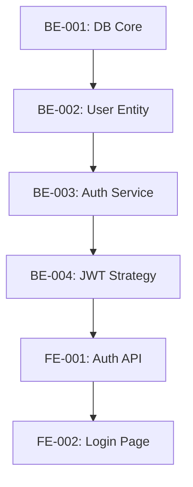
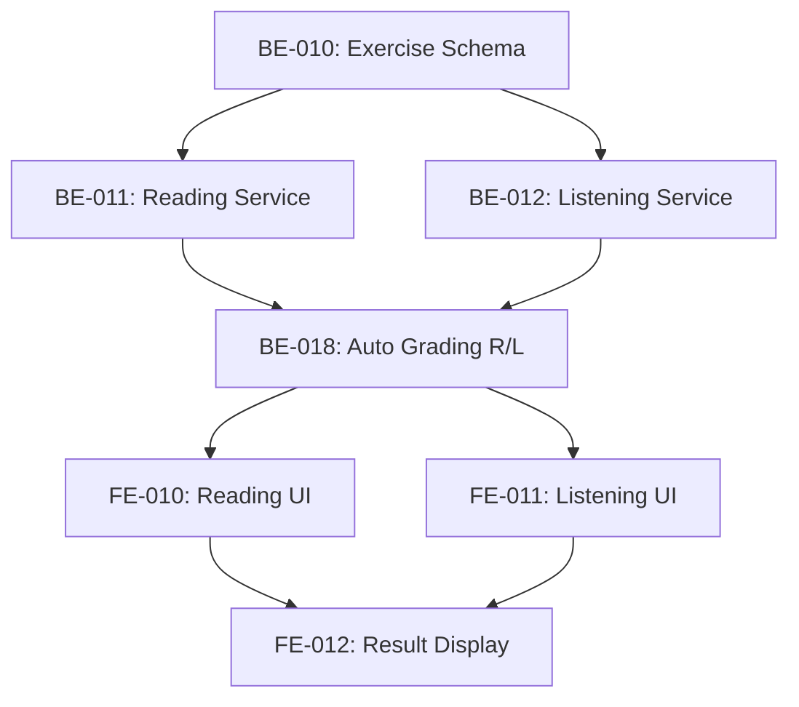
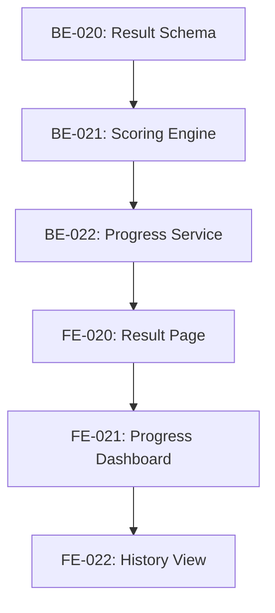

# 🎯 PHASE 1: MVP - Execution Order

**Timeline**: 6 weeks  
**Goal**: Core platform với Authentication, Practice features, Results tracking

---

## 📊 Sprint Overview

| Sprint | Duration | Focus | Files |
|--------|----------|-------|-------|
| **Sprint 01-02** | Week 1-2 | Authentication & User Management | 6 tasks |
| **Sprint 03-04** | Week 3-4 | Practice Features (Reading/Listening) | 8 tasks |
| **Sprint 05-06** | Week 5-6 | Results & History | 5 tasks |

**Total**: 19 tasks over 6 weeks

---

## 🚀 Sprint 01-02: Authentication (Week 1-2)

**Goal**: User có thể đăng ký, đăng nhập, quản lý profile

### Task Dependencies



### Task List

| ID | Task | Effort | Dependencies | Status |
|----|------|--------|--------------|--------|
| **BE-001** | Database Core Setup | 4h | None | 🔴 |
| **BE-002** | User Entity & Migrations | 3h | BE-001 | 🔴 |
| **BE-003** | Auth Service (Register/Login) | 6h | BE-002 | 🔴 |
| **BE-004** | JWT Strategy & Guards | 4h | BE-003 | 🔴 |
| **FE-001** | Auth API Client | 3h | BE-004 | 🔴 |
| **FE-002** | Login/Register Pages | 5h | FE-001 | 🔴 |

**Total Effort**: 25 hours (~3 days)

### Deliverables

✅ Users có thể register/login  
✅ JWT tokens được issue và validate  
✅ Protected routes hoạt động  
✅ User profile management

### Validation

```bash
# Test registration
curl -X POST http://localhost:8000/api/auth/register \
  -H "Content-Type: application/json" \
  -d '{"email":"test@vstepro.com","password":"Test123!","fullName":"Test User"}'

# Test login
curl -X POST http://localhost:8000/api/auth/login \
  -H "Content-Type: application/json" \
  -d '{"email":"test@vstepro.com","password":"Test123!"}'

# Test protected endpoint
curl -X GET http://localhost:8000/api/auth/me \
  -H "Authorization: Bearer <token>"
```

---

## 📚 Sprint 03-04: Practice Features (Week 3-4)

**Goal**: Students có thể làm bài Reading và Listening với auto-grading

### Task Dependencies



### Task List

| ID | Task | Effort | Dependencies | Status |
|----|------|--------|--------------|--------|
| **BE-010** | Exercise Schema & Migrations | 5h | BE-001 | 🔴 |
| **BE-011** | Reading Service | 6h | BE-010 | 🔴 |
| **BE-012** | Listening Service | 6h | BE-010 | 🔴 |
| **BE-013** | Question Bank Service | 4h | BE-010 | 🔴 |
| **BE-018** | Auto Grading (Reading/Listening) | 8h | BE-011, BE-012 | 🔴 |
| **FE-010** | Reading Practice UI | 10h | BE-018 | 🔴 |
| **FE-011** | Listening Practice UI | 10h | BE-018 | 🔴 |
| **FE-012** | Result Display Component | 6h | FE-010, FE-011 | 🔴 |

**Total Effort**: 55 hours (~7 days)

### Deliverables

✅ Reading exercises với multiple choice, true/false, matching  
✅ Listening exercises với audio player controls  
✅ Auto-grading cho Reading/Listening  
✅ Immediate feedback sau khi submit  
✅ Score calculation theo VSTEP rubric

### Validation

```bash
# Test create exercise
curl -X POST http://localhost:8000/api/exercises \
  -H "Authorization: Bearer <token>" \
  -H "Content-Type: application/json" \
  -d @fixtures/reading_exercise.json

# Test submit answers
curl -X POST http://localhost:8000/api/submissions \
  -H "Authorization: Bearer <token>" \
  -H "Content-Type: application/json" \
  -d @fixtures/reading_submission.json

# Test get results
curl -X GET http://localhost:8000/api/submissions/:id \
  -H "Authorization: Bearer <token>"
```

---

## 📊 Sprint 05-06: Results & History (Week 5-6)

**Goal**: Track progress, view history, analytics

### Task Dependencies



### Task List

| ID | Task | Effort | Dependencies | Status |
|----|------|--------|--------------|--------|
| **BE-020** | Result Schema & Migrations | 4h | BE-010 | 🔴 |
| **BE-021** | Scoring Engine | 6h | BE-020 | 🔴 |
| **BE-022** | Progress Tracking Service | 5h | BE-021 | 🔴 |
| **FE-020** | Detailed Result Page | 8h | BE-022 | 🔴 |
| **FE-021** | Progress Dashboard | 10h | BE-022 | 🔴 |

**Total Effort**: 33 hours (~4 days)

### Deliverables

✅ Detailed results với breakdown by question  
✅ Progress tracking over time  
✅ Performance analytics (strengths/weaknesses)  
✅ History của tất cả submissions  
✅ Charts và visualizations

### Validation

```bash
# Test get user progress
curl -X GET http://localhost:8000/api/progress/user/:userId \
  -H "Authorization: Bearer <token>"

# Test get analytics
curl -X GET http://localhost:8000/api/analytics/user/:userId \
  -H "Authorization: Bearer <token>"

# Test submission history
curl -X GET http://localhost:8000/api/submissions?userId=:userId&limit=10 \
  -H "Authorization: Bearer <token>"
```

---

## 📋 Overall Phase 1 Checklist

### Backend

- [ ] Database setup với Supabase
- [ ] Authentication service (register, login, logout)
- [ ] JWT token management
- [ ] User CRUD operations
- [ ] Exercise management (Reading/Listening)
- [ ] Auto-grading engine
- [ ] Submission tracking
- [ ] Progress analytics
- [ ] API documentation
- [ ] Unit tests (>80% coverage)
- [ ] Integration tests

### Frontend

- [ ] Login/Register pages
- [ ] Dashboard layouts (4 roles)
- [ ] Reading practice interface
- [ ] Listening practice interface
- [ ] Audio player controls
- [ ] Result display components
- [ ] Progress charts
- [ ] History view
- [ ] Responsive design
- [ ] Loading states
- [ ] Error handling
- [ ] Accessibility (WCAG AA)

### DevOps

- [ ] Development environment setup
- [ ] Environment variables configured
- [ ] Database migrations system
- [ ] CI/CD pipeline
- [ ] Staging deployment
- [ ] Monitoring setup

---

## 🎯 Success Criteria

### Functional

✅ **Authentication**
- Users can register with email/password
- Users can login and receive JWT token
- Protected routes work correctly
- Profile management functional

✅ **Practice**
- Students can browse exercises by skill/level
- Students can complete Reading exercises
- Students can complete Listening exercises
- Audio playback works smoothly
- Answers are submitted successfully

✅ **Grading**
- Reading/Listening auto-graded correctly
- Scores calculated according to VSTEP rubric
- Immediate feedback provided
- Correct/incorrect answers shown

✅ **Progress**
- Users can view detailed results
- Progress tracked over time
- History accessible
- Analytics show strengths/weaknesses

### Non-Functional

✅ **Performance**
- Page load < 3s
- API response < 1s
- Audio loads < 2s

✅ **Security**
- Passwords hashed (bcrypt)
- JWT tokens secure
- SQL injection prevented
- XSS prevented

✅ **Quality**
- 0 TypeScript errors
- 0 ESLint warnings
- >80% test coverage
- All accessibility checks pass

---

## 🚦 Phase Gates

### Gate 1: Authentication Complete (End of Week 2)

**Criteria:**
- [ ] All Sprint 01-02 tasks completed
- [ ] Authentication tests passing
- [ ] Manual testing successful
- [ ] Code review approved

**Go/No-Go Decision**: _______________

### Gate 2: Practice Features Complete (End of Week 4)

**Criteria:**
- [ ] All Sprint 03-04 tasks completed
- [ ] Reading/Listening functional
- [ ] Auto-grading working
- [ ] Performance targets met

**Go/No-Go Decision**: _______________

### Gate 3: Phase 1 Complete (End of Week 6)

**Criteria:**
- [ ] All Sprint 05-06 tasks completed
- [ ] End-to-end testing passed
- [ ] User acceptance testing done
- [ ] Documentation complete

**Go/No-Go Decision**: _______________

---

## 🔄 Handoff to Phase 2

### Prerequisites

Before starting Phase 2 (AI Grading):

1. ✅ All Phase 1 tasks completed
2. ✅ Reading/Listening auto-grading stable
3. ✅ Database schema finalized
4. ✅ API contracts defined
5. ✅ Test data prepared
6. ✅ Staging environment ready

### Deliverables

- [ ] MVP deployed to staging
- [ ] User testing feedback collected
- [ ] Bug fixes completed
- [ ] Performance optimizations done
- [ ] Documentation updated
- [ ] Phase 2 planning finalized

---

## 📞 Support

### Blockers

If AI encounters blockers:

1. Check task dependencies completed
2. Review related documentation
3. Check similar patterns in codebase
4. Document blocker with details
5. Escalate if stuck > 2 hours

### Questions

- Technical: Check `/docs/technical/`
- Business logic: Check `/docs/business/`
- Design: Check `/docs/design/`
- General: Check `01_PROJECT_CONTEXT.md`

---

**Version**: 1.0.0  
**Last Updated**: December 21, 2024  
**Next Review**: End of Sprint 01-02
