# 🗄️ ERD & DATABASE DESIGN - THIẾT KẾ CƠ SỞ DỮ LIỆU

## Mục lục
1. [Tổng quan Database](#tổng-quan-database)
2. [Danh sách tất cả bảng](#danh-sách-tất-cả-bảng)
3. [ERD Diagram (Text-based)](#erd-diagram-text-based)
4. [Chi tiết từng bảng](#chi-tiết-từng-bảng)
5. [Indexes và Constraints](#indexes-và-constraints)
6. [Database Schema (DBML)](#database-schema-dbml)

---

## Tổng quan Database

### Thông tin chung
- **Database Engine**: PostgreSQL 14+
- **Character Set**: UTF-8
- **Collation**: Vietnamese (vi_VN)
- **Timezone**: Asia/Ho_Chi_Minh
- **Tổng số bảng**: 40+ tables
- **Storage Engine**: Default (PostgreSQL)

### Nguyên tắc thiết kế
1. **Normalization**: Chuẩn hóa đến 3NF
2. **UUID Primary Keys**: Sử dụng UUID thay vì auto-increment
3. **Soft Delete**: Sử dụng deleted_at thay vì xóa thật
4. **Timestamps**: Mọi bảng có created_at, updated_at
5. **JSONB**: Sử dụng cho flexible data
6. **Indexes**: Index cho foreign keys và search fields
7. **Constraints**: NOT NULL, CHECK, UNIQUE, FOREIGN KEY

---

## Danh sách tất cả bảng

### 1. Core Tables (Người dùng & Phân quyền)
| Bảng | Mô tả | Rows (estimated) |
|------|-------|------------------|
| users | Tất cả người dùng trong hệ thống | 15,000 |
| user_profiles | Thông tin chi tiết người dùng | 15,000 |
| roles | Vai trò trong hệ thống | 3 |
| permissions | Quyền hạn | 50 |
| user_stats | Thống kê hoạt động người dùng | 15,000 |
| login_history | Lịch sử đăng nhập | 500,000 |
| sessions | Phiên đăng nhập active | 2,000 |
| password_reset_tokens | Token reset mật khẩu | 100 |
| activity_logs | Nhật ký hoạt động | 1,000,000 |

### 2. Student Tables (Học viên)
| Bảng | Mô tả | Rows (estimated) |
|------|-------|------------------|
| student_profiles | Profile học viên | 12,000 |
| enrollments | Ghi danh khóa học/lớp | 20,000 |
| student_test_results | Kết quả thi của học viên | 200,000 |
| student_attendance | Điểm danh học viên | 100,000 |
| student_achievements | Thành tích học viên | 50,000 |
| student_notes | Ghi chú của học viên | 30,000 |
| student_progress | Tiến độ học viên | 20,000 |
| lesson_progress | Tiến độ từng bài học | 100,000 |

### 3. Teacher Tables (Giáo viên)
| Bảng | Mô tả | Rows (estimated) |
|------|-------|------------------|
| teacher_profiles | Profile giáo viên | 250 |
| teacher_stats | Thống kê giảng dạy | 250 |
| teacher_reviews | Đánh giá giáo viên | 5,000 |
| teacher_availability | Lịch khả dụng | 1,000 |
| teacher_time_off | Nghỉ phép | 500 |
| teacher_evaluations | Đánh giá định kỳ | 1,000 |

### 4. Class Tables (Lớp học)
| Bảng | Mô tả | Rows (estimated) |
|------|-------|------------------|
| classes | Lớp học | 50 |
| class_teachers | Giáo viên phụ trách lớp | 60 |
| class_students | Học viên trong lớp | 1,500 |
| class_schedules | Lịch học | 150 |
| class_sessions | Các buổi học | 2,000 |
| session_attendance | Điểm danh từng buổi | 50,000 |
| class_invitations | Link mời vào lớp | 100 |
| class_assignments | Bài tập của lớp | 500 |
| class_stats | Thống kê lớp học | 50 |

### 5. Content Tables (Nội dung)
| Bảng | Mô tả | Rows (estimated) |
|------|-------|------------------|
| courses | Khóa học | 100 |
| course_modules | Module trong khóa học | 500 |
| lessons | Bài học | 2,000 |
| materials | Tài liệu | 5,000 |
| material_folders | Thư mục tài liệu | 200 |
| content_versions | Phiên bản nội dung | 10,000 |

### 6. Exam & Question Tables (Đề thi & Câu hỏi)
| Bảng | Mô tả | Rows (estimated) |
|------|-------|------------------|
| questions | Ngân hàng câu hỏi | 10,000 |
| passages | Đoạn văn Reading | 500 |
| exams | Đề thi | 300 |
| exam_sections | Phần của đề thi | 1,200 |
| exam_questions | Câu hỏi trong đề | 30,000 |
| assignments | Bài tập | 500 |
| submissions | Bài nộp | 20,000 |
| ai_grading_logs | Log chấm AI | 10,000 |

### 7. Notification Tables (Thông báo)
| Bảng | Mô tả | Rows (estimated) |
|------|-------|------------------|
| notifications | Thông báo | 500,000 |
| notification_preferences | Tùy chọn thông báo | 15,000 |
| notification_templates | Mẫu thông báo | 50 |
| push_subscriptions | Đăng ký push notification | 5,000 |
| notification_logs | Log gửi thông báo | 1,000,000 |

### 8. Analytics & Reporting Tables
| Bảng | Mô tả | Rows (estimated) |
|------|-------|------------------|
| analytics_events | Sự kiện analytics | 5,000,000 |
| daily_stats | Thống kê theo ngày | 1,000 |
| reports | Báo cáo đã tạo | 5,000 |

### 9. Gamification Tables
| Bảng | Mô tả | Rows (estimated) |
|------|-------|------------------|
| badges | Định nghĩa huy hiệu | 50 |
| user_badges | Huy hiệu của user | 50,000 |
| goals | Mục tiêu | 30,000 |
| goal_progress | Tiến độ mục tiêu | 30,000 |

### 10. Payment Tables (Optional)
| Bảng | Mô tả | Rows (estimated) |
|------|-------|------------------|
| transactions | Giao dịch thanh toán | 10,000 |
| subscriptions | Đăng ký gói | 5,000 |
| invoices | Hóa đơn | 10,000 |

---

## ERD Diagram (Text-based)

### Mermaid ERD

```mermaid
erDiagram
    %% Core Entities
    users ||--o{ user_profiles : has
    users ||--o{ sessions : has
    users ||--o{ login_history : has
    users ||--o{ user_stats : has
    users ||--o{ activity_logs : creates
    users ||--o{ notifications : receives
    
    %% Student Entities
    users ||--o| student_profiles : is
    users ||--o{ enrollments : enrolls
    users ||--o{ student_test_results : takes
    users ||--o{ student_attendance : attends
    users ||--o{ student_progress : tracks
    
    %% Teacher Entities
    users ||--o| teacher_profiles : is
    users ||--o{ teacher_stats : has
    users ||--o{ teacher_reviews : receives
    users ||--o{ teacher_evaluations : receives
    
    %% Class Relationships
    classes ||--o{ class_teachers : has
    classes ||--o{ class_students : has
    classes ||--o{ class_schedules : has
    classes ||--o{ class_sessions : has
    classes ||--o{ class_assignments : has
    
    users ||--o{ class_teachers : teaches
    users ||--o{ class_students : studies
    
    class_sessions ||--o{ session_attendance : has
    users ||--o{ session_attendance : records
    
    %% Content Relationships
    courses ||--o{ course_modules : contains
    course_modules ||--o{ lessons : contains
    users ||--o{ courses : creates
    
    users ||--o{ materials : uploads
    
    courses ||--o{ enrollments : enrolls_in
    courses ||--o{ student_progress : tracks
    lessons ||--o{ lesson_progress : tracks
    
    %% Exam Relationships
    users ||--o{ questions : authors
    exams ||--o{ exam_sections : contains
    exam_sections ||--o{ exam_questions : contains
    questions ||--o{ exam_questions : used_in
    
    classes ||--o{ assignments : assigns
    exams ||--o{ assignments : uses
    
    assignments ||--o{ submissions : receives
    users ||--o{ submissions : submits
    submissions ||--o{ ai_grading_logs : logs
    
    %% Notification Relationships
    users ||--o{ notifications : receives
    users ||--o| notification_preferences : has
    users ||--o{ push_subscriptions : subscribes
    
    %% Gamification
    users ||--o{ user_badges : earns
    badges ||--o{ user_badges : awarded
    users ||--o{ goals : sets
```



---

## Chi tiết từng bảng

### Core Tables

#### users
```sql
CREATE TABLE users (
  id UUID PRIMARY KEY DEFAULT gen_random_uuid(),
  name VARCHAR(100) NOT NULL,
  email VARCHAR(255) NOT NULL UNIQUE,
  phone VARCHAR(20),
  password VARCHAR(255) NOT NULL,
  avatar VARCHAR(500),
  bio TEXT,
  role VARCHAR(20) NOT NULL DEFAULT 'Student',
  status VARCHAR(20) NOT NULL DEFAULT 'active',
  email_verified BOOLEAN DEFAULT FALSE,
  email_verified_at TIMESTAMP,
  last_login_at TIMESTAMP,
  last_login_ip VARCHAR(45),
  created_at TIMESTAMP NOT NULL DEFAULT NOW(),
  updated_at TIMESTAMP NOT NULL DEFAULT NOW(),
  deleted_at TIMESTAMP
);

CREATE INDEX idx_users_email ON users(email);
CREATE INDEX idx_users_role ON users(role);
CREATE INDEX idx_users_status ON users(status);
```

#### user_profiles
```sql
CREATE TABLE user_profiles (
  id UUID PRIMARY KEY DEFAULT gen_random_uuid(),
  user_id UUID NOT NULL REFERENCES users(id) ON DELETE CASCADE UNIQUE,
  date_of_birth DATE,
  gender VARCHAR(10),
  address TEXT,
  city VARCHAR(100),
  country VARCHAR(100) DEFAULT 'Vietnam',
  language VARCHAR(10) DEFAULT 'vi',
  timezone VARCHAR(50) DEFAULT 'Asia/Ho_Chi_Minh',
  notification_email BOOLEAN DEFAULT TRUE,
  notification_push BOOLEAN DEFAULT TRUE,
  facebook_url VARCHAR(255),
  linkedin_url VARCHAR(255),
  created_at TIMESTAMP NOT NULL DEFAULT NOW(),
  updated_at TIMESTAMP NOT NULL DEFAULT NOW()
);
```

### [Continue với tất cả các bảng khác...]

---

## Database Schema (DBML)

```dbml
// VSTEPRO Database Schema

// ===== CORE TABLES =====

Table users {
  id uuid [pk, default: `gen_random_uuid()`]
  name varchar(100) [not null]
  email varchar(255) [not null, unique]
  phone varchar(20)
  password varchar(255) [not null]
  avatar varchar(500)
  bio text
  role varchar(20) [not null, default: 'Student', note: 'Student, Teacher, Admin']
  status varchar(20) [not null, default: 'active', note: 'active, inactive, banned, deleted']
  email_verified boolean [default: false]
  email_verified_at timestamp
  last_login_at timestamp
  last_login_ip varchar(45)
  created_at timestamp [not null, default: `now()`]
  updated_at timestamp [not null, default: `now()`]
  deleted_at timestamp
  
  indexes {
    email
    role
    status
    created_at
  }
}

Table user_profiles {
  id uuid [pk]
  user_id uuid [ref: - users.id, unique, not null]
  date_of_birth date
  gender varchar(10)
  address text
  city varchar(100)
  country varchar(100) [default: 'Vietnam']
  language varchar(10) [default: 'vi']
  timezone varchar(50) [default: 'Asia/Ho_Chi_Minh']
  notification_email boolean [default: true]
  notification_push boolean [default: true]
  facebook_url varchar(255)
  linkedin_url varchar(255)
  created_at timestamp [not null, default: `now()`]
  updated_at timestamp [not null, default: `now()`]
}

Table roles {
  id uuid [pk]
  name varchar(50) [not null, unique, note: 'Student, Teacher, Admin']
  display_name varchar(100) [not null]
  description text
  permissions jsonb
  created_at timestamp [not null, default: `now()`]
  updated_at timestamp [not null, default: `now()`]
}

Table permissions {
  id uuid [pk]
  name varchar(100) [not null, unique, note: 'practice.access, user.create']
  display_name varchar(100) [not null]
  description text
  module varchar(50) [note: 'practice, user, exam']
  created_at timestamp [not null, default: `now()`]
}

// ===== STUDENT TABLES =====

Table student_profiles {
  id uuid [pk]
  user_id uuid [ref: - users.id, unique, not null]
  student_code varchar(50) [unique, note: 'SV-2024-00123']
  enrollment_date date [not null, default: `current_date`]
  graduation_date date
  current_level varchar(5) [default: 'A2']
  target_level varchar(5) [default: 'B2']
  education varchar(200)
  major varchar(100)
  occupation varchar(100)
  purpose text
  emergency_contact_name varchar(100)
  emergency_contact_phone varchar(20)
  preferred_learning_time varchar(50)
  learning_style varchar(50)
  created_at timestamp [not null, default: `now()`]
  updated_at timestamp [not null, default: `now()`]
}

Table student_test_results {
  id uuid [pk]
  student_id uuid [ref: > users.id, not null]
  test_id uuid
  test_type varchar(20) [not null, note: 'reading, listening, writing, speaking']
  test_mode varchar(20) [not null, note: 'practice, exam, mock_exam']
  level varchar(5)
  score decimal(3,1) [not null]
  total_questions integer
  correct_answers integer
  percentage decimal(5,2)
  time_taken integer [note: 'in seconds']
  started_at timestamp [not null]
  submitted_at timestamp [not null]
  class_id uuid [ref: > classes.id]
  assignment_id uuid
  status varchar(20) [default: 'completed']
  created_at timestamp [not null, default: `now()`]
  updated_at timestamp [not null, default: `now()`]
  
  indexes {
    student_id
    test_type
    level
    submitted_at
  }
}

// ===== TEACHER TABLES =====

Table teacher_profiles {
  id uuid [pk]
  user_id uuid [ref: - users.id, unique, not null]
  teacher_code varchar(50) [unique, note: 'GV-2023-00045']
  title varchar(10) [note: 'TS., ThS., GV.']
  joined_date date [not null, default: `current_date`]
  employment_type varchar(20) [not null, default: 'full_time']
  status varchar(20) [default: 'active']
  education jsonb
  certifications jsonb
  experience integer [default: 0]
  specialties jsonb
  levels_taught jsonb
  bio text
  achievements jsonb
  publications jsonb
  linkedin_url varchar(255)
  website_url varchar(255)
  max_hours_per_week integer [default: 40]
  created_at timestamp [not null, default: `now()`]
  updated_at timestamp [not null, default: `now()`]
}

Table teacher_stats {
  id uuid [pk]
  teacher_id uuid [ref: - users.id, unique, not null]
  current_classes integer [default: 0]
  total_classes integer [default: 0]
  current_students integer [default: 0]
  total_students_taught integer [default: 0]
  courses_created integer [default: 0]
  average_rating decimal(2,1) [default: 0]
  total_reviews integer [default: 0]
  student_pass_rate decimal(5,2) [default: 0]
  created_at timestamp [not null, default: `now()`]
  updated_at timestamp [not null, default: `now()`]
}

// ===== CLASS TABLES =====

Table classes {
  id uuid [pk]
  code varchar(50) [unique, not null, note: 'VST-B2-2024-15']
  name varchar(200) [not null]
  description text
  level varchar(5) [not null, note: 'A2, B1, B2, C1']
  max_students integer [not null, default: 30]
  min_students integer [default: 5]
  enrolled integer [default: 0]
  start_date date [not null]
  end_date date [not null]
  duration_weeks integer
  status varchar(20) [not null, default: 'upcoming']
  is_public boolean [default: true]
  require_approval boolean [default: false]
  thumbnail varchar(500)
  syllabus_url varchar(500)
  created_at timestamp [not null, default: `now()`]
  updated_at timestamp [not null, default: `now()`]
  archived_at timestamp
  
  indexes {
    code
    level
    status
    start_date
  }
}

Table class_teachers {
  id uuid [pk]
  class_id uuid [ref: > classes.id, not null]
  teacher_id uuid [ref: > users.id, not null]
  role varchar(20) [not null, default: 'primary', note: 'primary, assistant, substitute']
  assigned_at timestamp [not null, default: `now()`]
  removed_at timestamp
  is_active boolean [default: true]
  created_at timestamp [not null, default: `now()`]
  
  indexes {
    class_id
    teacher_id
    (class_id, teacher_id, role) [unique]
  }
}

Table class_students {
  id uuid [pk]
  class_id uuid [ref: > classes.id, not null]
  student_id uuid [ref: > users.id, not null]
  joined_at timestamp [not null, default: `now()`]
  enrollment_method varchar(50)
  status varchar(20) [not null, default: 'active']
  progress decimal(5,2) [default: 0]
  attended_sessions integer [default: 0]
  total_sessions integer [default: 0]
  attendance_rate decimal(5,2) [default: 0]
  average_score decimal(3,1) [default: 0]
  removed_at timestamp
  completed_at timestamp
  created_at timestamp [not null, default: `now()`]
  updated_at timestamp [not null, default: `now()`]
  
  indexes {
    class_id
    student_id
    status
  }
}

// ===== CONTENT TABLES =====

Table courses {
  id uuid [pk]
  title varchar(200) [not null]
  slug varchar(250) [unique]
  description text
  level varchar(5) [not null]
  skills jsonb
  thumbnail varchar(500)
  total_modules integer [default: 0]
  total_lessons integer [default: 0]
  total_duration integer [default: 0]
  created_by uuid [ref: > users.id, not null]
  status varchar(20) [default: 'draft']
  published_at timestamp
  price decimal(10,2) [default: 0]
  is_free boolean [default: true]
  enrolled_count integer [default: 0]
  average_rating decimal(2,1) [default: 0]
  created_at timestamp [not null, default: `now()`]
  updated_at timestamp [not null, default: `now()`]
  
  indexes {
    slug
    level
    status
    created_by
  }
}

Table course_modules {
  id uuid [pk]
  course_id uuid [ref: > courses.id, not null]
  title varchar(200) [not null]
  description text
  order_number integer [not null]
  total_lessons integer [default: 0]
  duration integer [default: 0]
  is_locked boolean [default: false]
  unlock_after_module uuid [ref: > course_modules.id]
  created_at timestamp [not null, default: `now()`]
  updated_at timestamp [not null, default: `now()`]
  
  indexes {
    course_id
    (course_id, order_number) [unique]
  }
}

Table lessons {
  id uuid [pk]
  module_id uuid [ref: > course_modules.id, not null]
  title varchar(200) [not null]
  description text
  order_number integer [not null]
  content_type varchar(20) [not null, note: 'video, text, quiz, exercise']
  video_url varchar(500)
  video_duration integer
  text_content text
  questions jsonb
  attachments jsonb
  is_preview boolean [default: false]
  is_required boolean [default: true]
  created_at timestamp [not null, default: `now()`]
  updated_at timestamp [not null, default: `now()`]
  
  indexes {
    module_id
    content_type
    (module_id, order_number) [unique]
  }
}

// ===== EXAM TABLES =====

Table questions {
  id uuid [pk]
  skill varchar(20) [not null, note: 'reading, listening, writing, speaking']
  question_type varchar(50) [not null]
  question_text text
  passage_id uuid [ref: > passages.id]
  audio_url varchar(500)
  options jsonb
  correct_answer text
  correct_answers jsonb
  points decimal(4,1) [default: 1]
  difficulty varchar(20) [default: 'medium']
  explanation text
  tags jsonb
  times_used integer [default: 0]
  created_by uuid [ref: > users.id, not null]
  status varchar(20) [default: 'active']
  created_at timestamp [not null, default: `now()`]
  updated_at timestamp [not null, default: `now()`]
  
  indexes {
    skill
    question_type
    difficulty
    created_by
  }
}

Table exams {
  id uuid [pk]
  title varchar(200) [not null]
  code varchar(50) [unique]
  description text
  exam_type varchar(20) [not null, default: 'practice']
  level varchar(5) [not null]
  skills jsonb
  total_questions integer [default: 0]
  total_points decimal(6,1) [default: 0]
  passing_score decimal(6,1)
  total_duration integer
  status varchar(20) [default: 'draft']
  created_by uuid [ref: > users.id, not null]
  created_at timestamp [not null, default: `now()`]
  updated_at timestamp [not null, default: `now()`]
  published_at timestamp
  
  indexes {
    code
    exam_type
    level
    status
  }
}

Table assignments {
  id uuid [pk]
  title varchar(200) [not null]
  description text
  assignment_type varchar(20) [default: 'homework']
  exam_id uuid [ref: > exams.id]
  class_id uuid [ref: > classes.id]
  assigned_date timestamp [not null, default: `now()`]
  due_date timestamp [not null]
  total_points decimal(6,1)
  passing_score decimal(6,1)
  grading_method varchar(20) [default: 'auto']
  status varchar(20) [default: 'assigned']
  created_by uuid [ref: > users.id, not null]
  created_at timestamp [not null, default: `now()`]
  updated_at timestamp [not null, default: `now()`]
  
  indexes {
    class_id
    exam_id
    status
    due_date
  }
}

Table submissions {
  id uuid [pk]
  assignment_id uuid [ref: > assignments.id]
  exam_id uuid [ref: > exams.id, not null]
  student_id uuid [ref: > users.id, not null]
  attempt_number integer [default: 1]
  answers jsonb [not null]
  started_at timestamp [not null]
  submitted_at timestamp
  time_spent integer
  status varchar(20) [default: 'in_progress']
  auto_score decimal(6,2)
  graded_score decimal(6,2)
  final_score decimal(6,2)
  percentage decimal(5,2)
  passed boolean
  created_at timestamp [not null, default: `now()`]
  updated_at timestamp [not null, default: `now()`]
  
  indexes {
    assignment_id
    exam_id
    student_id
    status
    (assignment_id, student_id, attempt_number) [unique]
  }
}

// ===== NOTIFICATION TABLES =====

Table notifications {
  id uuid [pk]
  user_id uuid [ref: > users.id, not null]
  type varchar(50) [not null]
  category varchar(20) [not null]
  title varchar(200) [not null]
  message text [not null]
  action_url varchar(500)
  data jsonb
  is_read boolean [default: false]
  read_at timestamp
  created_at timestamp [not null, default: `now()`]
  
  indexes {
    user_id
    type
    category
    is_read
    created_at
  }
}

// ===== ANALYTICS TABLES =====

Table analytics_events {
  id uuid [pk]
  user_id uuid [ref: > users.id]
  session_id uuid
  event_type varchar(50) [not null]
  event_name varchar(100)
  properties jsonb
  ip_address varchar(45)
  device_type varchar(20)
  created_at timestamp [not null, default: `now()`]
  
  indexes {
    user_id
    event_type
    created_at
  }
}

Table daily_stats {
  id uuid [pk]
  date date [not null, unique]
  total_users integer [default: 0]
  new_users integer [default: 0]
  active_users integer [default: 0]
  tests_taken integer [default: 0]
  average_score decimal(3,1)
  revenue decimal(10,2) [default: 0]
  created_at timestamp [not null, default: `now()`]
  updated_at timestamp [not null, default: `now()`]
}

// ===== RELATIONSHIPS SUMMARY =====

// One-to-One
Ref: users.id - user_profiles.user_id
Ref: users.id - student_profiles.user_id
Ref: users.id - teacher_profiles.user_id
Ref: users.id - teacher_stats.teacher_id

// One-to-Many
Ref: users.id < student_test_results.student_id
Ref: users.id < notifications.user_id
Ref: users.id < courses.created_by
Ref: courses.id < course_modules.course_id
Ref: course_modules.id < lessons.module_id
Ref: classes.id < class_students.class_id
Ref: classes.id < class_teachers.class_id
Ref: users.id < class_students.student_id
Ref: users.id < class_teachers.teacher_id
Ref: exams.id < assignments.exam_id
Ref: assignments.id < submissions.assignment_id

// Many-to-Many (through junction tables)
// users <-> classes through class_students
// users <-> classes through class_teachers
// questions <-> exams through exam_questions
```

---

## Indexes và Constraints

### Primary Keys
Tất cả bảng sử dụng UUID làm primary key:
```sql
id UUID PRIMARY KEY DEFAULT gen_random_uuid()
```

### Foreign Keys
Sử dụng ON DELETE CASCADE hoặc SET NULL tùy business logic:
```sql
-- CASCADE: Xóa child khi xóa parent
user_id UUID REFERENCES users(id) ON DELETE CASCADE

-- SET NULL: Set NULL khi xóa parent
created_by UUID REFERENCES users(id) ON DELETE SET NULL
```

### Unique Constraints
```sql
-- Single column
email VARCHAR(255) UNIQUE

-- Multiple columns (composite unique)
UNIQUE (class_id, student_id, removed_at)
```

### Check Constraints
```sql
-- Validate values
CHECK (end_date > start_date)
CHECK (enrolled <= max_students)
CHECK (score >= 0 AND score <= 10)
```

### Indexes for Performance
```sql
-- Single column indexes
CREATE INDEX idx_users_email ON users(email);
CREATE INDEX idx_users_role ON users(role);

-- Composite indexes
CREATE INDEX idx_submissions_assignment_student 
  ON submissions(assignment_id, student_id);

-- JSONB indexes (GIN)
CREATE INDEX idx_questions_tags ON questions USING GIN (tags);

-- Partial indexes
CREATE INDEX idx_active_users 
  ON users(created_at) WHERE deleted_at IS NULL;
```

---

## Summary

Database VSTEPRO bao gồm:
- **40+ tables** được tổ chức logic
- **UUID primary keys** cho scalability
- **Comprehensive relationships**: 1-1, 1-n, n-n
- **JSONB fields** cho flexibility
- **Soft deletes** cho data retention
- **Indexes** optimize cho queries
- **Constraints** đảm bảo data integrity
- **Normalized** đến 3NF
- **Estimated 10M+ rows** khi production

**Ngày tạo**: 2024-12-11  
**Phiên bản**: 1.0
